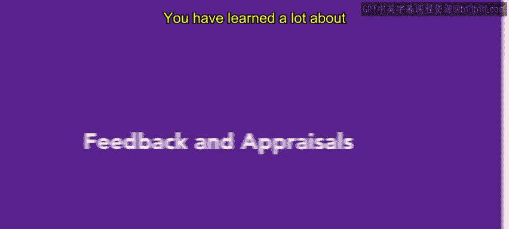
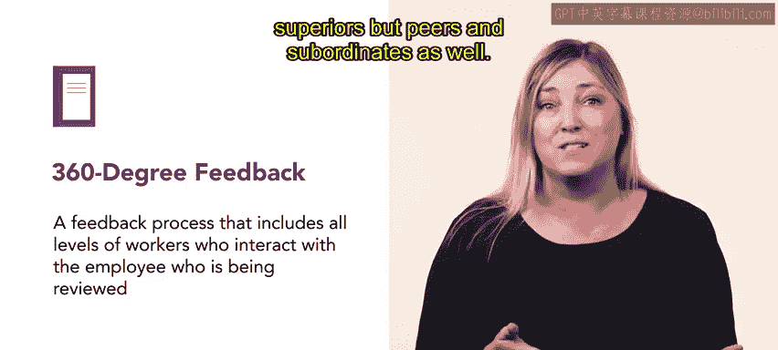

**HRCI人力资源助理课程：4-5：反馈与评估**

在本节课中，我们将学习绩效反馈的核心概念以及评估流程，特别是360度反馈方法。我们将探讨其重要性、运作方式以及对员工和组织的益处。

---

你已经学习了许多关于不同评估方法的知识，并了解了它们对员工和组织成功的重要性。

今天，我们将讨论反馈和评估流程。正如你所知，员工的绩效通常由其主管进行审查。然而，现在越来越普遍的做法是，不仅从上级那里收集绩效衡量信息，也从同事和下属那里收集。这种方法被称为**360度反馈**。

**360度反馈**是指收集所有与该员工有工作交互的各级人员（包括上级、同级和下属）的反馈信息。

与仅由主管评估的方法相比，这种**360度反馈**方法能提供更详细、更全面的绩效信息。

此外，**360度反馈**还能确保员工不会不当对待同事或下属，并对上级保持尊重。

---

**360度反馈**鼓励员工在面对反馈时，以恰当且非防御性的方式作出回应。事实上，员工如何回应反馈，与反馈内容本身同等重要。

对于所有人力资源专业人士而言，理解反馈的重要性至关重要。接下来，你将进一步了解评估流程，包括一个绩效评估的示例。

---

**总结**

本节课中，我们一起学习了**360度反馈**这一核心评估方法。我们了解到，它通过收集多维度反馈，提供了更全面的绩效视图，并有助于促进员工在工作关系中的恰当行为。理解并有效运用反馈是绩效管理成功的关键。