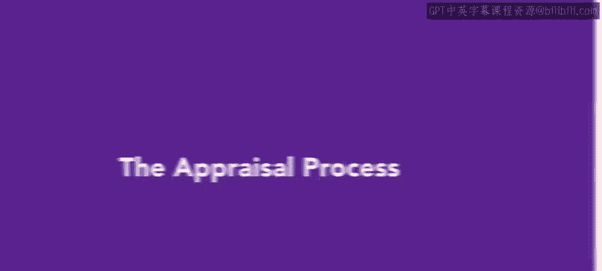
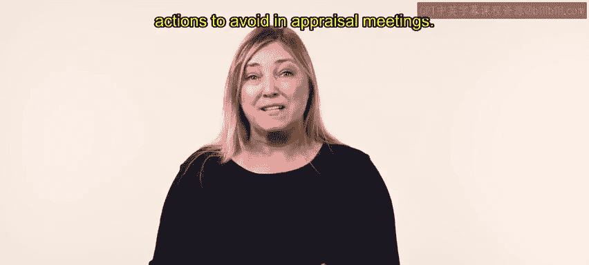
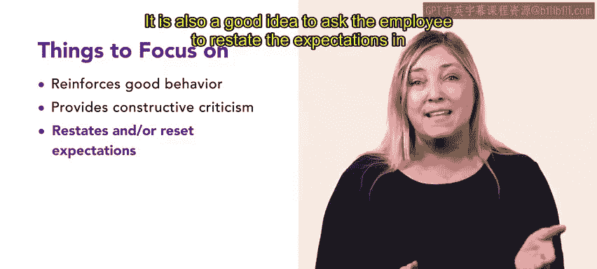
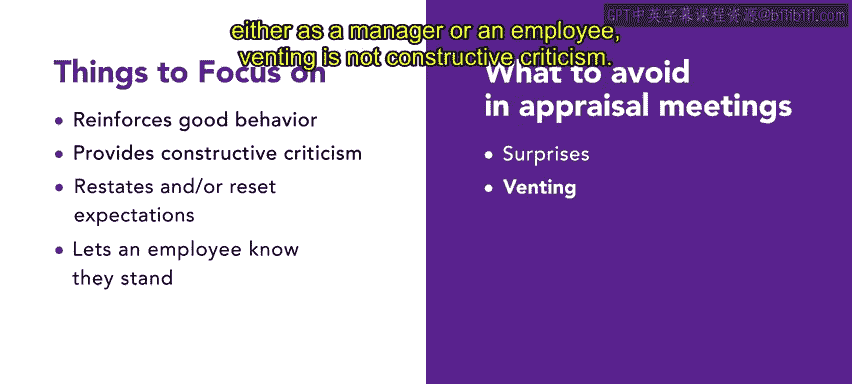
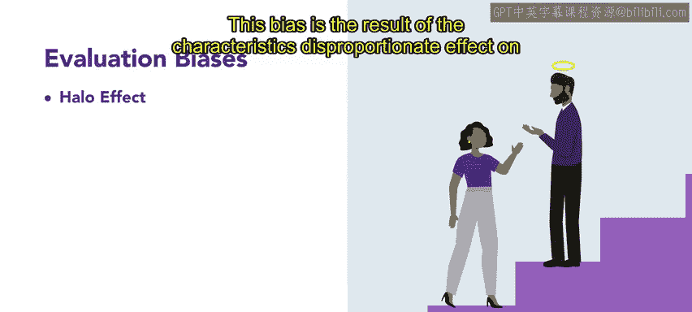
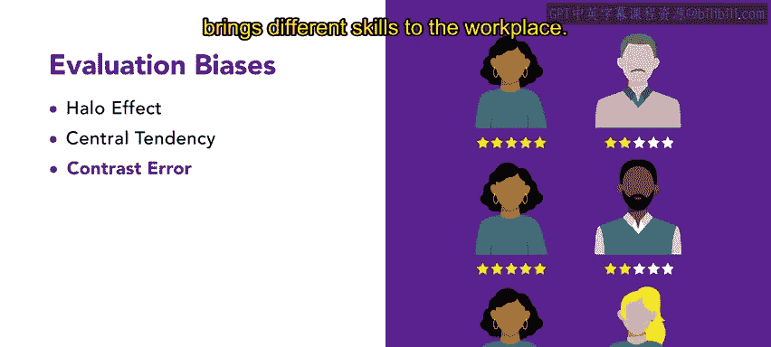
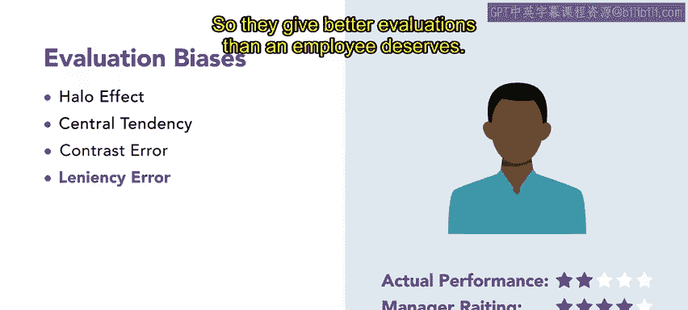
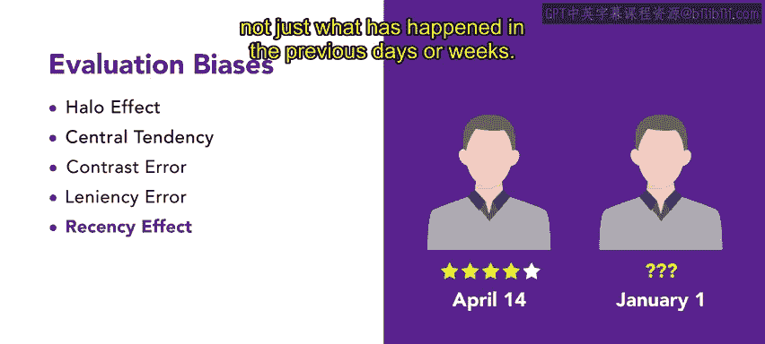
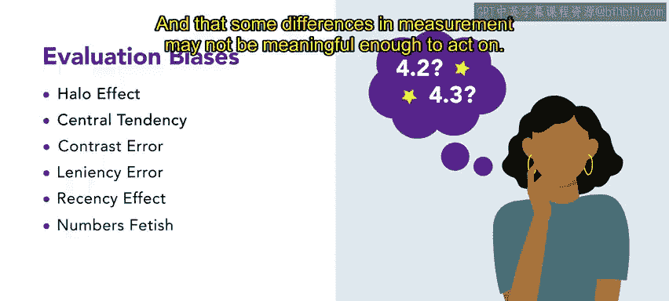
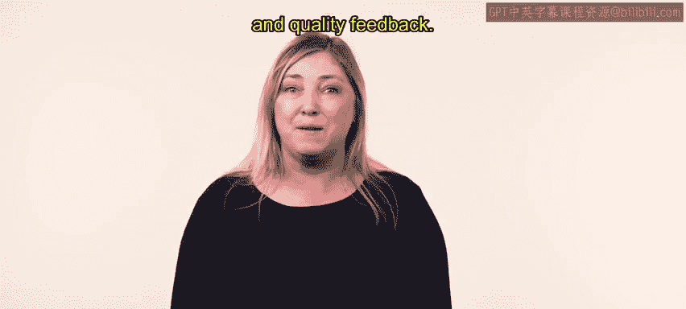

# HRCI《人力资源助理（员工关系、合规，4-5课／共5课）》：P49：44_评估流程

## 📋 概述
在本节课中，我们将要学习绩效评估流程。你将了解到评估的积极作用、评估会议中应避免的行为，以及在整个过程中需要注意的各种评估偏见。

---

## 🔍 绩效评估流程简介
绩效评估流程中，管理者会评估每位员工，并与他们讨论评估结果。这是管理者最重要也最困难的任务之一。然而，它也为管理者和员工双方提供了几个重要的成长机会。

上一节我们介绍了评估流程的基本概念，本节中我们来看看在评估过程中应重点关注的几个方面。

以下是评估流程中应关注的几个积极方面：
*   **强化良好行为**：每个人都乐于被告知自己做得好的地方，以及自己是团队中有价值的成员。
*   **提供建设性批评**：有必要提供员工应如何改进绩效的具体行动示例。
*   **重申或重置期望**：有时员工表现不佳是因为他们不知道、忘记或误解了对他们的期望。评估会议是澄清期望的好时机。让员工用自己的话复述期望，是确保他们理解的好方法。
*   **让员工了解自身定位**：我们都想知道自己的定位，但常常不敢问。评估流程提供了无需提问就能回答这个问题的机会。

---

## ⚠️ 评估会议中应避免的行为
除了关注积极方面，评估会议中也有一些行为需要避免。

以下是评估会议中应避免的事项：
*   **避免“突然袭击”**：管理者应在全年与员工保持开放的沟通。评估会议上所说的内容应是对已有反馈的强化，而不是让员工感到意外。
*   **避免宣泄情绪**：无论是管理者还是员工，评估会议都不是宣泄情绪的时候。宣泄情绪并非建设性批评。

---

## 🧠 评估过程中需注意的偏见
在评估员工绩效时，所有评估者都容易受到偏见的影响。在实施绩效评估技术时，牢记这些偏见非常重要。

上一节我们讨论了评估会议的行为准则，本节中我们来深入了解一下几种常见的评估偏见。

以下是几种常见的评估偏见：
*   **光环效应**：当评估者基于员工的某一个好或坏的特征来做出整体评价时，就会发生这种偏见。这是该特征对评估者印象产生了不成比例影响的结果。
    *   **公式/描述**：`整体评价 ≈ 单一突出特征`
*   **趋中倾向（平均偏见）**：当评估者难以比较员工之间的差异，并给大多数员工一个平均评分时，就会发生这种偏见。他们也可能为了避免为正负评价提供理由而这样做。
*   **对比误差**：当评估者将所有员工与某一个体（例如一位杰出员工）进行比较时，就会发生这种偏见。这会使所有其他员工看起来都像是工作做得不好。重要的是记住每个人都是独特的，并为工作场所带来不同的技能。
*   **宽大误差**：当雇主不愿严厉评估员工或申请人，从而给出比员工应得的更好的评价时，就会发生这种偏见。
*   **近因效应**：近因效应会影响评估者，因为很难权衡很久以前发生的事件与最近发生的事件。通常，近期事件在我们的脑海中会占据更大的比重。重要的是思考员工的整体表现，而不仅仅是前几天或前几周发生的事情。
*   **数字迷恋**：为了尽可能保持客观，一些评估者可能会产生数字迷恋，他们痴迷于尝试量化绩效，并衡量数字间的微小差异。因此，重要的是要记住，任何工作的某些方面可能都难以量化，并且测量上的一些差异可能不足以产生有意义的行动依据。

---

## 📝 总结
本节课中我们一起学习了绩效评估流程。我们了解到，正确地进行员工评估并与之讨论结果，是管理者面临的最重要任务之一。它提供了给予员工建设性和高质量反馈的机会。同时，我们探讨了评估的积极作用、会议中应避免的行为，以及需要警惕的各种评估偏见，以帮助管理者更公正、有效地完成这项工作。