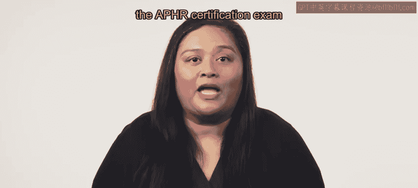

# HRCI《人力资源助理（员工关系、合规，4-5课／共5课）｜HRCI Human Resource Associate》 - P4：82_恭喜.zh_en - GPT中英字幕课程资源 - BV1qE4m19788

Congratulations， you have now completed this course on compensation and benefits you have certainly learned a lot this course covered about 20% of the APHR exam and introduced some cornerstone skills for an HR professional。

First， you were introduced to compensation systems， wages， and differential pay structures。

You then learn the basics of compensation and benefits， including wage equity。

 pay for performance and incentives。You'll look deeper into compensation and benefits and cover the different types of available benefits and their functions and finally you discovered how to design payroll and benefits technology to meet the needs of the organization and employees great work on this course the next course focuses on employee relations  employee relations is another substantial segment of the APHR certification exam and you'll pick up a lot of new concepts。

😊。

