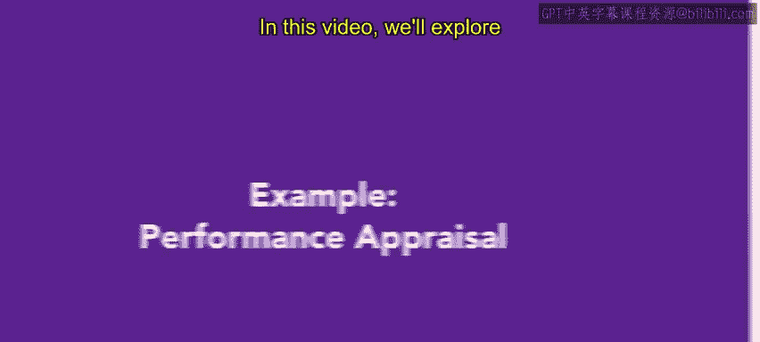
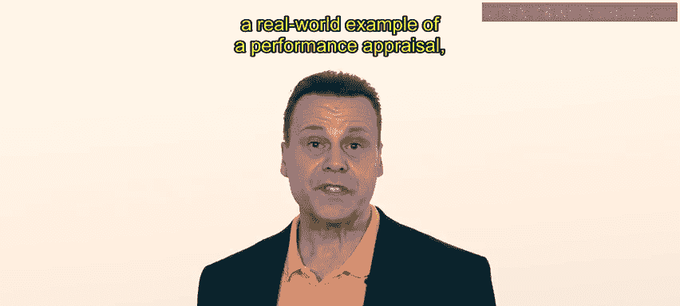
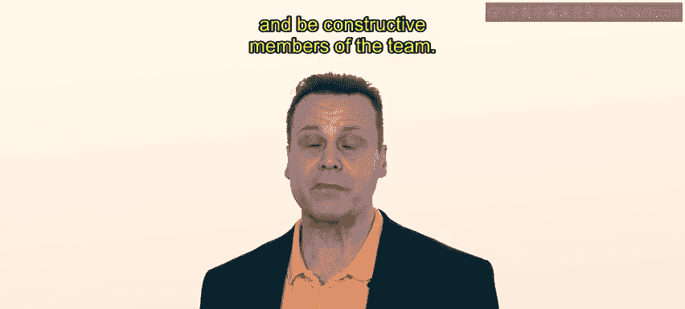
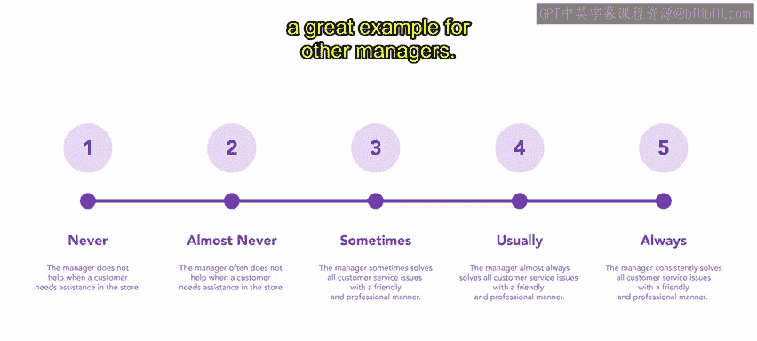
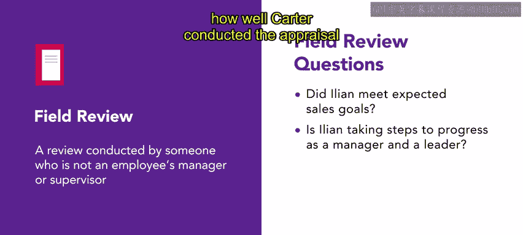

# HRCI人力资源助理课程：4-5：绩效评估示例 📋

在本节课中，我们将通过一个真实世界的示例，来探讨绩效评估（也称为绩效评审）的具体过程。我们将跟随人力资源专业人士Neri，了解她在一家名为Urban Attire的公司中如何协助进行一次绩效评估。

Urban Attire是一家专注于为现代都市生活提供休闲服饰的中型企业。其业务包括工厂、实体店和总部。多样化的地点和职位类型为人力资源部门带来了广泛的责任。该公司的每一位员工都会接受某种形式的绩效评估。

---

Urban Attire以其能为所有员工提供及时反馈而自豪。公司深知这有助于员工在其岗位上成长，并成为团队中有建设性的成员。

---

今天，Neri正在协助对一位门店经理进行绩效评估。请记住，**绩效评估是员工与经理之间的一次会议，旨在概述员工表现的好坏**。

在本案例中，门店经理Ilan正在与区域经理Carter会面，Neri也参加了这次会议。在会议中，Carter使用了多种不同的评估方法，并与Ilan进行了讨论。

---

首先，Carter使用**BARS方法**（行为锚定等级评价法）来分析Ilan经常完成的任务。例如，门店经理需要处理店内客户服务问题。

Carter使用了一个五点量表进行评估。其中，**1分**表示经理在顾客需要帮助时未提供协助，而**5分**表示经理始终能以友好和专业的方式解决所有客户服务问题。

在审查了该门店的所有可用信息，并结合Carter在Ilan门店的观察时间后，Carter确定Ilan在此类别中获得了**5分**。Ilan在客户服务方面特别熟练，是其他经理的优秀榜样。

---

作为Ilan评估的一部分，Neri还提供了一份**实地考察评估**。Neri有一套用于此类评估的标准问题集。这有助于使对同一职位多个人员的实地评估具有可比性。

在实地评估中，Neri向Ilan的直属上司Carter提出了一系列问题以收集信息。有些问题是客观的，例如“Ilan是否达到了预期的销售目标？”，有些则更主观，例如“Ilan是否在采取措施以成长为一名经理和领导者？”。在实地评估中，他们还观察了Ilan执行典型工作任务的情况。

由于这是评估的一部分，并且由不常与Ilan共事的Neri执行，因此希望这次评估能更加客观、自由且不带偏见。在Ilan的案例中，这类评估也有助于评估其是否朝着晋升的方向发展。

这次评估对Ilan来说非常顺利。看起来他无疑正朝着未来晋升的方向稳步前进。Neri很高兴能观察并参与这次评估会议，并记录了Carter如何出色地主持评估，以及Ilan作为经理的卓越表现。我们稍后会再次跟进Neri的情况。

---

为员工提供评估和反馈是管理工作中非常重要的一环。它可以帮助组织成员了解自己的优点以及如何改进。所使用的评估方法将取决于组织的需求和所涉及的人员。

**作为人力资源专业人士，您很可能需要帮助决定用于评估的方法，并协助进行这些评审。**

接下来，您将学习有关职场纪律的内容。

---

## 总结

本节课中，我们一起学习了绩效评估的实际应用示例。通过Urban Attire公司门店经理Ilan的案例，我们了解了绩效评估会议的基本流程，以及**BARS方法**和**实地考察评估**两种具体评估工具的使用。绩效评估是帮助员工成长和促进组织发展的重要管理活动，人力资源专业人员在其中扮演着关键的支持与执行角色。