# HRCI《人力资源助理（员工关系、合规，4-5课／共5课）｜HRCI Human Resource Associate》 - P54：49_纪律记录.zh_en - GPT中英字幕课程资源 - BV1qE4m19788

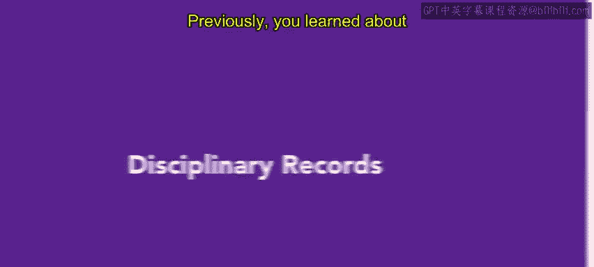

Previously， you learned about methods of disciplinary action that an organization can take to correct behavior when employees do not follow workplace rules。

In this video， you'll learn how to document such situations and why it's important to do so as you've learned。

 HR teams should have policies， procedures and handbooks in place that establish expectations for employee behavior。

When employees significantly or repeatedly deviate from these expectations。

 their behavior should be addressed through corrective action， the employees misbehavior。

 any disciplinary conversations and any corrective actions should be documented and recorded in the employee's personnel file。

 Let's explore each of these types of documentation。😊。

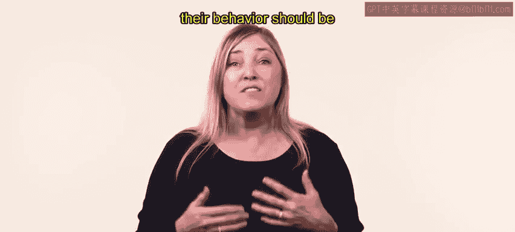

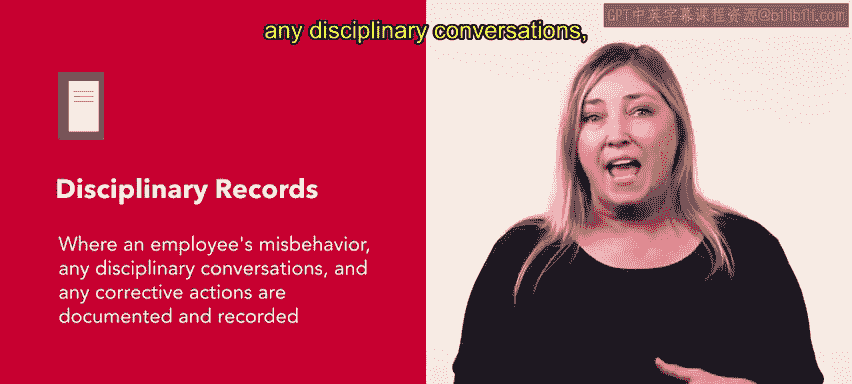

The first item of documentation is a record of misbehavior。Any issues should be recorded factually。

 Vgue statements or subjective judgments about the employee should be avoided。

 Be sure to provide dates and details whenever possible。 This information should speak for itself。

 especially if a pattern of misbehavior is established。

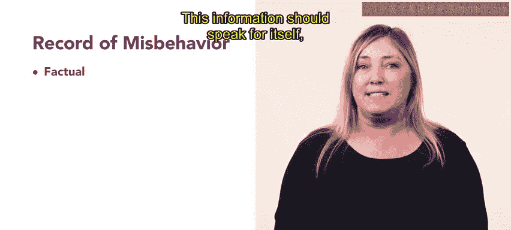

For instance， at Connective an employee Sarah's actions have caused workplace conflict recently。

 Sarah's supervisor is recording the incidents in her disciplinary record。

 The incident should be recorded with facts and accuracy。

 If the supervisor writes Sarah is often rude to her peers。 she should work on her attitude。

 This is a subjective judgment。 and does not provide specific details about the incidents that occurred。

 Let's review how to document the situation better。 Instead。

 Sarah's supervisor writes two entries as follows。 February 2， According to Jack D from sales。

 Sarah referred to Jack as a loser during a meeting with a partner on January 26。😊，March 7th。

 Sarah emailed Eliah from Market on February 19th， writing that Eli's presentation was boring and hard to sit through。

These entries include facts What happened and the dates that they occurred this documentation will help establish a pattern of behavior if needed。

 the second item of documentation is a record of disciplinary conversations when an employee is disciplined HR should produce a written transcript of the conversation the employee should review this transcript any questions and answers regarding the transcript should also be recorded。

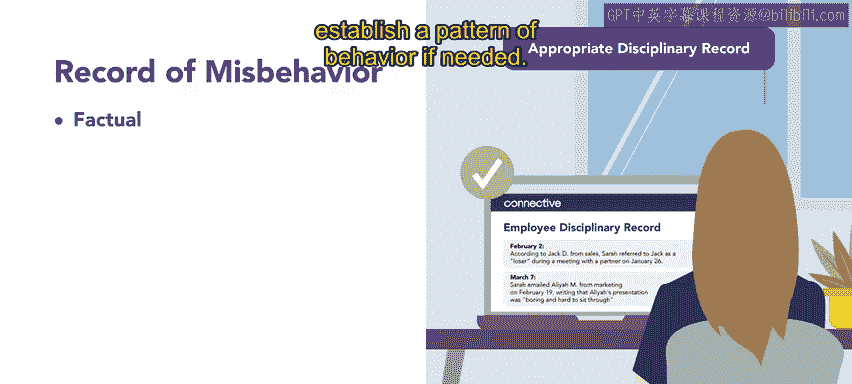

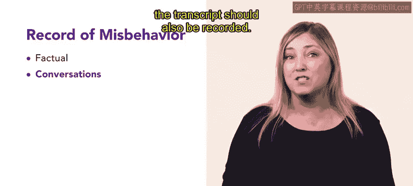

At Connective， Sarah's supervisor had a disciplinary conversation with her after the first incident was reported on February 2nd。

After the second incident， an HR representative also had a conversation with Sarah These conversations were recorded by HR and transcripts sent to Sarah to review Finally。

 any corrective actions taken in response to the employee's behavior should be documented appropriately。

 for instance， any written or verbal warnings， suspensions or changes in pay should be noted。😊。

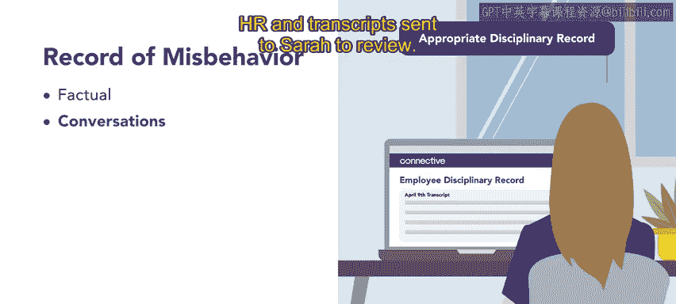

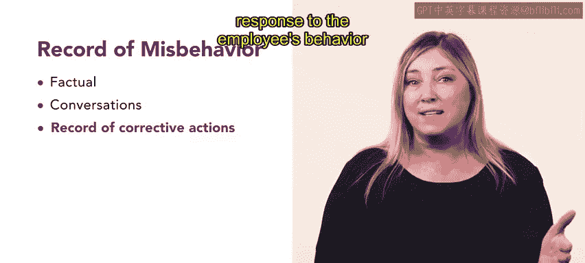

A record of corrective actions can help with future disciplinary actions and can assist with progressive discipline。

Some organizations might choose to remove corrective action records after long periods of good behavior。

 however， severe misbehavior， like harassment or violence should be permanently documented。

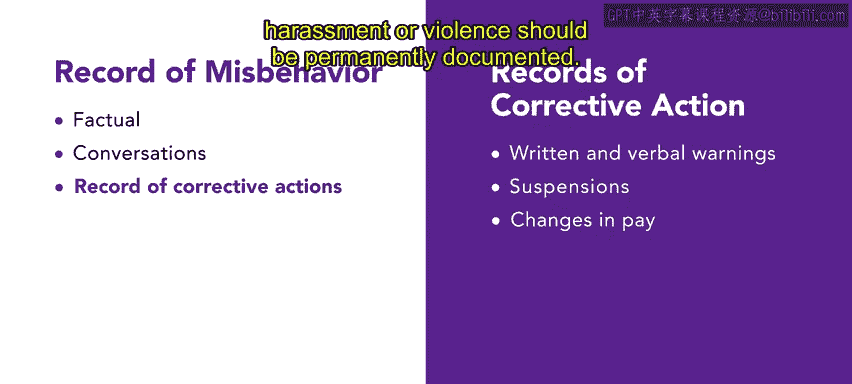

In Sarah's case， her file shows corrective actions as follows， two disciplinary conversations。

 which included verbal warnings， a written warning and a suspension that is labeled ongoing。

 As you've now learned， documentation is a key component of both progressive discipline and positive discipline。

😊。

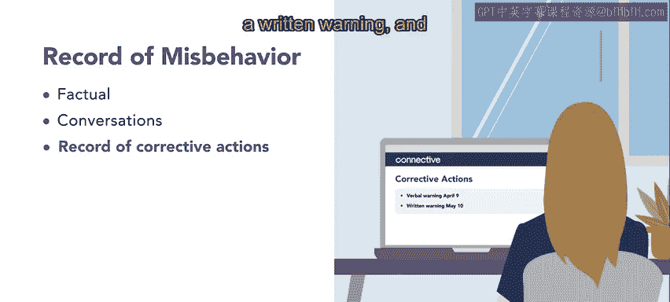

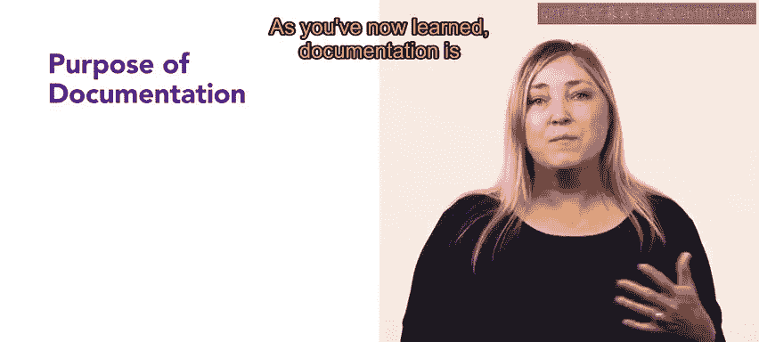

Documentation serves a number of purposes， it slows down the disciplinary process。

 forcing the manager to think carefully before taking action。

 it establishes a pattern of behavior to assist management in making future disciplinary decisions and it provides a record that protects the employer if an employee leader sues for wrongful termination。

😊。

Documentation is an important part of an HR associate's regular workload。

 but it can be especially important when it comes to assisting an organization with disciplinary procedures Com up you'll explore the topic of terminating a worker's employment。

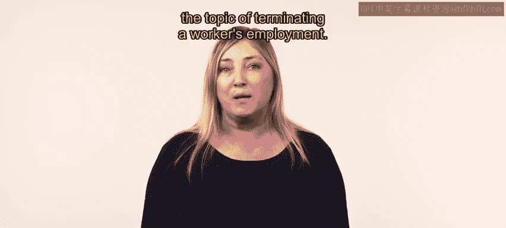