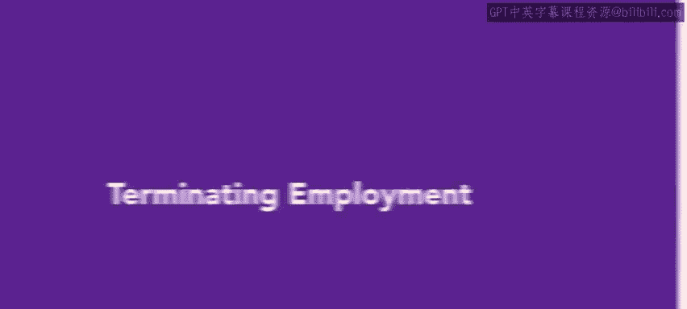
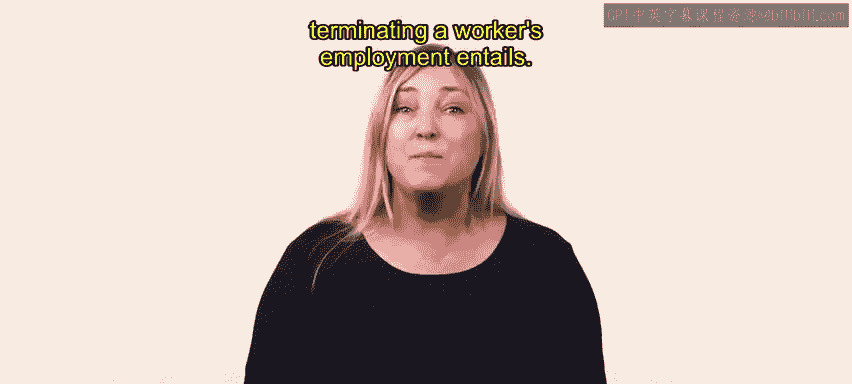
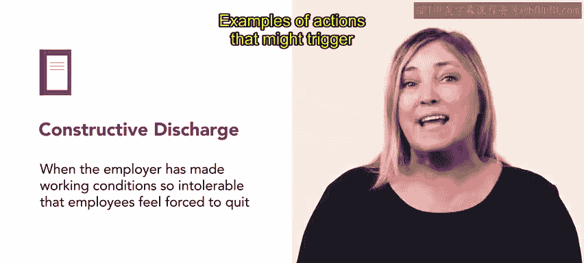
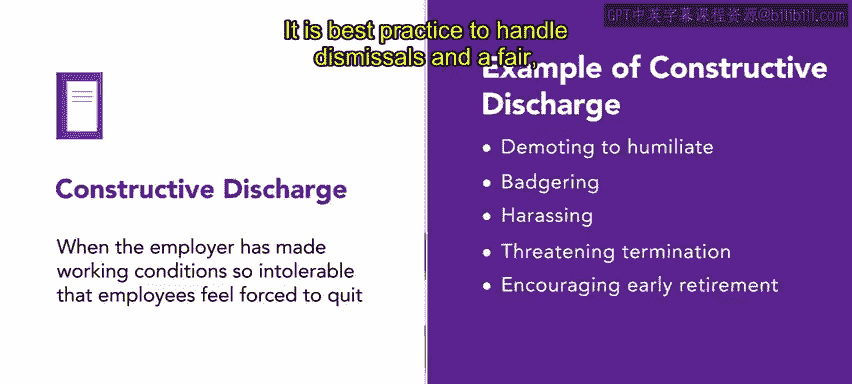
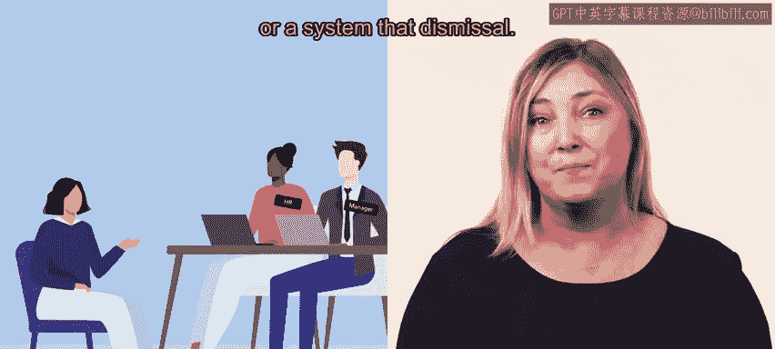

# HRCI《人力资源助理（员工关系、合规，4-5课／共5课）｜HRCI Human Resource Associate》 - P55：50_终止雇佣.zh_en - GPT中英字幕课程资源 - BV1qE4m19788

Dismissing an employee is always a difficult task。 It can negatively affect both the employee and the employer。

 especially if it is mishandled。Most employers try to avoid dismissal and instead employ progressive discipline。

 such as warnings and other remedies in an attempt to improve the situation。

 but sometimes it just doesn't work。In this video， you'll explore what terminating a worker's employment entails。

In the United States， the doctrinerine of Employment at will allows employers to fire employees without giving a reason。

 as long as the reason isn't illegal。Illegal reasons include discrimination based on age。

 gender or race。 Most companies dismiss a worker for a specific reason。 thus。

 most firings are considered termination for cause。

 meaning the company can point to the behavior or performance of the employee as the cause termination for cause provides the organization with some protection against wrongful termination lawsuits。

😊，There are several common reasons for termination for cause， these include poor performance。

 deliberately violating company policy， stealing or embezzling， failing a drug or alcohol test。

 insubordination， using company property for personal business and lying on a resume。

Sometimes dismissals are the result of a bad hiring process where the employee and the job are a poor fit。

 organizations can avoid this type of termination by matching candidates to a specific job description and being selective in hiring the cost of mishandling a dismissal can be high。

 a wrongful termination lawsuit can incur substantial legal fees and if the company is found in the wrong and expensive settlement。

😊，Employers must be careful when taking that final step of dismissal。

 a wrongful termination suit can be filed if a dismissed employee believes that their civil rights were violated。

 the question of discrimination can almost always be raised。

 even when a company dismisses groups of workers or whole departments in a mass layoff。

If layoffs target older employees or other protected classes of employees。

 it can be seen as discriminatory。Although employers are protected to a certain extent by the doctrine of employment at will。

 a wrongful termination suit typically argues that the employee was let go without just cause。

 there are three exceptions that protect employees from wrongful termination First。

 a company cannot fire an employee who's protected by federal or state equal employment and workplace law。

 for example， a company cannot fire a whistleblower for reporting unsafe work environments。

 second through common law exceptions， employees are protected by implied contracts。

 such as guidelines in an employee handbook。😊，Third。

 public policy exemptions protect an employee from being fired for refusing to break the lawEmploy will sometimes claim constructive discharge。

 This occurs when the employer has made working conditions so intolerable that employees feel forced to quit examples of actions that might trigger a constructive discharge include demoting an employee as a way of humiliating them。

 Bagering or harassing， threatening termination or encouraging early retirement。

It is best practice to handle dismissals in a fair， consistent。

 humane and respectful manner the Human resourcess Department is often called upon to support line managers when they terminate an employee's employment in many cases。

 HR representatives will document or assist in the dismissal。😊。

How an employee is treated during this difficult process speaks volumes about the culture of the organization。

HR should prepare and train managers for dismissals and should help them handle the situation professionally。

 allowing dismissed employees to collect their personal belongings and give a brief goodbye to colleagues often reduces ill will。

 Most fired workers are very unhappy in the moment。 But if they are treated with respect。

 many awkward or ugly scenes can be avoided。 In some cases， typically with layoffs。

 HR will provide outplacement services， in which they voluntarily assist the terminated employee in finding another job。

😊。

Terminating a worker's employment is never an easy task， but as an HR professional。

 you'll help make the process easier for both the manager and the employee being dismissed。Coming up。

 you'll learn about avoiding legal trouble once you've terminated an employee。

