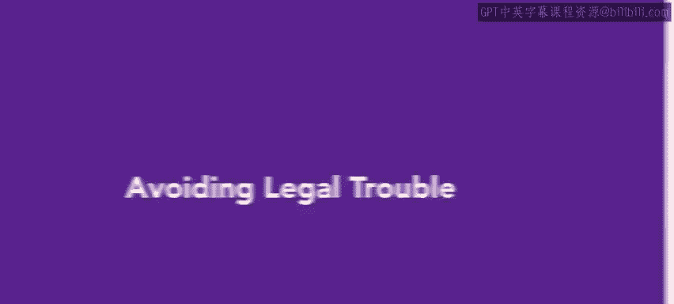
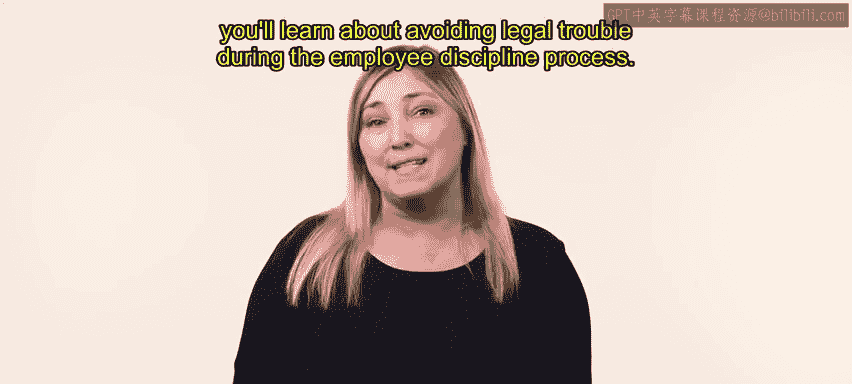
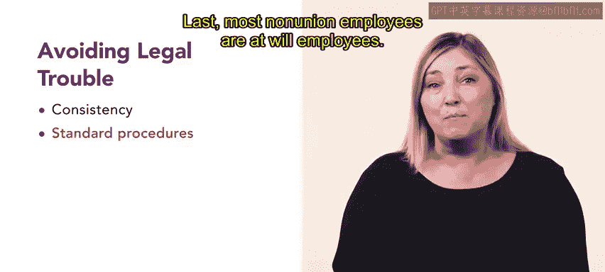
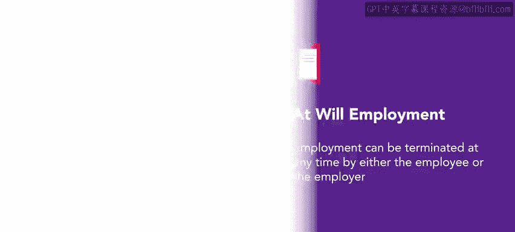
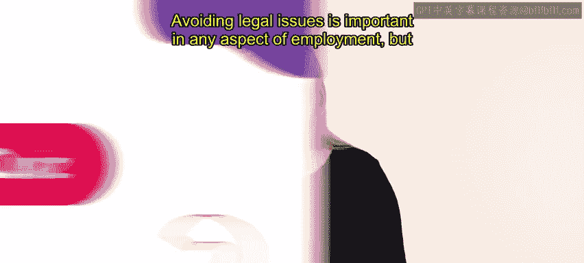
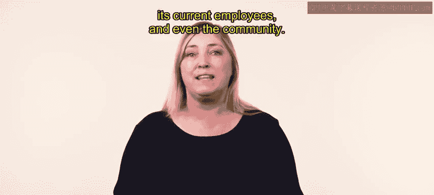

# HRCI《人力资源助理（员工关系、合规，4-5课／共5课）｜HRCI Human Resource Associate》 - P56：51_避免法律纠纷.zh_en - GPT中英字幕课程资源 - BV1qE4m19788

Numerous laws and court cases define actions and employers should avoid when handling employee discipline issues。

 keeping track of the various due's and dons can get tricky。 However。

 there are some basic principles that make the discipline process smoother。 in this video。

 you'll learn about avoiding legal trouble during the employee discipline process。

 to avoid legal trouble， the first principle is consistent。

 Disc up to and including termination should be consistent。 For example。

 if John at slice you receives a verbal warning for not helping clean the restaurant and kitchen at the end of their shift。

 then Jay should get the same discipline for the same offense。 Second。

 your organization should have a standard procedure for progressive discipline。

 particularly in the case of subpar work， an employee should first be warned about the problem and allowed to correct it before harsher sanctions are imposed。

 For example， when Jay was first hired as。

ICU they kept burning the pizzas They were distracted by customers and left the pizzas in the oven for too long。

 Jay's manager reminded them to provide friendly customer service。

 but to pay attention to the pizzas more closely， they also told Jay they would need to move to a different station if they continued to burn pizzas Jay improved so there was no need for further interventions。

😊，When addressing a union worker or other contract employee know the contract provisions before undertaking any disciplinary action Last。

 most non-union employees or at will employees， a legal termat will means employment can be terminated at any time by either the employee or the employer that does not mean at will employees can be terminated for any reason。

 however， all anti-discrimination laws apply， and an employee cannot be fired for refusing to do something that is against the law。

 for example， employees at slice you cannot be fired for refusing to serve alcohol to minors。

 even if their manager tells them to or threatens to terminate their position for disobedience。😊。

Selling alcohol to underage customers is against the law。

Avoiding legal issues is important in any aspect of employment。

 but it's especially so in a case of disciplining an employee adherence to the law establishes trust between the organization。

 its current employees and even the community。

