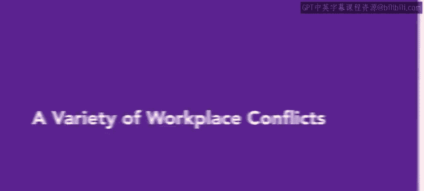
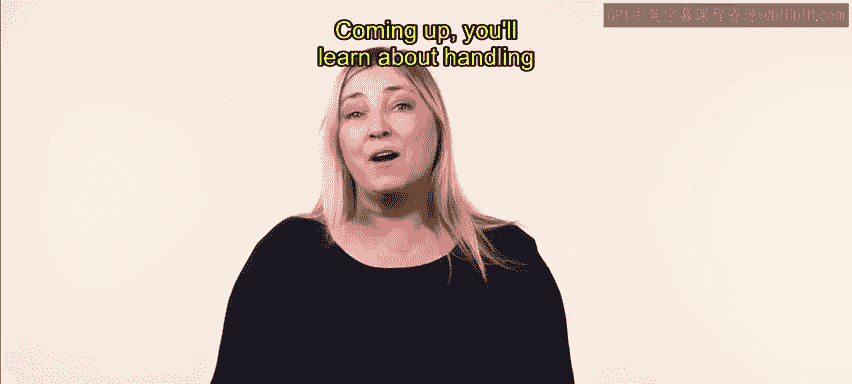

# HRCI《人力资源助理（员工关系、合规，4-5课／共5课）｜HRCI Human Resource Associate》 - P58：53_各种工作场所冲突.zh_en - GPT中英字幕课程资源 - BV1qE4m19788

Workplace conflict is not a one size fits all concept。

 it can involve a variety of issues and can manifest itself in a variety of ways in this video you'll learn about some key types of conflict in the workplace let's get started。

😊。

The first type of conflict you might experience in the workplace revolves around values in this type of conflict。

 employees allow their differing religious， moral， ethical。

 or political beliefs and practices to affect their opinions of and interactions with other colleagues。

 especially with those who hold opposing values The next type of conflict involves power。

 a power conflict stems from the desire to gain or maintain a sense of authority over one's colleagues。

 Often conflict arises because two or more individuals disagree about who should be in charge of a group。

 a project or a decision。😊，Conflict can also arise when two or more parties argue over monetary issues。

 including salaries and wages， benefits， allotment of resources， and payments to outside parties。

Successful organizations are built on clear rules and structure。

 but sometimes an issue at the leadership level will create conflict that manifests in other parts of the organization when employees spot cracks in the foundation。

 including disorgan， disloyalties and inconsistent and unfair application of policies and practices。

 conflict will appear in pockets throughout the organization。

 although most leaders are focused on the issues within their organizations。

 it is important to remain aware of external concerns that can produce unrest and disorder among employees。

 these externalities might include political issues such as a change in government leadership。

 recessions and other financial problems and issues surrounding an organization's clients。

 partners and competitors。😊，Interpersonal conflicts are the final type will review differences among individuals in professional or personal goals。

 work style and communication preferences can cause interpersonal conflict。

Interpersonal conflicts can involve parties both inside and outside the organization this type of conflict is quite common in organizations and can arise from a simple disagreement and then escalate。

😊，A worker might experience a conflict with their manager and supervisors， peers， subordinates。

 or customers and clients。

Knowing the different types of conflict will help you quickly identify， mitigate。

 or possibly prevent troublesome issues before they escalate Com up you'll learn about handling difficult people in the workplace。

