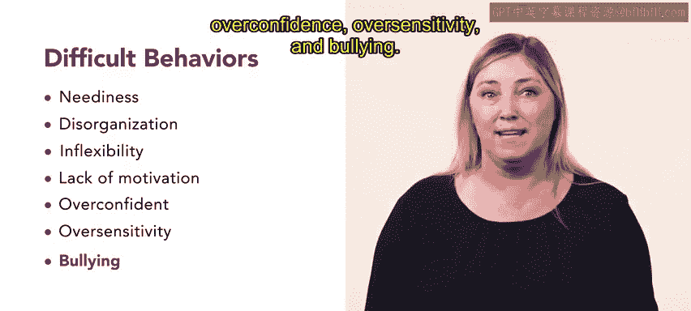
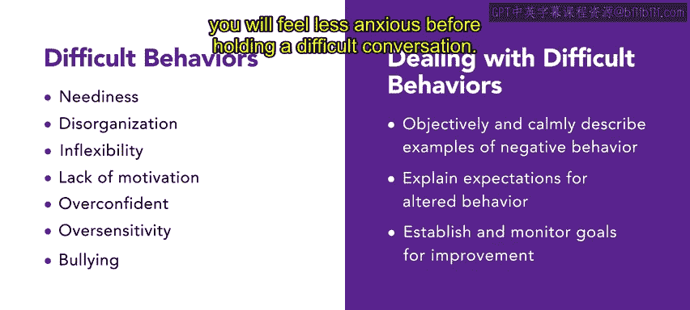
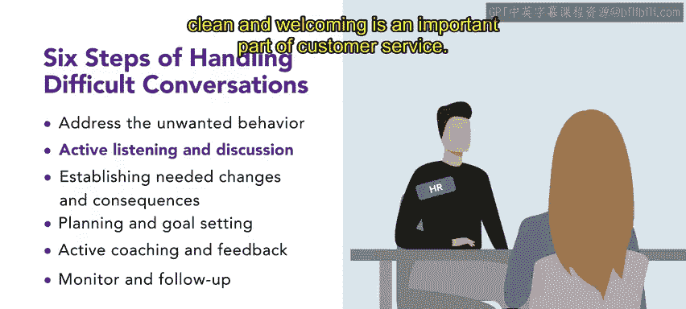
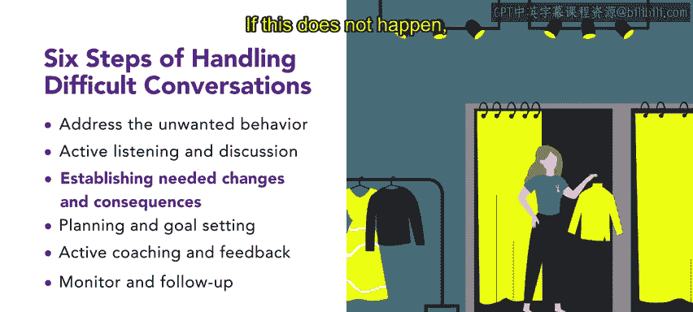
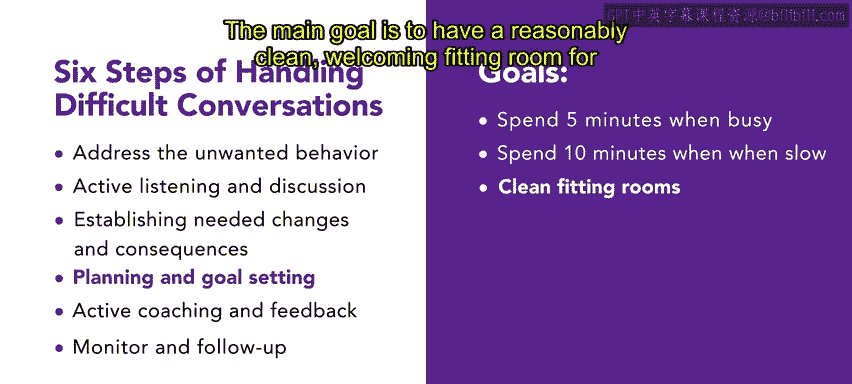
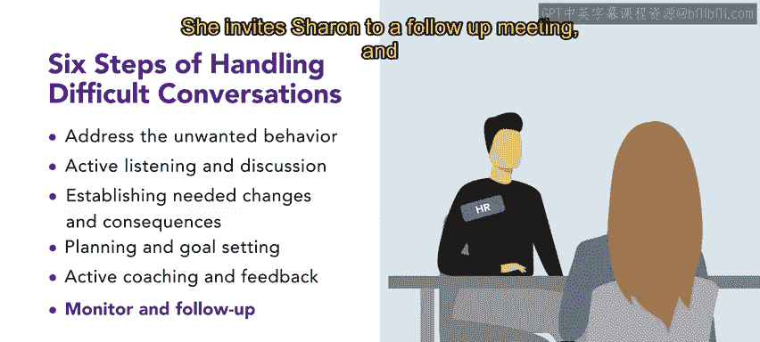
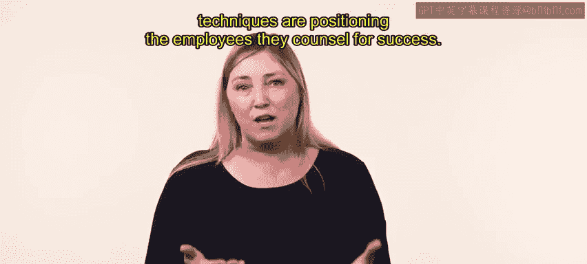
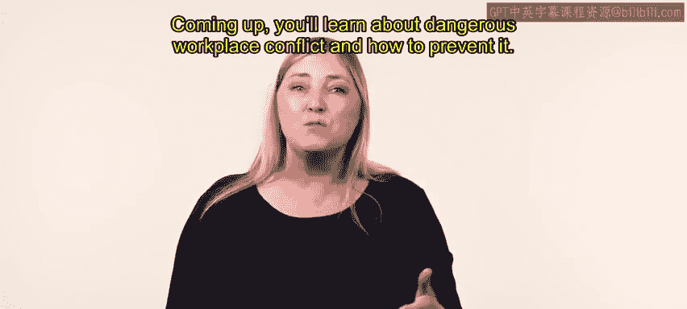

# HRCI《人力资源助理（员工关系、合规，4-5课／共5课）｜HRCI Human Resource Associate》 - P59：54_处理难相处的人.zh_en - GPT中英字幕课程资源 - BV1qE4m19788

Workplace conflict often results from troublesome， disruptive and counterproductive behavior by employees In this video。

 you'll learn about handling difficult people in the workplace to begin with a few examples of difficult behavior include neediness。

 disorganization， inflexibility， lack of motivation， overconfidence oversensitivity and bullying。

As an HR manager， you can deal with difficult behavior in a professional and effective manner First。

 you should objectively and calmly describe examples of negative behavior that were displayed by the employee Then you should explain the expectations for altered behavior Last you should establish and monitor goals for improvement。

😊，By following this approach， you will find it easier to give negative feedback and you will feel less anxious before holding a difficult conversation you can approach difficult behavior in a professional manner by following the six steps of handling difficult conversations。

The six steps of handling difficult conversations are address the unwanted behavior。

 active listening and discussion， establishing needed changes and consequences。

 planning and goal setting Act coaching and feedback and monitor and follow up。

 Let's review a six step process for difficult conversations。 We use urban attire as an example。

 Ne the HR associated urban attire has received a complaint from Avery about a coworker-er Sharon According to Avery。

 Sharon has not been resetting the fitting rooms after customers finish trying on their items。

 leaving clothing behind on the benches and hooks in each stall。😊。

Avery isn't sure how to approach the situation， so they've asked Neary for help。First。

 the unwanted behavior must be addressed。 So Neary schedules of meeting with Sharon。

 In their meeting， Neie makes sure to listen to Sharon。

 Sharon explains that when the store gets extra busy。

 it's difficult to keep up with resetting the fitting rooms。

 because as she returns the clothing into the sales floor， another customer often request help。

 Neary agrees about the challenge， but reminds Sharon that keeping the rooms clean and welcoming is an important part of customer service。

 Together， Neary and Sharon draft a plan for reasonable changes and the consequences if there is no progress。

 They agree that Sharon should reset the fitting rooms after each customer。

 even if it's simply taking the clothes out and putting them aside to re or put back out on the sales floor later。

 If this does not happen， they will have another conversation to discuss disciplinary measures。😊。

Nary and Sharon make a plan and set goals so that Sharon can succeed in their plan。

 Sharon will take at least five minutes after every customer to tidy up the fitting rooms during busy periods and at least 10 minutes during less busy times。

 The main goal is to have a reasonably clean， welcoming fitting room for the next customer。😊。

Throughout the next week， Neri coaches Sharon and offers feedback on her progress。 As time goes on。

 Sharon improves。 She is able to balance busy times with many customers and takes a few minutes to clean up after each one。

 She and Avery even start to work as a team。😊，After another week。

 Neri continues to monitor Sharon but offers less feedback。

 She invites Sharon to a follow up meeting and they both agree that a huge improvement has been made Through this discussion。

 the relationship between manager and employee must maintain professionalism and mutual respect。

 making sure that they do not allow emotions to guide their actions。

 managers who are enthusiastic and employ positive reinforcement will discover that their coaching is not only effective。

 but that it can also become an enjoyable experience。😊。

Managers or HR professionals who employ this six step process or other progressive techniques are positioning the employees they counsel for success。

😊。

Learning how to handle difficult people is an important skill that will help maintain positive connections in the team and the organization。

Coming up， you'll learn about dangerous workplace conflict and how to prevent it。

