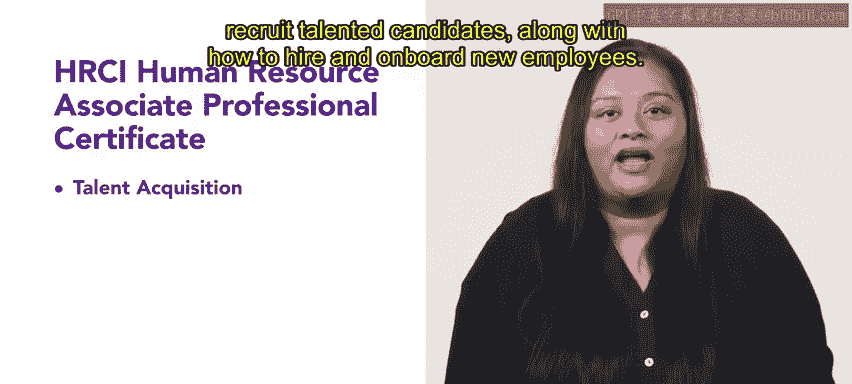

# HRCI人力资源助理专业证书课程：P0：课程介绍 🎯

在本节课中，我们将要学习HRCI人力资源助理专业证书课程的整体结构与核心内容。本课程旨在为你提供成为一名人力资源助理所需的专业技能，并帮助你为参加HRCI助理级人力资源专业认证考试做好准备。

---

## 课程概述

欢迎来到HRCI人力资源助理专业证书课程。你选择了迈向人力资源职业的道路，这令人振奋。本课程将重点培养你作为人力资源助理所需的实用技能。从事人力资源职业将使你能够引导他人完成其职业发展路径，并帮助你的组织打造一支强大的员工团队，从而实现蓬勃发展。

本课程也将为你参加HRCI助理级人力资源专业认证考试做好准备。

---

## 课程结构详解

上一节我们介绍了课程的整体目标，本节中我们来看看具体的课程模块安排。本证书课程共包含五个核心模块，每个模块聚焦于人力资源的一个关键职能领域。

以下是五个课程模块的详细介绍：

*   **第一课：人才招聘**
    本课程专注于人才招聘流程的各个方面。你将学习如何预测劳动力需求、寻找并招募优秀候选人，以及如何聘用新员工并使其顺利入职。

*   **第二课：学习与发展**
    本课程将概述在组织中创建有效培训的最佳实践。你将学习识别培训需求、实施培训的不同方法，以及如何评估培训计划的有效性。

*   **第三课：薪酬与福利**
    在本课程中，你将深入研究员工整体薪酬包的复杂性。这涉及构建薪酬策略和评估市场福利趋势。你还将学习不同的福利选项，以及如何评估不同的薪酬体系和人力资源技术。

*   **第四课：员工关系导论**
    我们将讨论如何创建和管理组织政策与程序。你将评估管理层与员工之间的价值观和态度，并学习适用于各级员工的绩效管理方法。

*   **第五课：合规与风险管理导论**
    最后一门课程通过审视风险评估和培养风险管理思维，介绍风险管理与合规策略。你将学习不同类型的合规要求，包括法律合规与安全合规，及其在运营政策中的作用。课程最后将探讨人力资源在组织重组中的角色。

---

## 总结与开始

本节课中我们一起学习了HRCI人力资源助理专业证书课程的全部五个模块内容，从人才招聘到合规管理，涵盖了人力资源助理的核心职责。我们有很多内容要学习，现在让我们开始吧。