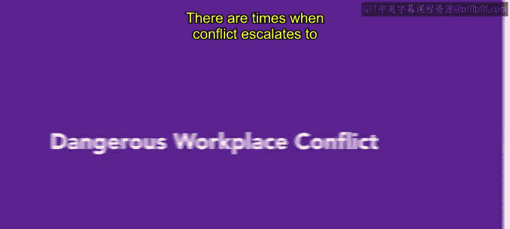

# HRCI人力资源助理课程：4-5：危险的工作场所冲突 🚨

在本节课中，我们将学习如何处理可能升级到危险级别的工作场所冲突。我们将了解危险冲突的形式、识别其预警信号，并探讨组织应如何制定政策与程序来预防和应对此类情况。

---

有时，冲突会升级到危及工作、福祉或安全的程度。

这种危险的冲突可能对组织产生毁灭性影响，分散其注意力和资源，甚至导致其停止运营。

在本视频中，你将学习如何处理危险的工作场所冲突。

当冲突威胁到工作场所中每个人的安全与保障时，无论他们是直接卷入其中还是不知情的旁观者，管理者都必须了解如何识别危险冲突的征兆，并制定明确的行动计划，在导致严重后果之前解决它。

---

危险冲突有多种形式。其范围从言语辱骂和威胁，到暴力行为，例如人身攻击甚至凶杀。

尽管暴力行为有时确实会出人意料地出现，但重要的是要理解，大多数有暴力倾向的人通常不会随意行事。往往存在一个攻击和报复的模式，最终以暴力行为告终。

以下是暴力行为的一些常见预警信号。

这些信号包括：
*   出勤率差和工作模式不一致。
*   注意力不集中和生产力下降。
*   破裂或不存在的职场关系。
*   个人卫生状况差。
*   行为不可预测。
*   有吸毒或酗酒的证据。
*   对枪支和暴力行为产生兴趣。
*   或表现出过度压力或抑郁的迹象。

---

上一节我们了解了危险冲突的预警信号，本节中我们来看看组织应如何从制度层面进行预防。

每个组织，无论其行业或规模如何，都应制定明确的政策和程序，以预防和处理暴力及其他危险的工作场所冲突。

首先，审查与工作场所安全相关的任何法律或政府发布的资源会有所帮助。

例如，在美国，1970年的《职业安全与健康法案》为在大多数私人和公共组织中创造和维持安全健康的工作条件提供了指导方针。

---

有了处理冲突的政策和程序，组织就可以努力预防危险冲突的发生，并在此类行为确实发生时减少责任风险。

---

有时，你可能需要引入外部帮助来协助化解激烈的冲突，尤其是在员工安全受到威胁时。

在处理危险的冲突情况时，管理者绝不应让自尊心左右他们的判断。

寻求其他管理者和员工的帮助或请求执法部门到场，并非软弱的表现。相反，这可能意味着生与死的区别。

---

接下来，你将学习如何预防工作场所暴力。

---

**总结**

本节课中，我们一起学习了危险工作场所冲突的严重性、其多种表现形式以及识别暴力行为的常见预警信号。我们还探讨了组织建立明确政策和程序的重要性，并强调了在处理高风险冲突时，管理者应保持理性，必要时果断寻求外部帮助。这些知识对于维护工作场所的安全与稳定至关重要。