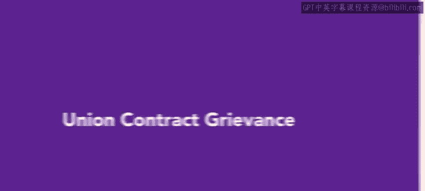
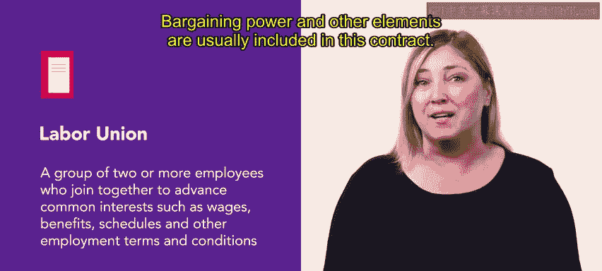
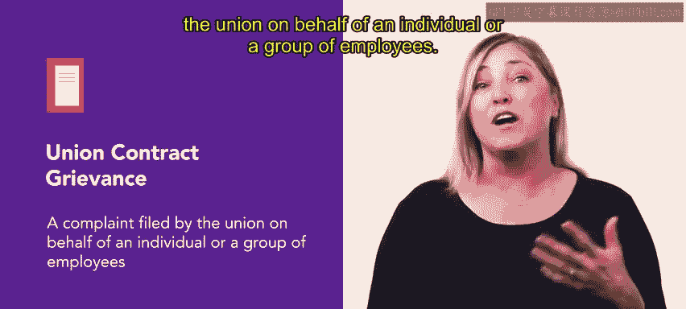
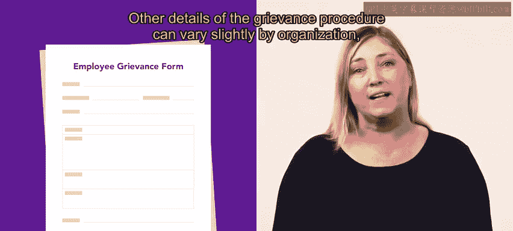

# HRCI人力资源助理（员工关系、合规）：4-5：工会合同申诉 📝

在本节课中，我们将学习工会合同申诉的相关知识。工会是美国职场的重要组成部分，理解申诉流程对于维护和谐的劳资关系至关重要。

## 工会的定义与作用

自20世纪30年代初以来，工会一直是美国职场的重要存在。它们是预防或缓解职场冲突的有效工具。

根据美国劳工部的定义，**工会**是由两名或以上员工组成的团体，他们联合起来以争取共同利益，例如：
*   工资
*   福利
*   工作时间安排
*   其他雇佣条款与条件

## 工会合同与申诉的引入

上一节我们了解了工会的基本定义，本节中我们来看看工会合同是如何运作的，以及申诉是如何产生的。

当员工群体组建工会并被雇主组织承认后，工会与组织会共同制定一份合同，详细规定工会的运作方式。这份合同通常包含**谈判权**和其他要素。合同一旦生效，双方都必须遵守其条款。

如果员工认为管理层错误地执行了合同条款，或曲解了其他成文的公司政策，他们可以提出申诉。**申诉**本质上是一种投诉，而解决申诉的过程被称为**申诉程序**。在工会化的工作场所，申诉通常由工会代表个人或员工群体提出。

以下是可能提出申诉的几种情况：
*   员工或员工群体感到自身利益因雇主行为受到负面影响。
*   合同条款遭到违反。
*   集体谈判协议或工会合同中规定的其他政策遭到违反。

偶尔，工会也可能代表所有员工提出全组织范围的申诉，但这种情况相对罕见。

## 申诉程序详解

了解了申诉的起因后，我们来看看标准的申诉处理流程是怎样的。

申诉有时可以口头提出，但更常见的做法是公司要求通过填写**申诉表**以书面形式提交。申诉程序的具体细节可能因组织而异，但大体框架相同。

第一步，工会代表向员工的直属主管提出申诉。

接下来可能发生三种情况：
1.  主管和工会代表可能认定申诉无效。
2.  主管可能提出一个能成功解决申诉的方案。
3.  可能无法达成令工会和员工满意的解决方案。

如果申诉在第一步未获解决，则进入下一步：将申诉提交给更高级别的管理层。如果在此级别达成满意解决，申诉程序终止；如果仍未解决，则按合同规定提交至下一个管理层级。

申诉流程将沿着管理链向上推进，直至问题成功解决。如果申诉在最高管理层仍无法解决，集体谈判协议通常规定将问题提交**仲裁**，仲裁员的决定对双方均具有约束力。

## 总结与展望

本节课中，我们一起学习了工会合同申诉的核心概念与标准流程。无论员工是否是工会成员，对工会合同申诉及其提交流程的基本理解，都有助于维护组织与员工之间的关系。

接下来，你将学习如何进行健康的职场对话。