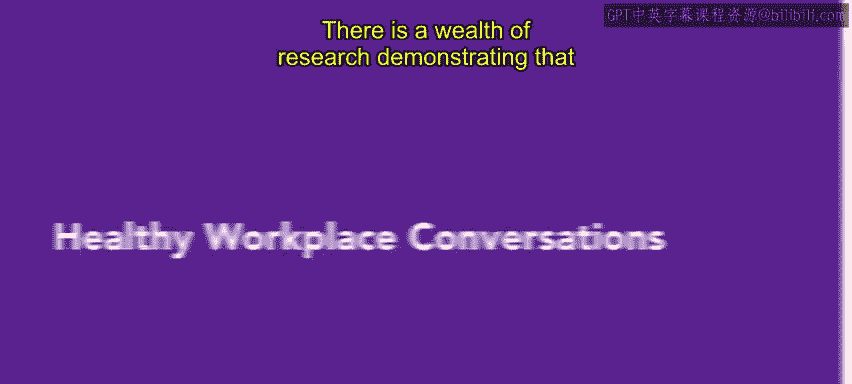
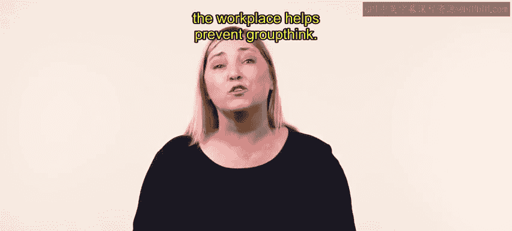
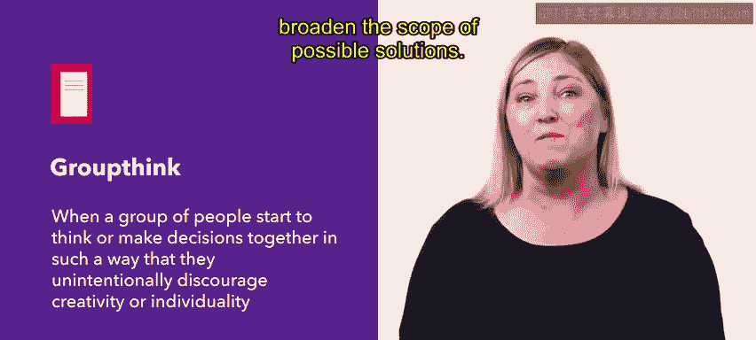
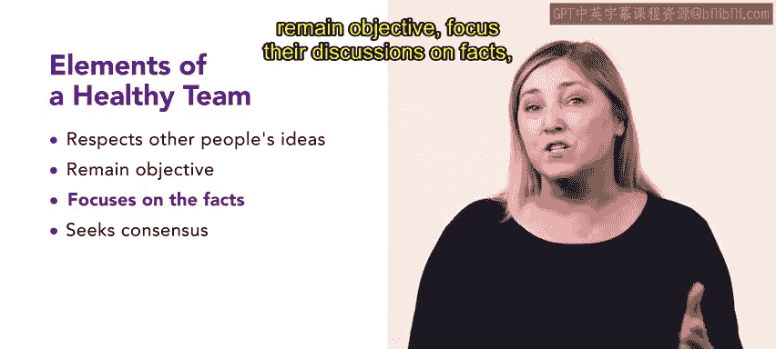
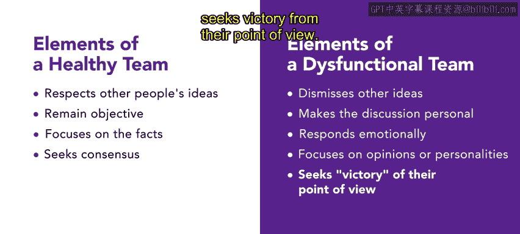
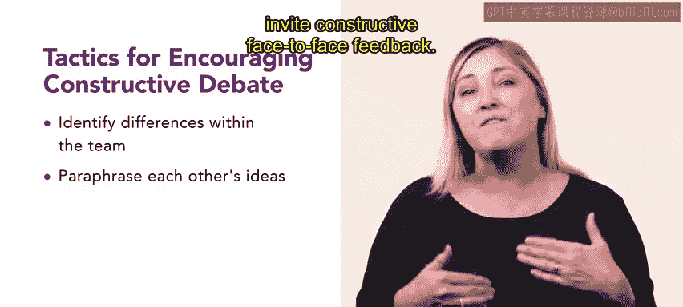
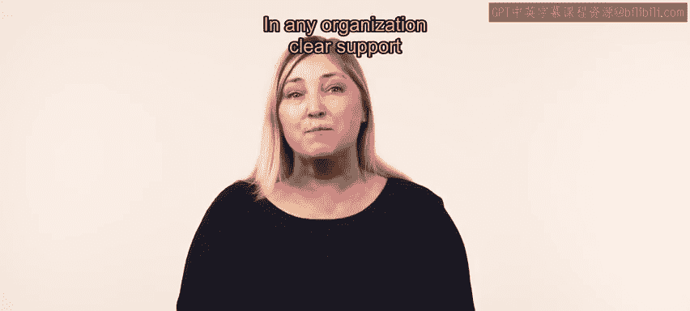
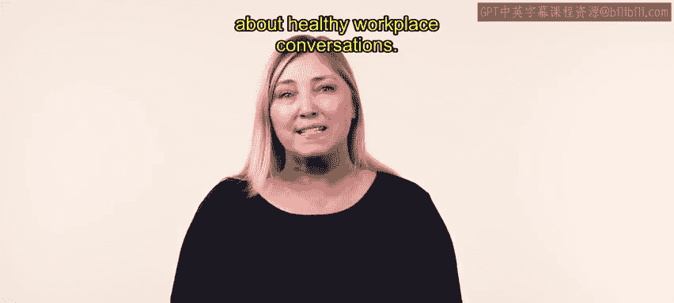

# HRCI《人力资源助理（员工关系、合规，4-5课／共5课）》：P63：健康的工作场所对话

## 概述
在本节课中，我们将要学习健康的工作场所对话如何支持组织的多元化和包容性。我们将探讨团队思维、建设性冲突以及如何通过有效的对话管理来激发团队的创造力与生产力。

---

大量研究表明，多元化和包容性的组织不仅更具创造力和创新性，而且生产力和盈利能力也更强。本视频将介绍健康的工作场所对话如何支持组织内部的多元化和包容性。

关于多元化和包容性的健康对话，以及将相关举措融入工作场所，有助于防止**群体思维**。群体思维是指一群人开始以某种方式共同思考或决策，以至于无意中扼杀了创造力或个性。

一个多元化且管理良好的团队，其创造力可以超越任何个人。我们广泛的能力、思维模式和经历，使得团队更不容易陷入群体思维，更有可能拓宽潜在解决方案的范围。

社会心理学告诉我们，人们常常感到被迫遵从群体决策，无论他们是否同意。成员们认为提出异议具有社交风险，因此在群体思维中，对一致性的渴望压倒了对不同个人观点的表达。成功的创意团队拥抱多样性，但这说起来容易做起来难。多样性的好处在于团队成员提供不同的视角，并在创意上相互推动。

然而，风险在于差异可能产生破坏性而非建设性的冲突，从而阻碍效率。尽管如此，专家们一致认为，一定程度的冲突能促进创造过程。在《哈佛商业评论》的一篇题为《管理团队如何能进行良性争论》的文章中，凯瑟琳·艾森哈特及其同事发现，具有高水平建设性、实质性冲突的技术公司最具创造力。

事实上，有几个要素可以表明一个团队是健康的还是功能失调的。

以下是健康团队的特征：
*   成员开放并尊重彼此的想法。
*   保持客观。
*   将讨论集中在事实上。
*   围绕共同目标寻求共识。

以下是功能失调团队的特征：
*   成员不承认甚至直接否定他人的想法。
*   使讨论个人化或情绪化回应。
*   关注意见或个性。
*   甚至在团队内部形成派系，寻求自身观点的胜利。

为了防止团队功能失调，并帮助对话保持健康高效，可以指定一名协调员或团队领导。协调员或团队领导的任务是引导团队进行实质性冲突，同时避免个人纷争。必须向团队明确说明哪些评论是允许的，哪些是不允许的。团队还应清楚如何挑战观点，而不是挑战人。

团队领导可以采用多种策略来鼓励建设性辩论。识别团队内部的差异有助于达成对所有视角的共同理解。团队成员也可以复述彼此的想法，并邀请建设性的面对面反馈。

另一种防止群体思维、鼓励健康工作场所对话的方法是**赋能**团队的所有成员。团队的有效性在很大程度上取决于其成员的赋能程度。当成员们有信心挑战传统智慧、蔑视传统思维，甚至无视现有规则时，团队就能利用其创造力来解决问题。如果团队成员不确信自己可以自由思考、公开表达，而不必担心审查或批评，团队就会不愿意接受这一使命。

在任何组织中，团队成员都应感到被赋能，可以不受约束地进行创造性思考。高层管理人员的明确支持对于传达这种感觉最为有效。

管理者与员工之间的健康工作场所对话可以支持组织的包容性和多样性。

## 总结
本节课中，我们一起学习了健康工作场所对话的重要性。我们了解到，通过促进多元化、管理建设性冲突、明确对话规则以及赋能团队成员，可以有效防止群体思维，激发团队的创造力和生产力，从而支持组织的包容性与多样性发展。