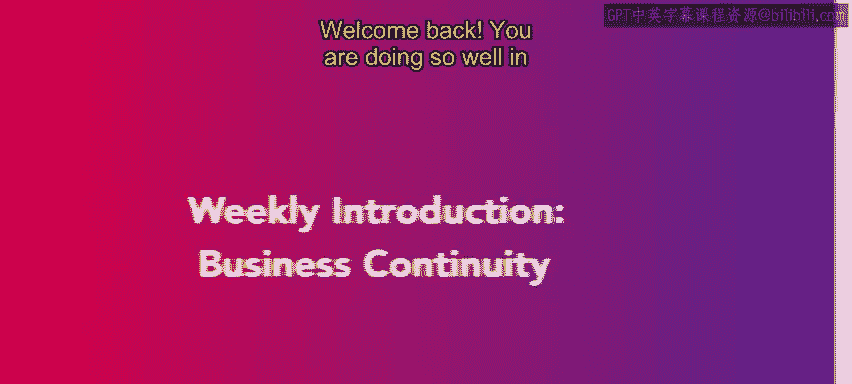
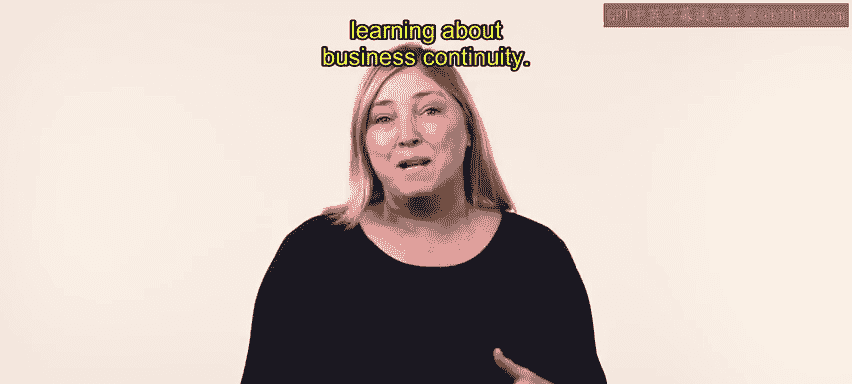
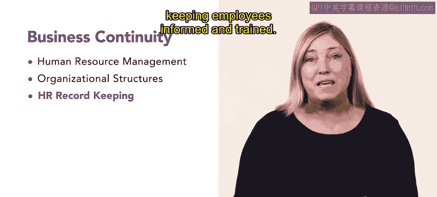

# HRCI《人力资源助理（员工关系、合规，4-5课／共5课）｜HRCI Human Resource Associate》 - P65：60_每周介绍：业务连续性.zh_en - GPT中英字幕课程资源 - BV1qE4m19788

Welcome back， you are doing so well in your journey to becoming an HR professional。

 keep it up in this week's lessons you will be learning about business continuity。

In the first lesson， you will review the basic goals of human resource management or HRM you'll review how to create goals for an entire HR department using the SMRT goals method。

You will also learn about management information systems and strategic planning。In the next lessons。

 you'll focus on organizational structures， this will include learning about functional organizations。

 the divisional model， matrix organizations and network organizations you will also review functional business areas and flexible work strategies。

😊，Finally， you will learn about HR record keepinging， including the four categories of HR documents。

 employees rights relating to records and relevant OSHA forms。

 then you will shift focus to keeping employees informed and trained Let's get started with this week's lessons as you progress towards your HR career。

😊。

