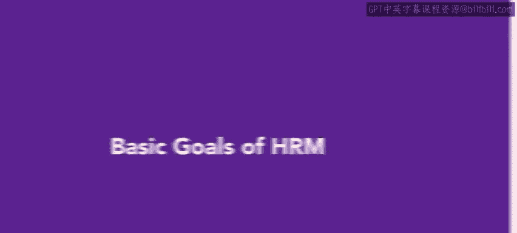
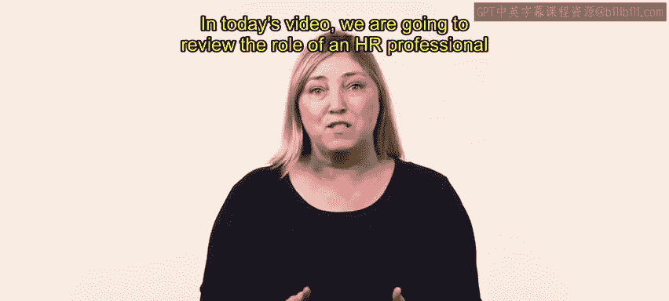
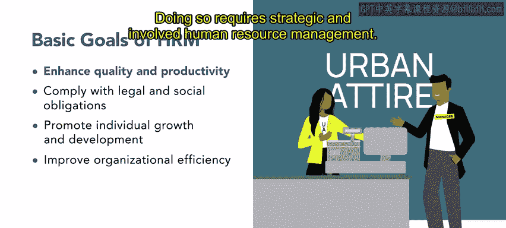
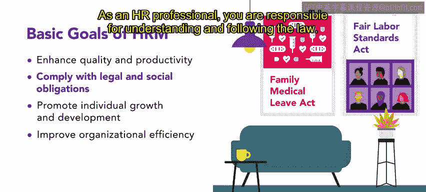
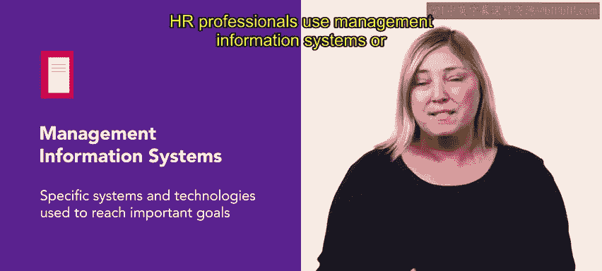
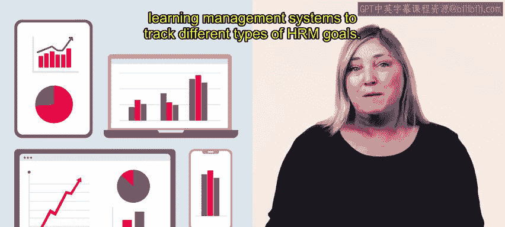
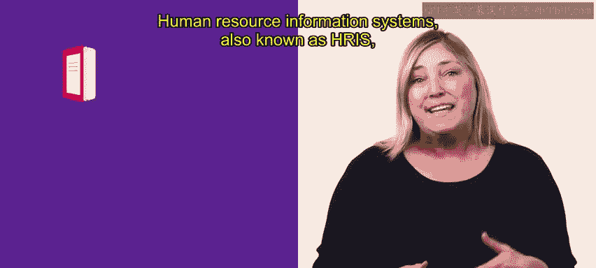
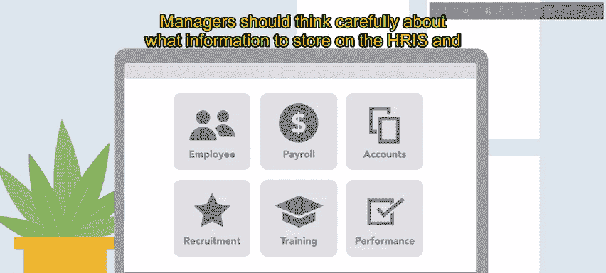
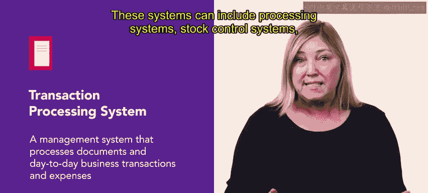

# HRCI《人力资源助理（员工关系、合规，4-5课／共5课）｜HRCI Human Resource Associate》 - P66：61_人力资源管理的基本目标.zh_en - GPT中英字幕课程资源 - BV1qE4m19788

In today's video we are going to review the role of an HR professional by exploring the basic goals of human resources management or HRM In your future role as an HR professional。

 you will have many goals related to HRM The first goal of HRM is to enhance quality and productivity。

A good manager works with employees to help maximize their productivity and the quality of their work。

Doing so requires strategic and involved human resource management。

The second goal is to comply with legal and social obligations as you'll recall from previous videos。

 there are many legal issues to think about in an HR role These issues include compensation。

 family and medical leave the Fair Labor Standards Act and much more as an HR professional you are responsible for understanding and following the law Another important goal is to promote individual growth and development training and development are meant to maximize the potential of an organization。

 but there is a clear distinction between the two Tra refers to activities that seek to enhance an individual's knowledge or skills so they can better accomplish their current job。

😊。

Development involves activities aimed at improving the skills of an employee so they can perform better in the future。

You will be responsible for understanding the difference and creating。

 promoting and implementing them within your organization。

 The last goal is to improve organizational efficiency。

 This goal is linked to the others as all of these goals are required to maintain an efficient organization。

😊，Efficient organizations are more productive and are better able to compete in their relevant markets。

HR professionals use management information systems or specific systems and technologies to reach important goals。

These computerized information processing systems allow HR professionals to collect and analyze data related to organization and employee performance。

This data encourages better decision making and organizational management。

HR professionals may also use human resource management systems， transaction processing systems。

 and learning management systems to track different types of HRM goals。

Human resource information systems， also known as HRIS。

 are a powerful way to improve efficiency because they use technology to streamline many time consuming HR responsibilities。

Timekeeping， payroll， scheduling， recruiting， workforce planning， benefits eligibility。

 and more can be coordinated through an HRIS These systems allow HR managers to store。

 organize and easily access employee information and also reduce the space necessary for physical files。

😊，When implementing an HRIS， it is important to think about how the system will integrate into ongoing work practice。

Managers should think carefully about what information to store on the HRIS and who will have access to it a transaction processing system is a management system that processes documents and day to day business transactions and expenses。

 including simultaneous and large volume transactions。

These systems can include processing systems， stock control systems， and payroll systems。

As an HR professional， you will have a series of goals to accomplish these will include enhancing quality and productivity。

 complying with legal and social obligations， promoting individual growth and development。

 and improving organizational efficiency。You can use management information systems。

 human resource information systems， and transaction processing systems to help achieve your goals。

Up next， you will further enhance your knowledge of goals by reviewing and setting SM goals。😊。

