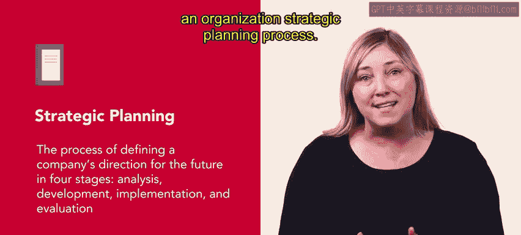
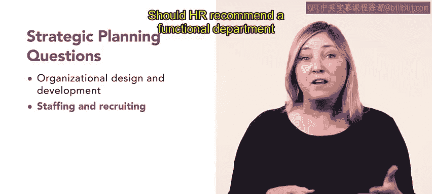

HRCI人力资源助理课程：4-5：战略规划

在本节课中，我们将学习人力资源在组织战略规划，特别是在分析阶段所扮演的角色。我们将了解战略规划的过程，以及人力资源部门如何通过审计和分析来支持组织的战略方向。

上一节我们介绍了目标设定和管理信息系统，本节中我们来看看人力资源在战略规划中的角色。

战略规划是为公司未来定义方向的过程，包含分析、制定、实施和评估四个阶段。人力资源在整个组织的战略规划过程中扮演着重要角色，因为它负责人力资源管理。

将人力资源部门整合到组织的战略规划工作中至关重要，尤其是在未来组织计划涉及并购时。人力资源必须对组织以及任何潜在的并购目标进行审计。

根据商业教授大卫·乌尔里奇的观点，组织审计评估六个重要的组织特征。以下是这些特征：
*   **共享思维模式**：组织是否拥有相同的使命和目标。
*   **能力**：组织内存在哪些知识、技能和能力。
*   **结果**：绩效管理结构是怎样的。
*   **治理**：当前的组织结构、沟通系统和政策是什么。
*   **工作流程与变革能力**：组织是否具备改进、变革和学习的能力与意愿。
*   **领导力**：领导者是谁，他们在组织中的角色和价值观是什么。

评估这些特征后，人力资源管理可以确定组织变革（如并购）将如何影响组织，并实施任何必要的调整。通过这个审计过程，人力资源管理也能解答关于组织当前业务和使命的问题。

人力资源管理也可以协助其他审计过程。人力资源管理可以解答的问题类别之一是关于组织当前的业务和使命。例如，考虑两家汽车制造商：现代和法拉利。现代将自己定义为为预算有限的人群制造优质、实惠产品的公司。法拉利则根据其与限量版公路和赛道车辆相关的工艺和卓越性来定义自己。两家汽车制造商都处于汽车市场，然而，现代以优质实惠的汽车瞄准大众市场，而法拉利则瞄准专属奢侈品市场的消费者。

了解企业当前的使命和价值观有助于指导组织的未来计划，并指出弱点所在。

第二类战略规划问题旨在发现内部属性与外部市场机会，通常在此阶段使用**SWOT分析**或**波特五力模型**。我们将在本课后面更详细地学习这些。

这个发现过程使组织的领导者能够 pinpoint 其能力和成本效益，同时找到销售组织产品或服务的外部机会。例如，现代汽车价格低廉但制造能力强，可能吸引美国注重成本的购车者。

第三类战略规划问题聚焦于人力资源实践将如何增加组织的竞争优势。

所采用的策略可以适用于整个组织，也可能针对主要业务部门甚至每个部门有独特的方法。

这些问题涉及以下主题：
*   **组织设计与开发**：组织新的总体战略方向应该是什么？人力资源如何支持它？
*   **人员配置与招聘**：现有员工能否执行战略方向？是否需要新员工？人力资源是否应建议将某个职能部门外包或离岸？
*   **学习与发展、绩效与奖励**：应在组织的各个层面（包括人力资源在培训、基准和员工激励方面）采取哪些战略步骤？这些战略步骤将如何实施？

作为人力资源专业人士，您将通过进行和分析此类审计的结果来为战略规划过程做出贡献。您还将负责通过预测执行未来计划所需的技能和知识，以及通过招聘来满足这些需求，帮助实施组织的战略愿景。

接下来，我们将更详细地探讨不同的分析审计方法。

本节课中我们一起学习了人力资源在战略规划分析阶段的核心作用，包括组织审计的六个特征、三类战略规划问题，以及人力资源专业人士如何通过审计和人才规划来支持组织的战略方向。