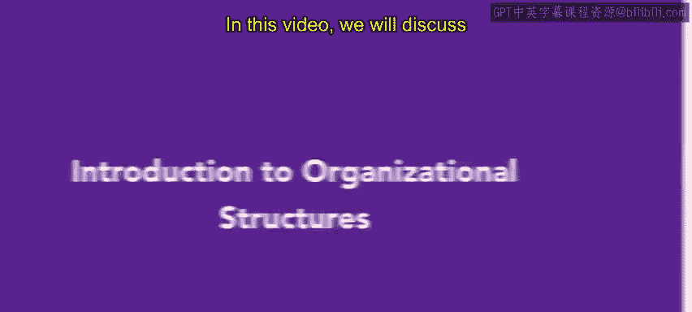
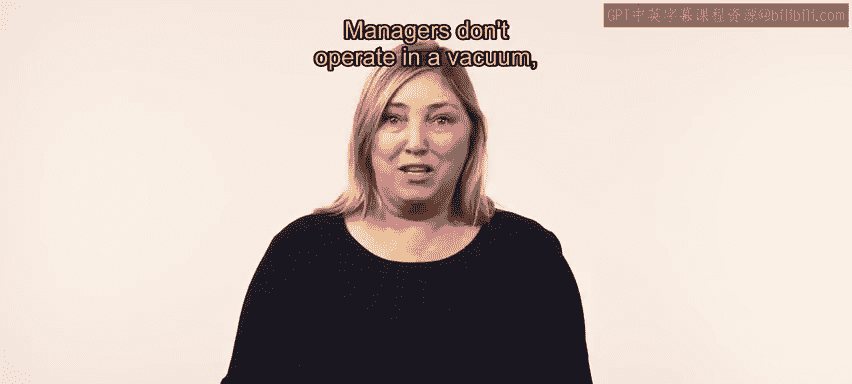
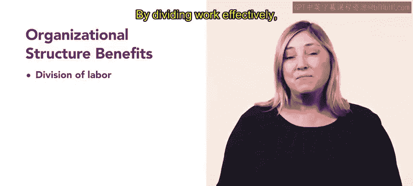
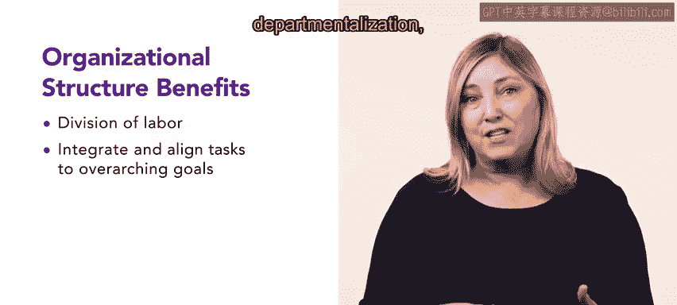
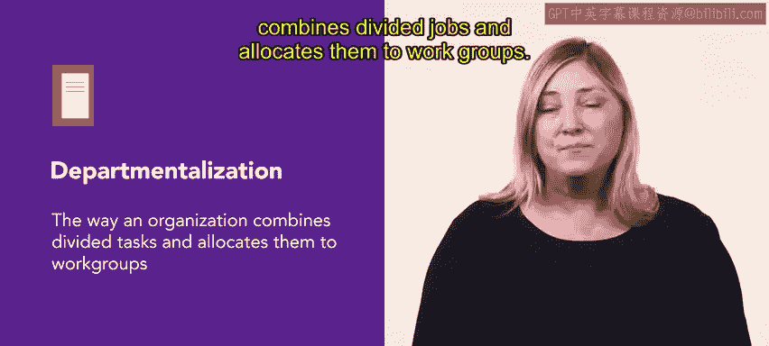
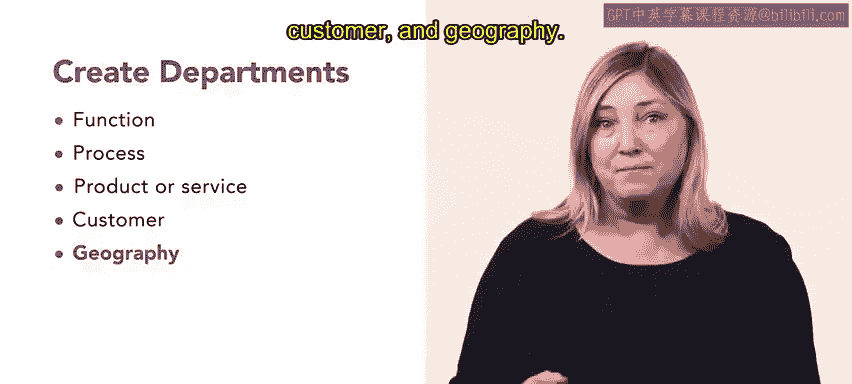
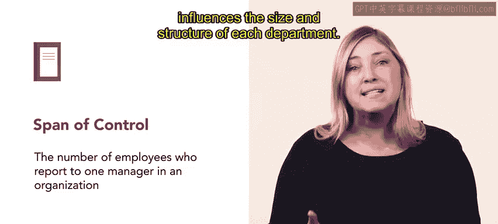
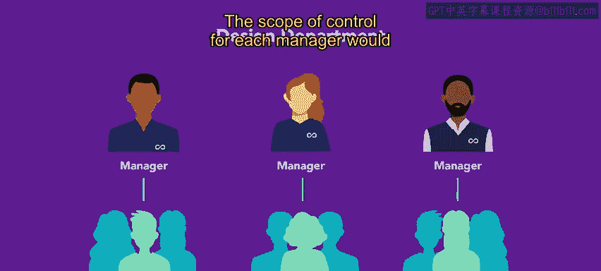
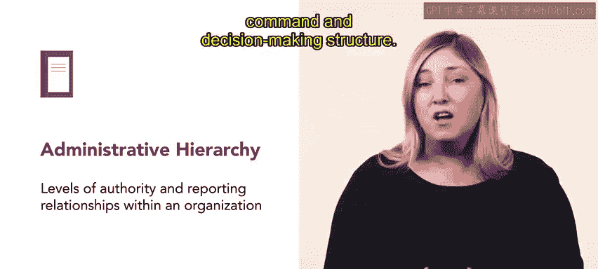
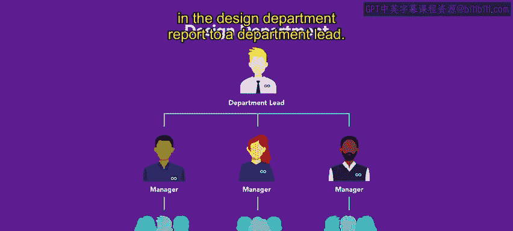

# HRCI《人力资源助理（员工关系、合规，4-5课／共5课）｜HRCI Human Resource Associate》 - P69：64_组织结构简介.zh_en - GPT中英字幕课程资源 - BV1qE4m19788

In this video we will discuss organizational structure and how it helps create successful organizations。

 we will explore key concepts such as departmentalization， division of labor。

 and Sp of control and how each element shapes organizational structure。😊。

Managers don't operate in a vacuum， rather they work in an organizational setting。

 organizational structure refers to the way that employees and processes are grouped into departments or functions in an organization。

Organizational structure also includes the reporting relationships between employees， managers。

 supervisors and others organizational structure is necessary for the organization to do its work successfully organizational structure serves two primary purposes。

😊，First， it accounts for the division of labor the division of labor assigns different jobs and responsibilities to individuals within the organization。

 an effective division of labor allows for efficient labor usage。

 standardization of work processes and reduce training costs。

By dividing work effectively， an organization may create job specialization。

 which allows for greater work efficiency。 Jo specialization defines jobs as narrowly as possible。

 which creates streamlined tasks and highly skilled workers。😊。

Other job specialization results in well defined repetitive tasks such as car assembly lines。

 however， excessive specialization may cause work to become tedious and uninteresting。

 so an organization should be aware of this potential downfall。

The second benefit of organization structure is that it helps integrate and align individual jobs with overarching business goals。

Organizations use three basic methods to coordinate the individual jobs， departmentalization。

 span of control and administrative hierarchy let's start with departmentalization departmentalization refers to the way an organization combines divided jobs and allocates them to work groupss organizations create departments in five common ways。

 function， process， product or service， customer and geography for example。

 function based departments would be dividing the organizations based on the business function each department serves such as HR marketing and sales。

If an organization departmentalizes based on product。

 they create teams that focus on each of the products they offer。

 we will explore these five ways and more details later in the lesson。

Span of control is another method to organize structure within an organization The span of control is a number of employees who report to one manager in an organization。

 the more people that a manager supervises， the wider their span of control。

 a narrow span of control means that a manager supervises fewer employees or leads a smaller department with focused and specialized tasks。

😊，In this way， the span of control influences the size and structure of each department。

For example， in the design department， there might be three managers。

 each leading a small team that is tasked with a specific design task， such as social media content。

 product design or website design the scope of control for each manager would only span the members of their specific team administrative hierarchy refers to the levels of authority and reporting relationships within an organization it establishes the chain of command and decision making structure。

For example， the individual managers in the design department report to a department lead。

You have just learned how organizational structure is the foundation for effective organizations。

 it establishes the relationships， tasks， reporting and authority necessary for an organization to function。

 departmentalization， division of labor， span of control。

 and administrative hierarchy are all interconnected components that build upon this organizational structure。

By understanding and optimizing these elements， organizations can enhance employee effectiveness and efficiency。

