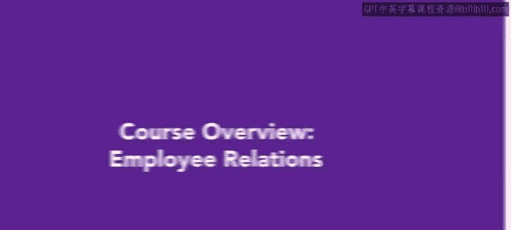
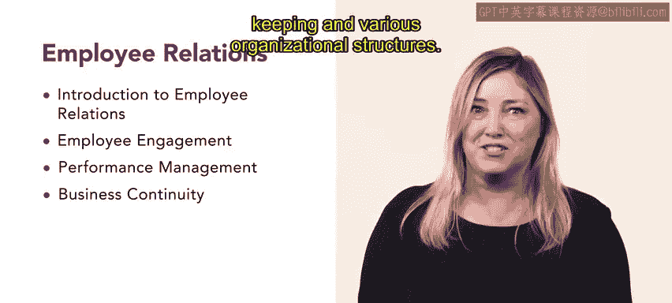

# HRCI《人力资源助理（员工关系、合规，4-5课／共5课）｜HRCI Human Resource Associate》 - P6：1_课程概述：员工关系.zh_en - GPT中英字幕课程资源 - BV1qE4m19788

Hello， welcome to employee relations， the fourth course in the Human Resource Asiate Professional certificate program。

 The fourth course in this program is focused on how an organization relates to and interacts with its employees Employee relations is an important part of the APHR exam accounting for 24% of the exam In the first week we will begin with an introduction to employee relations you will learn about an organization's mission。

 vision， ethics and values we will also discuss company communications and handbooks In the second week。

 we move on to employee engagement you'll learn how to create an inclusive culture and inclusion initiatives You'll also learn how to evaluate employee engagement。

😊。

The third week continues with performance management。

 You'll learn about performance appraisal methods， as well as how to handle workplace discipline。

 Disal and conflict。 Finally， in the fourth week will discuss business continuity。

 We'll explore human resource management or record keepingeping and various organizational structures。

 This course， like the previous courses， contains lessons with multiple videos。

 reading and activities。 you'll find real world examples to help you understand how concepts might appear in a true to life scenario。

 There are quizzes， exercises and projects to help you practice your skills。😊。

Employee relations is an important facet of HR work。

 This course will help you understand how employee relations might impact your future role as an HR professional。

 Let's get started。😊。

