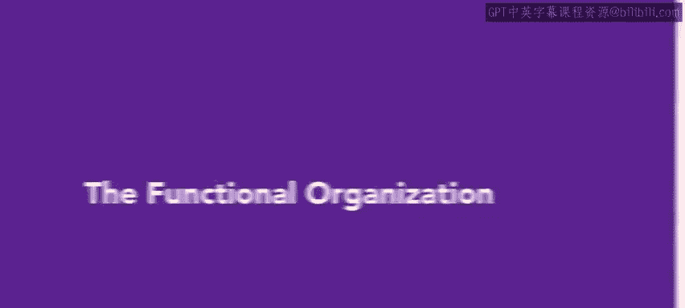

# HRCI《人力资源助理（员工关系、合规，4-5课／共5课）｜HRCI Human Resource Associate》 - P70：65_职能型组织.zh_en - GPT中英字幕课程资源 - BV1qE4m19788

In today's video， we will explore the functional organization structure and how it influences relationships between employees and departments let's get started。

Functional structure refers to a department or division where people have similar specialties or skills。

 such as the accounting or IT department in an organization。Let's use Connective。

 a B2B telecom company to illustrate this。With 350 employees。

 Connective follows a functional organizational structure that ensures efficient operations and effective coordination。

Various departments within Connective contribute to the company's success these departments include sales。

 marketing， operations， accounting， human resources， IT， and research and development。

Let's examine the sales department at Connective。This department includes all sales representatives and executives responsible for driving sales and managing client relationships。

Each team member has specific goals and objectives aligned with their respective functions by grouping employees based on their sales expertise。

 Connective ensures a focused and specialized approach to sales activities。😊。

This arrangement results in streamlined operations。

 improved productivity and enhanced customer service All sales employees at Connective have a clear reporting structure within the department。

😊。

Employees report to the respective team managers and the team managers in turn report to the sales department manager。

This streamlined hierarchy promotes clear lines of authority。

 enabling efficient decision making within the specialized sales area This structure provides employees with guidance and feedback and enables them to collaborate effectively。

😊。

While functional organization brings several advantages to Connective。

 it's crucial to acknowledge potential drawbacks One challenge is a limited communication between departments。

 which can affect collaboration and information sharing to mitigate this risk。

 Connective promotes interdepartmental communication and encourages teamwork。

You have now learned that a functional organization allows for clear hierarchy， specialization。

 and effective coordination within each department。

The functional organizational structure offers a valuable framework that groups employees based on their skills and ensures a streamlined system。

😊。

