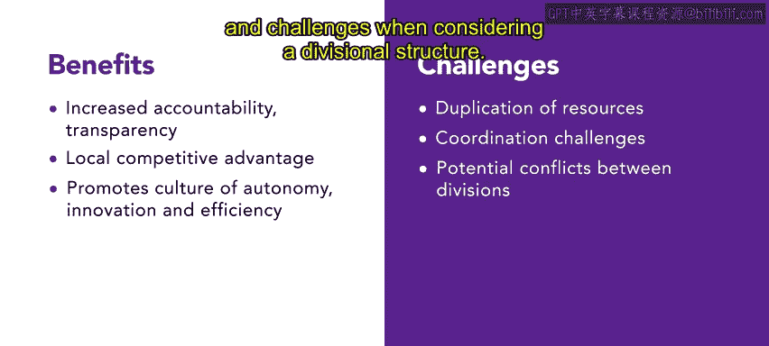

# HRCI《人力资源助理（员工关系、合规，4-5课／共5课）》：P71：事业部制模型 🏢

在本节课中，我们将要学习一种不同于传统职能型组织的结构——事业部制模型。我们将了解它的定义、特点、优势与挑战，并通过一个具体案例来加深理解。

## 概述

许多组织拥有诸如市场、销售和行政等独立的职能部门。然而，事业部制组织采取了不同的方法。它不依赖于职能部门，而是根据特定的产品、服务或区域来组建团队。

## 什么是事业部制结构？

上一节我们提到了事业部制与传统结构的区别，本节中我们来看看它的具体定义。

事业部制组织结构是一种框架，它将员工根据其服务的**产品、服务或区域**进行分组，而不是根据他们的职能角色。

每个事业部都拥有一套完整的功能，包括会计、销售、市场等。这种结构主要有利于那些在多个区域运营、服务不同市场或管理多种产品的公司。它使员工能够集中注意力，并为特定需求定制策略。

## 案例：SliceU披萨连锁店

为了更直观地理解，我们来看一个具体的例子。以下是SliceU公司的案例说明。

*   **公司背景**：SliceU是一家知名的披萨连锁店，在全国各地的大学校园附近设有便利的门店。
*   **组织结构**：SliceU采用事业部制组织结构，根据其服务的不同大学校园创建独立的事业部。
*   **事业部职责**：每个事业部负责管理和向其特定位置的学生提供优质的披萨，并由其专属的市场和运营团队领导。
*   **结构优势**：这种事业部制结构使SliceU能够确保高效运营、开展有针对性的营销活动，并为每个大学校园的学生提供个性化服务。

## 与传统职能型结构的对比

了解了事业部制的运作方式后，我们将其与传统的职能型结构进行对比。

如果SliceU采用职能型结构，它将拥有独立的市场部、销售部和行政部来负责所有门店。然而，在职能型结构中，协作和专业化可能受到限制，SliceU的营销活动可能无法针对每个地点的具体需求进行专门定制。

相比之下，事业部制结构使SliceU能够定制其菜单、营销策略和运营方式，以满足每个大学校园的独特需求，从而提高了客户满意度。

## 优势与挑战

每种组织结构都有其利弊。本节我们来总结一下事业部制的主要优势与可能面临的挑战。

**优势**：
*   **提高问责制与透明度**。
*   **获得本地化竞争优势**。
*   **促进自主、创新的文化**。
*   **高效扩展市场供给**。

**挑战**：
*   **可能导致资源重复**。
*   **带来协调上的挑战**。
*   **可能引发事业部之间的潜在冲突**。

因此，每个组织在考虑采用事业部制时，都应权衡其益处与挑战。

## 总结

本节课中，我们一起学习了事业部制模型。这种独特的方法通过按产品、服务或区域划分团队，改善了协作，并释放了员工技能的全部潜力。通过采用事业部制模型，组织可以战略性地调整其资源，并促进跨职能协作，从而提升生产力和成功率。