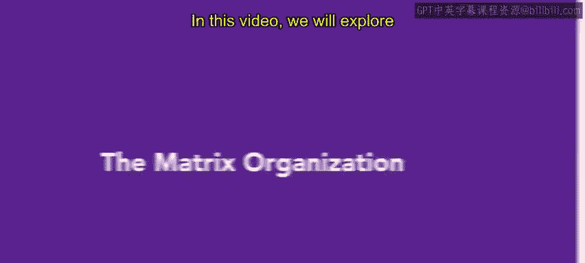
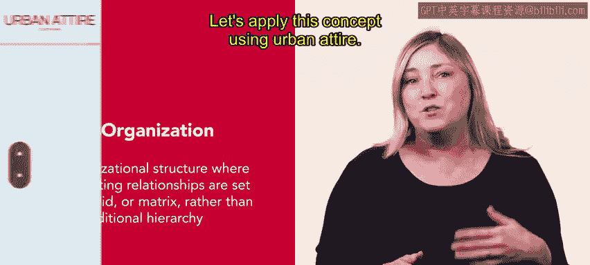
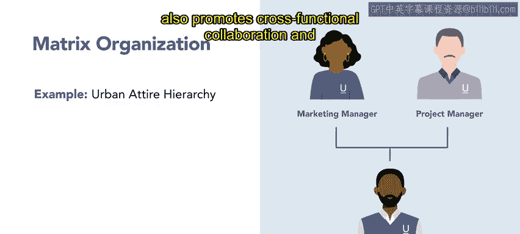
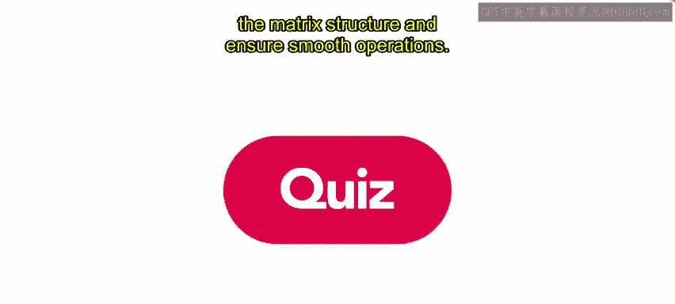

# HRCI《人力资源助理（员工关系、合规，4-5课／共5课）》：P72：67_矩阵型组织

在本节课中，我们将探讨另一种重要的组织结构——矩阵型组织。课程结束时，你将理解矩阵型组织的定义及其运作方式。

## 🏗️ 什么是矩阵型组织？

矩阵型组织是一种组织结构，其报告关系被设置为网格或矩阵形式，而非传统的层级结构。

这种结构超越了单一部门的界限，鼓励团队与个人之间的协作与思想交流。它使员工能够增长知识、拓宽技能，并为超出其直接部门范围的项目做出贡献。

## 🧥 矩阵型组织实例分析

为了更直观地理解，我们以一家专注于现代都市休闲服饰的企业“都市风尚”为例进行分析。

在“都市风尚”的矩阵型组织中，一位市场营销专员隶属于市场部，并向其直属上级——市场经理汇报。

然而，该专员也可能被分配到特定的项目或营销活动中。在这种情况下，他/她还需要向负责该具体任务的项目经理汇报。

**组织结构关系可以表示为：**
`员工 -> 职能经理（如：市场经理）`
`员工 -> 项目经理（如：特定活动项目经理）`

这种设置确保了市场营销专员能够将其专业知识贡献到更多的企业活动中。它促进了跨职能协作，并最大化了专员对组织的影响力。

## ⚠️ 矩阵型组织的挑战与应对

尽管矩阵结构带来诸多好处，它也伴随着挑战。双重汇报关系可能导致角色模糊，并为员工（如“都市风尚”的市场专员）带来潜在的冲突。

那么，如何应对这一挑战呢？以下是几个关键措施：

*   **清晰的沟通**：确保信息在职能经理、项目经理和员工之间透明、顺畅地流动。
*   **明确的角色与职责**：在项目开始时，就清晰地界定每个人的任务、权限和汇报线。
*   **有效的冲突解决机制**：建立正式的流程，以快速、公正地解决因双重领导可能产生的分歧。

通过实施这些措施，组织可以驾驭矩阵结构的复杂性，确保运营顺畅。

## ✅ 总结

本节课我们一起学习了矩阵型组织。通过采用矩阵结构，像“都市风尚”这样的组织能够跨多个项目和活动充分利用员工的技能，并优化资源配置。其核心在于打破部门墙，通过**双重汇报关系**（`员工 -> 职能经理 + 项目经理`）来促进协作与灵活性，但同时需要配套的管理措施来应对可能的挑战。

