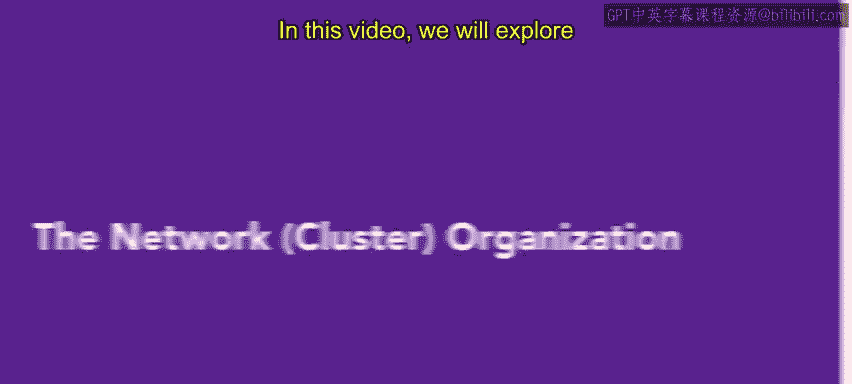
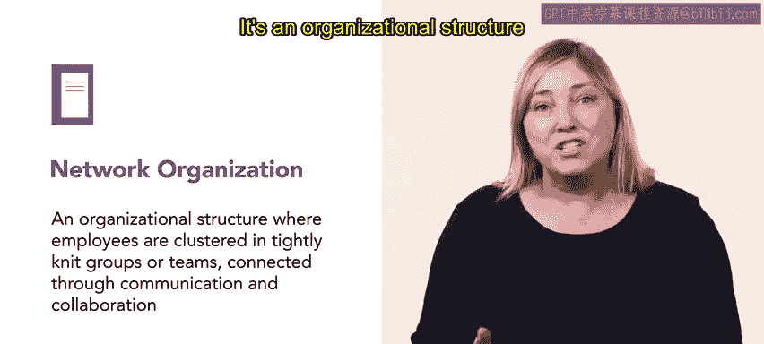
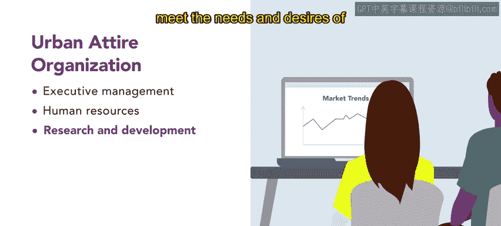
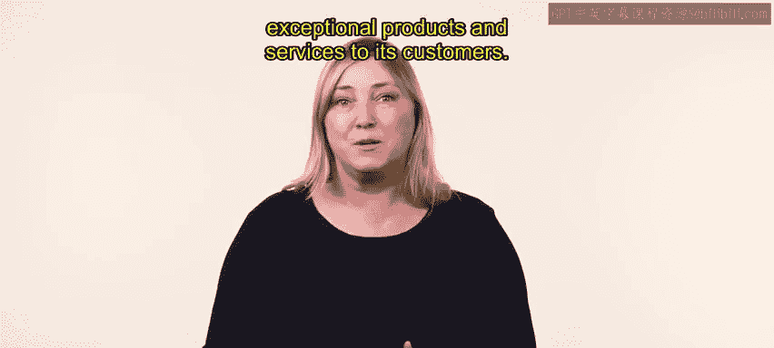
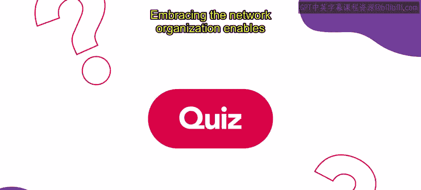

# HRCI《人力资源助理（员工关系、合规，4-5课／共5课）》 - P73：68_网络集群组织

在本节课中，我们将要学习**网络组织**的概念。我们将以之前了解过的品牌“Urban Attire”为例，阐述其不同部门如何通过协作与沟通来共同推动公司成功。

## 什么是网络组织？🤔

上一节我们介绍了本节课的主题。本节中，我们来看看网络组织的具体定义。

网络组织是一种组织结构，其特点是员工被组织成紧密联系的**小组或团队**，并通过沟通与协作相互连接。其核心关系可以表示为：

**网络组织 = 紧密联系的团队 + 持续的沟通与协作**

## Urban Attire的部门互动 🔄

理解了基本概念后，我们以Urban Attire公司为例，具体分析其执行管理、人力资源、研发以及销售与市场部门是如何互动的。

以下是各部门协作关系的具体说明：

*   **执行管理部门**：该部门负责设定公司的战略愿景和发展方向。他们会与人力资源部门协作，招募和培养支持公司目标的人才。

*   **人力资源部门**：该部门与研发部门紧密互动。这种协作确保公司能够吸引并留住创新型员工，同时培育一种注重创造力和持续改进的文化。

*   **研发部门**：该部门致力于持续创新，并与销售和市场部门合作。他们共同了解市场趋势、收集客户反馈，并开发出符合目标受众需求和期望的产品及营销策略。

## 网络组织的优势 💪

通过以上实例，我们看到了部门间的具体协作。那么，采用这种网络组织模式能为公司带来哪些好处呢？

通过拥抱网络组织模型，Urban Attire创造了一个充满活力且相互关联的环境。在这里，知识得以共享，团队为实现共同目标而协作。这种组织结构使公司能够快速适应市场趋势，促进创新，并为客户提供卓越的产品和服务。

## 总结 📝

本节课中，我们一起学习了网络组织的核心概念及其运作方式。

拥抱网络组织能使公司充分利用各部门的集体智慧和专业知识。通过有效的沟通与协作，公司可以保持敏捷与创新，从而在快节奏的市场中蓬勃发展。