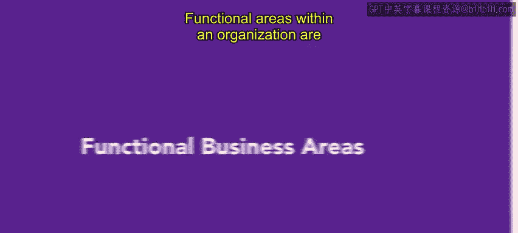
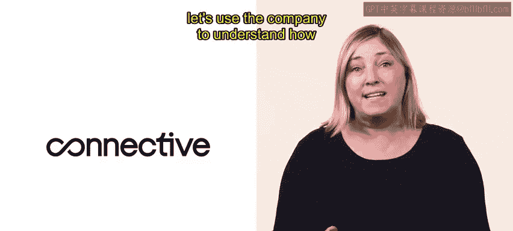
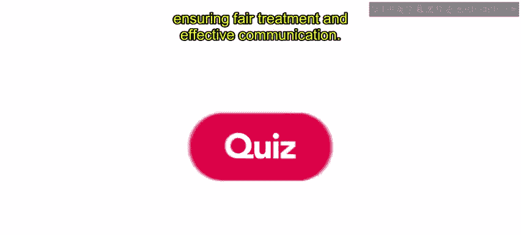

# HRCI《人力资源助理（员工关系、合规，4-5课／共5课）｜HRCI Human Resource Associate》 - P74：69_职能业务领域.zh_en - GPT中英字幕课程资源 - BV1qE4m19788

Functional areas within an organization are like puzzle pieces that work together to achieve business goals。

Each area has a specific focus and contributes to the organization's success。

Let's explore each of these areas Remember the telecom brand connective。

 let's use the company to understand how each function of an organization works。😊。

Connive' management team supervises the performance of employees in all functional areas of the organization。

They provide guidance， allocate resources， and ensure smooth progress toward their desired outcomes。

Now let's focus on operations。Connives operations function plays a crucial role in ensuring the smooth functioning of its telecom services。

 they enable the company to deliver reliable connectivity solutions to their customers。

The operations team manages the network infrastructure and ensures the communication channels are working efficiently。

They monitor system performance， diagnose and troubleshoot technical issues。

 and proactively maintain a high level of service reliability。

Next is the marketing and sales function， Connective excels in this area。

The team understands the importance of marketing and sales in the telecom industry。

 they apply the renowned marketing mix known as the four Ps， product， price。

 place and promotion to reach and engage their target audience they carefully determine pricing strategies。

 consider various distribution channels and devise promotional activities to connect with Connect's market effectively。

Connective's finance and accounting function focuses on short term and long term financial goals they assess how to raise funds。

 manage risks associated with investments， and ensure accurate financial statements for the organization。

😊，The accounting team also provides managers with the information they need to allocate resources Next up is the research and development function。

😊，Connective emphasizes research and development to drive innovation within its industry。

R&D is at the forefront of developing new products， enhancing existing services。

 and improving the overall customer experience through a collaborative and iterative process。

 the R&D team develops ideas and conducts thorough research and experiments to bring cutting edge solutions to the market。

By aligning its R&D efforts with the broader organizational objectives。

 Connective ensures they remain a leader in delivering enhanced solutions。

The HR team at Connective is committed to providing training and development opportunities that empower employees to reach their full potential。

 they also excel in recruiting and onboarding experienced individuals who align with the company's vision。

Additionally， HR prioritizes employee satisfaction by implementing initiatives that build a positive work culture and promote collaboration and engagement among team members。

😊，They also drive employee relations， ensuring fear treatment and effective communication。

Understanding the various functions within an organization is essential for success and growth。

 whether it's effective management， strategic marketing， sound financial management。

 innovative research and development or fostering a solid workforce。

 each function plays a vital role in shaping its overall success。

