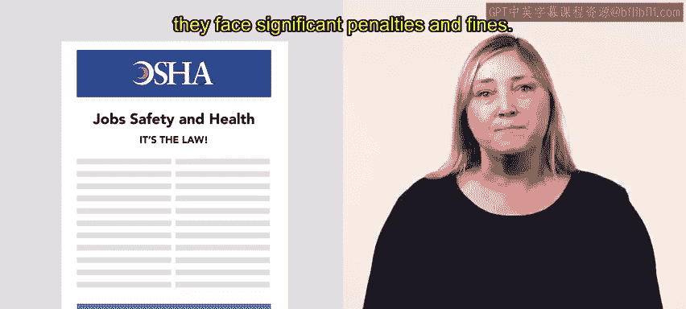

# HRCI《人力资源助理（员工关系、合规，4-5课／共5课）》：P79：OSHA与记录保存

## 📋 课程概述
在本节课中，我们将学习美国职业安全与健康管理局（OSHA）关于工作场所伤害与疾病记录保存的核心要求。我们将了解哪些企业需要遵守规定、需要提交哪些表格，以及如何区分与工作相关和非工作相关的事件。

上一节我们介绍了员工医疗和人事记录相关的权利，本节中我们来看看职业安全与健康管理局（OSHA）及其记录保存规定。

## 📝 OSHA记录保存要求
根据OSHA规定，员工人数超过10人的企业必须完整、准确地记录与工作相关的疾病和伤害。

部分被认定为低风险的行业可以部分豁免此要求。以下是部分豁免行业的例子：
*   机动车经销商
*   加油站
*   鞋店
*   花店
*   软件出版商

## 🚨 OSHA事件通知要求
雇主还必须就某些与工作相关的事件通知OSHA。以下是具体的时间要求：
*   如果员工在工作中死亡，雇主必须在**8小时内**通知OSHA。
*   如果员工受伤并需要住院治疗、截肢或失明，雇主必须在**24小时内**通知OSHA。

如果组织未能遵守这项法律，将面临重大的处罚和罚款。

## 📄 常见的OSHA表格
接下来，我们来详细了解一下您可能会遇到的常见OSHA表格。

### 表格300：工作相关伤害与疾病日志
**表格300**，也称为工作相关伤害或疾病日志，雇主使用此表格来报告工作相关的伤害和疾病。

该表格需要填写以下信息：
*   伤害或疾病的类型
*   导致伤害或疾病的原因
*   受伤或患病人员的身份信息
*   伤害或疾病发生的地点和时间

雇主必须在知晓事件后的**一周内**完成此表格。

### 表格300A：工作相关伤害与疾病摘要
**表格300A** 是一份总结每个工作年度在工作场所发生的疾病和伤害的表格。

此表格也称为工作相关伤害和疾病摘要。关于上一年的信息必须在**2月1日**之前张贴在工作场所，并保持可查看状态直至**4月30日**。

### 表格301：伤害与疾病事件报告
**表格301** 提供了关于严重疾病和伤害事件的额外信息。

表格301要求雇主提供以下信息：
*   受伤员工接受治疗的地点
*   主治医生的姓名
*   事件发生前员工行为的详细信息
*   事件原因的信息

## ❌ 非工作相关事件的记录
雇主不需要记录非工作相关的事件。在以下情况下，事件被视为非工作相关：
*   事件是工作场所以外的活动造成的。
*   症状在工作场所显现，但员工当时并非在工作场所执行工作任务。
*   事件发生在员工在计划工作时间前后进行个人活动时。
*   事件发生在员工通勤途中，在公司物业内发生车辆事故时。
*   事件因食用员工自己准备的食物或饮料导致。
*   事件因员工服用与非工作相关疾病相关的药物导致。
*   事件是员工故意自残造成的。

## 🎯 本节总结
本节课中我们一起学习了OSHA记录保存的核心要求。

总结来说，OSHA要求组织填写表格300、表格300A和表格301，以报告工作场所的伤害、疾病和死亡事件。您需要知道填写哪种表格、如何填写，以及（如果适用）如何在 workplace 张贴。然而，雇主不需要保存与非工作相关伤害的记录。

下一节，您将了解更多关于相关OSHA表格的知识。