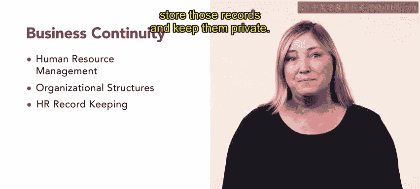

# HRCI《人力资源助理（员工关系、合规，4-5课／共5课）｜HRCI Human Resource Associate》 - P81：76_每周回顾：业务连续性.zh_en - GPT中英字幕课程资源 - BV1qE4m19788

Great job completing another week of learning you are one step closer to your goal of becoming an HR professional throughout this week you learned about business continuity you began by learning about human resource management or HRM。

 specifically you learned about the basic goals of HRM， including how goal setting。

 management information systems and strategic planning all work together in the HR field。😊。

Next you learned about organizational structures， including the functional organization。

 the divisional model， the matrixtrix organization， and the network or cluster organization。

 you then learned about functional business areas and flexible work strategies。To conclude the week。

 you learned the importance of HR record keeping by reviewing the categories of HR documents。

 employees rights， and important OSHA forms you also learned about how to properly store those records and keep them private。

Human resource management， organizational structures。

 and record keeping are all essential components of working in the human resources field。Coming up。

 you will identify the next steps in building your career as an HR associate。

