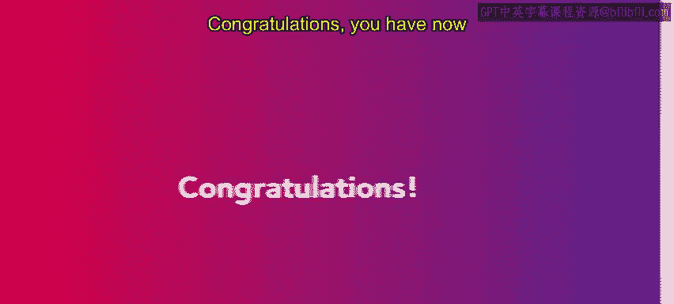
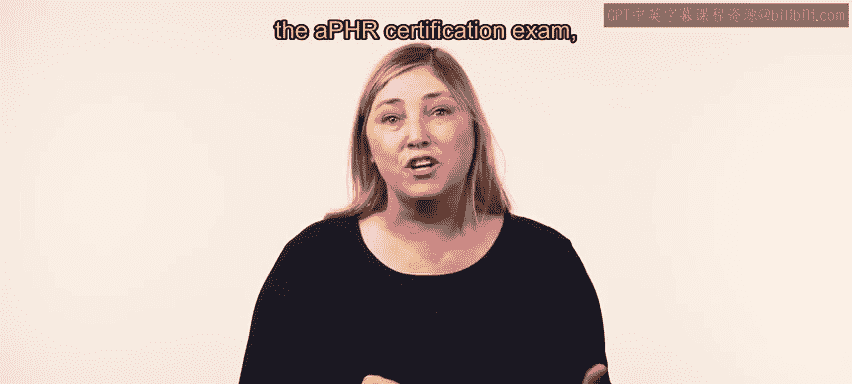

# HRCI《人力资源助理（员工关系、合规，4-5课／共5课）｜HRCI Human Resource Associate》 - P82：77_恭喜.zh_en - GPT中英字幕课程资源 - BV1qE4m19788

Congratulations， you have now completed this course on employee relations。

 You have certainly learned a lot。 This course covered some important skills for an HR professional。

😊，First， you were introduced to an organization's mission。

 vision and values You learned how to develop a mission statement。

 a vision statement and a value statement you then learned about ethical codes employee communication including effectively using the employee handbook you explored inclusion initiatives including work life balance。

 employee engagement and how to measure employee satisfaction。

 and finally you discovered performance appraisal and how to handle workplace conflicts great work on this course The next course focuses on compliance and risk management。

 complianceance and risk management is another substantial segment of the APHR certification exam and you'll pick up a lot of new concepts。

😊。

