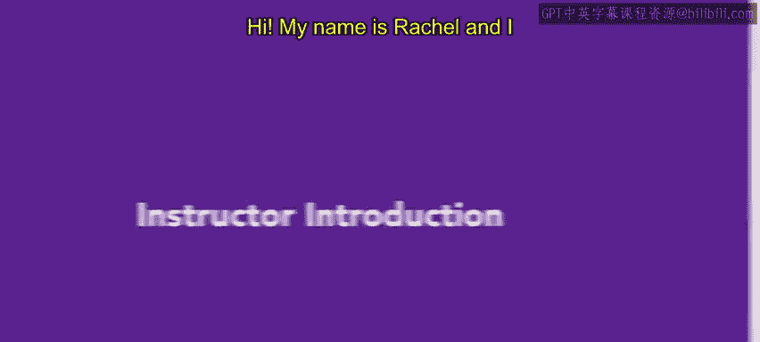
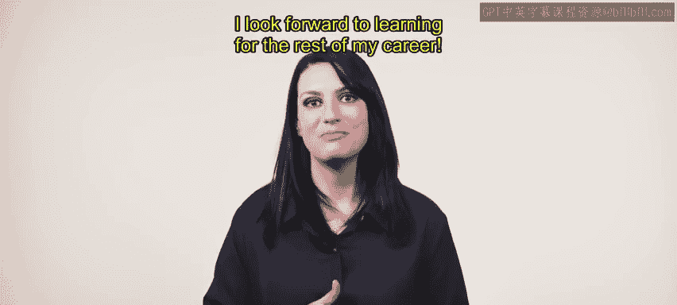

# HRCI《人力资源助理（员工关系、合规，4-5课／共5课）》：2：讲师介绍：Rachel 📚

在本节课中，我们将了解本课程的讲师——Rachel。她将分享自己的背景以及她如何进入人力资源领域。

## 讲师背景

我叫Rachel，将是本课程的讲师。在我们开始之前，我想先介绍一下我自己和我的背景。

我毕业于洛约拉玛丽蒙特大学，获得了传播学荣誉学位。我选择学习传播学，因为它可以应用于多个领域，而且在我大学时，我还不完全确定自己将来要走哪条路。尽管如此，我始终对人力资源有着浓厚的兴趣，而且这种兴趣在我血液中流淌。

我父亲在HR领域工作了40多年。从小我就对HR充满好奇，常常问一些问题。所以我在很多年里就已经在潜移默化地吸收HR的知识。

## 进入人力资源领域

大学毕业后，我在旧金山的一个科技创业公司做了行政工作。我很快意识到，这家公司给了我一个可以学习和成长的机会。我从办公室支持做起，迅速发现我最喜欢的部分是：迎新、员工互动、协助解决员工问题，基本上与员工相关的一切事务。

我表达了自己想要发展的兴趣，最终有机会加入人力资源团队。我在这过程中不断学习，逐步晋升，最终成为了一名人力资源通才。到我离开公司时，我已经管理了员工生命周期的各个方面——从筛选和面试候选人，到入职培训，再到福利管理、员工培训等全方位工作。除此之外，我还处理所有移民事务，包括国际和国内的案例，并建立了公司的国际雇佣结构，涵盖了14个国家。

这段经历让我深刻认识到，选择一个不仅能提供成长机会的公司，还能愿意投资员工及其未来的重要性。

## 总结与发展

我将永远感激那些在我职业生涯中帮助我成长的经验和导师，这不仅让我在人力资源领域成长，也让我在个人层面得到了很多提升。最近，我一直从事人力资源咨询工作，每一次经验都让我从不同的角度在HR领域内不断学习和进步。

我热爱人力资源的原因之一是，它有着多个不同的方面和职能，所以你总能学到新的东西。我期待在未来的职业生涯中继续学习。

讲到学习，让我们开始吧。😊

---

在本节课中，我们一起了解了Rachel讲师的背景、她的职业发展历程，以及她对人力资源领域的热爱。希望通过她的分享，你能对HR的工作有更深的理解，并为将来学习其他课程做好准备。