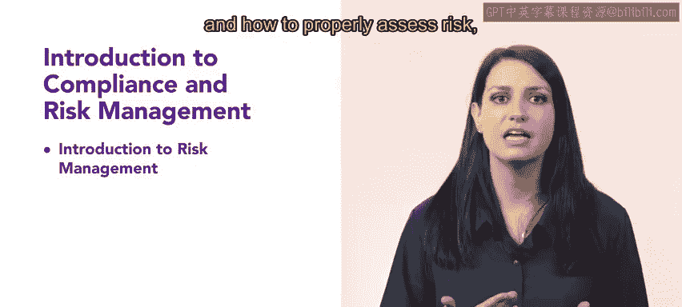

# HRCI人力资源助理课程：4.1：合规与风险管理导论 🛡️

在本节课中，我们将学习人力资源管理中的两个核心领域：风险管理与合规。理解并掌握这些知识，对于确保企业平稳运营和规避潜在问题至关重要。

## 概述

本周课程将介绍风险管理与合规的基本概念。作为一名人力资源专业人士，这两者都将在你的工作中扮演至关重要的角色。课程首先会带你了解风险管理，包括你在其中的职责、风险管理的四个阶段，以及如何正确评估风险类型并以积极或消极的心态去应对它们。接着，你将学习合规的相关知识，包括如何确保合规得到遵循、其重要性，以及法律合规与组织合规之间的区别。成功运营企业离不开有效的风险管理和合规工作，因此，对所有人力资源从业者而言，深刻理解这些内容都是非常关键的。

现在，让我们正式开始。

## 风险管理入门

上一段我们概述了本周的学习内容，本节中我们来看看风险管理的具体构成。风险管理是一个系统性的过程，旨在识别、评估和应对可能影响组织目标的不确定性。

以下是风险管理的四个核心阶段：

1.  **风险识别**：这是发现、确认并记录潜在风险的过程。例如，通过头脑风暴、检查清单或历史数据分析来找出可能的问题。
2.  **风险评估**：对已识别的风险进行分析，评估其发生的可能性（**概率**）和可能造成的影响（**影响程度**）。这有助于确定处理风险的优先顺序。
3.  **风险应对**：根据评估结果，制定并实施策略来处理风险。主要策略包括：规避、减轻、转移（如购买保险）或接受风险。
4.  **风险监控与审查**：持续跟踪已识别的风险，监测残余风险，识别新风险，并评估风险管理过程的有效性，确保其适应环境变化。

## 人力资源专业者的合规职责

了解了风险管理的基本框架后，我们接下来聚焦于合规领域。合规是指确保组织及其员工的行为符合所有适用的法律、法规、标准和内部政策。

以下是关于合规需要掌握的几个要点：

*   **确保合规**：人力资源部门需通过制定清晰的政策、提供定期培训、进行内部审计和建立举报机制来确保合规得到遵循。
*   **合规的重要性**：有效的合规管理可以保护组织免受法律制裁、财务损失和声誉损害，同时也能营造公平、安全的工作环境。
*   **法律合规与组织合规**：
    *   **法律合规**：指遵守外部强制性的法律法规，例如劳动法、安全健康条例（OSHA）等。这是必须满足的底线要求。
    *   **组织合规**：指遵守组织内部自行制定的政策、道德准则和行为规范。它通常高于法律要求，旨在塑造企业文化和管理内部风险。

## 总结

本节课中，我们一起学习了人力资源管理中的风险管理与合规导论。我们探讨了风险管理的四个阶段（识别、评估、应对、监控），以及人力资源专业者在管理风险中的角色。同时，我们也明确了合规的含义、其重要性，并区分了法律合规与组织合规。掌握这些基础知识，是构建有效人力资源实践、保障组织稳健发展的第一步。