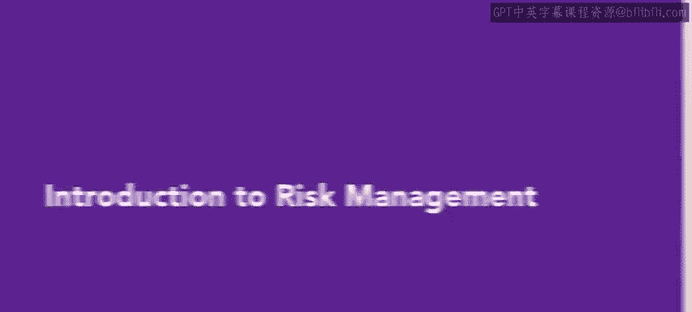
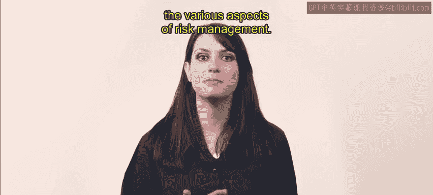
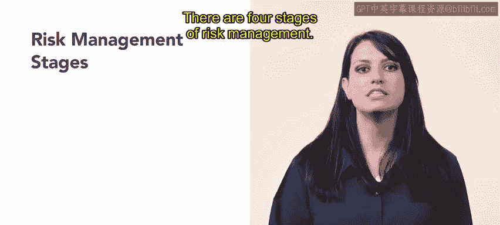
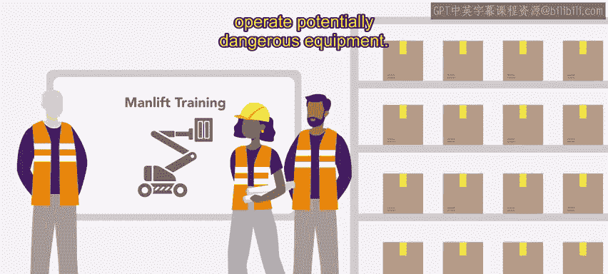
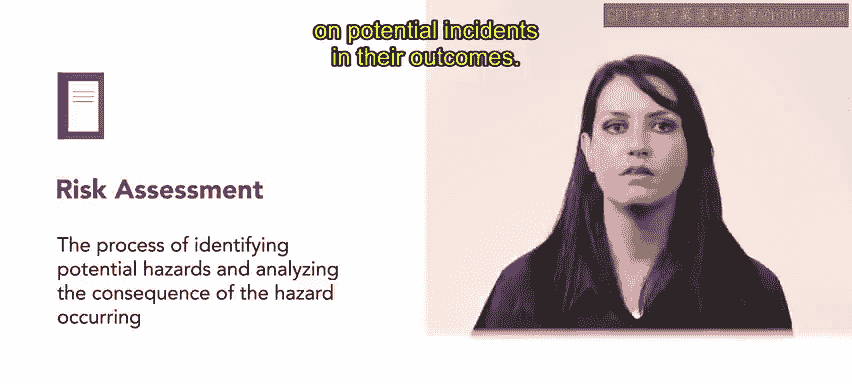
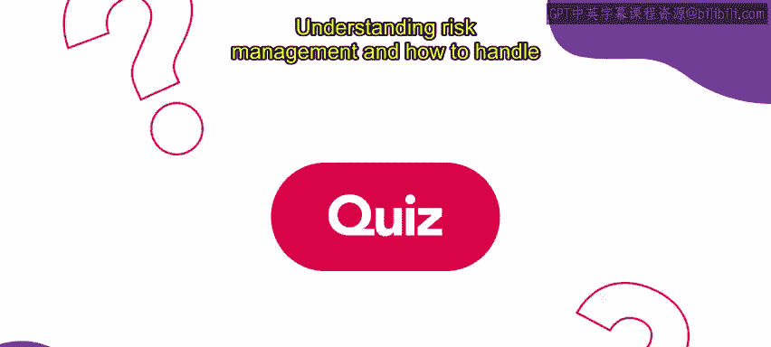

# HRCI《人力资源助理（员工关系、合规，4-5课／共5课）｜HRCI Human Resource Associate》 - P88：5_风险管理介绍.zh_en - GPT中英字幕课程资源 - BV1qE4m19788

A major component of HR is understanding risk management and how to protect an organization。

Throughout this week， you will learn about the various aspects of risk management。

Risk management is the process of analyzing potential threats and deciding how to prevent them。

 There are two main focuses in risk management， protect the employees and protect the organization。

Both of these aspects will be discussed in future videos， but today we'll introduce the concept。

There are four stages of risk management first identify the risk。

Next， assess the risk。Third， mitigate or eliminate the risk and finally monitor or refuse the risk management process。

These stages will be reviewed more thoroughly in further videos。When managing risk。

 organizations should place an emphasis on understanding health and safety laws and regulations。

A key agency is the Occupational Safety and Health Administration。

 also known as OSHA OSHA considers and adopts important safety standards that are designed to prevent and address accidents in the workplace。

The majority of organizations are subject to OSHA laws and are therefore required to follow them。

 For example， Urban attire organizes merchandise in a warehouse until it is shipped to the stores。

OHA rules require new warehouse employees to complete three training courses concerning powered platforms。

 man lifts， and vehicle mounted work platforms before they can begin work。

These trainings ensure that all employees in the warehouse clearly understand how to safely operate potentially dangerous equipment。

Another way organizations can manage risk is to perform risk assessments。

A risk assessment is a process of identifying potential hazards and analyzing the consequences if the hazard occurs。

When conducting a risk assessment， it is helpful to engage employees who are most likely to encounter the risk。

 as they often have the best perspective on potential incidents and their outcomes。

For instance， Urban attire schedules risk assessments twice each year。

 HR meets with carefully selected employees to discuss potential threats such as accidental cuts from using sharp tools like knives and box cutters。

Because the risk of cuts cannot be completely eliminated。

 the risk team works together to find ways of alleviating the risk。

Understanding risk management and how to handle risk is an essential component of working in human resources In upcoming videos。

 you will further develop your knowledge about risk management。

 including the four stages of risk management， types of risks， risk mindset and more。

