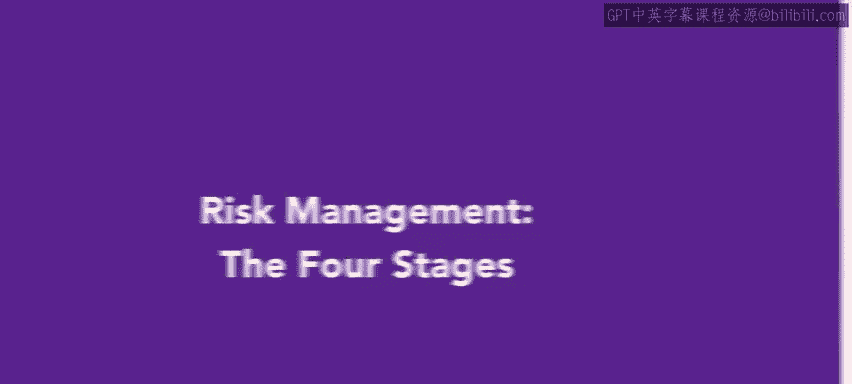
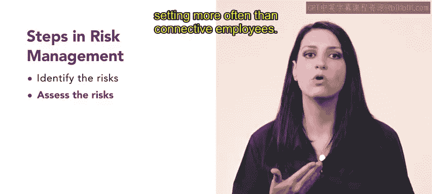
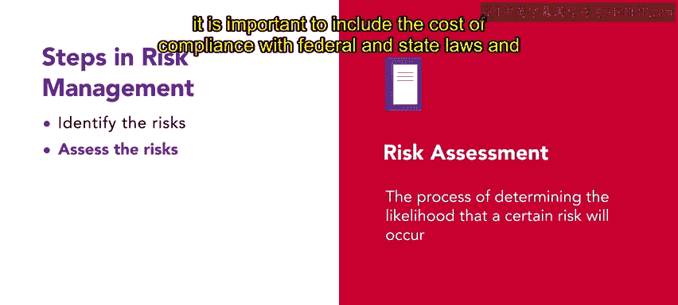
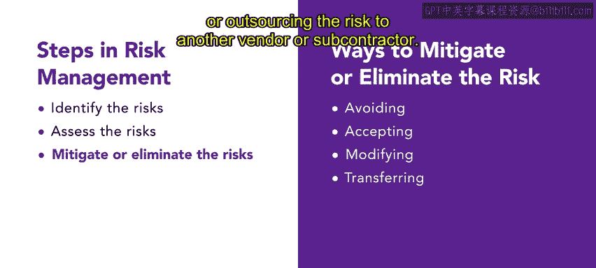

# HRCI《人力资源助理（员工关系、合规，4-5课／共5课）｜HRCI Human Resource Associate》 - P89：6_风险管理的四个阶段.zh_en - GPT中英字幕课程资源 - BV1qE4m19788

As you've previously learned， risk management is a process of analyzing potential threats and deciding how to prevent them。

There are four stages that constitute the process of risk management。

Let's explore each stage further。There are several forms of risk。

 One risk an an organization may face is legal risk， including lawsuits and contracts。

Organizations may also experience physical risk to property， plant and equipment。

Risk to privacy and data can also be a large threat for an organization。

 especially those dealing with a significant amount of personal information。

Any of these risks can create financial consequences or risks。Finally。

 an organization might face risk to their reputation or their ability to continue business when trying to manage risk。

 the first step is to identify the risk。 One way to do this is to conduct a comprehensive audit of all functional areas of the organization。

The second step in risk management is to assess the risk also known as risk assessment。

It's important to understand that all organizations are different and therefore have different risks。

For example， employees at SliceU are much more likely to have physical injuries such as cuts and burns than connective employees。

 simply because slicelicU employees work in a restaurant setting more often than connective employees。

Risk assessment is the process of determining the likelihood that a certain risk will occur。

Risk assessment also focuses on the consequences to the organization if the risk were to occur。

 such as legal fees。When conducting risk assessment。

 it is important to include the cost of compliance with federal and state laws and regulations。

 such as training and reporting。 The third stage of risk management is to mitigate or eliminate the risk。

 Once an organization has determined its risks， it must develop and implement strategies to address them。

There are several ways to mitigate or eliminate risk。First。

 an organization can take action to avoid the risk； Oply。

 an organization can accept the risk as an essential part of conducting business。

This strategy allows organizations to better evaluate and plan for the likely consequences of the risk。

Some organizations may choose to modify the risk by incorporating programs and plans that might reduce the likelihood of the risk occurring。

 such as training。Finally， an organization may also transfer or share the risk by purchasing insurance or outsourcing the risk to another vendor or subcontractor。

The final risk management stage is to monitor and refine the risk management program Unfortunately。

 no matter how well you plan， accidents will happen and new risks will emerge。

Modifications to a risk management plan are always necessary to address the current environment。

This monitoring and refinement is a key task for an HR professional。

Understanding the four stages of risk management ensures that the two focuses of risk management。

 protecting the employees and protecting the organization are more easily accomplished。

In the next video， you will learn about risk management responsibilities。

