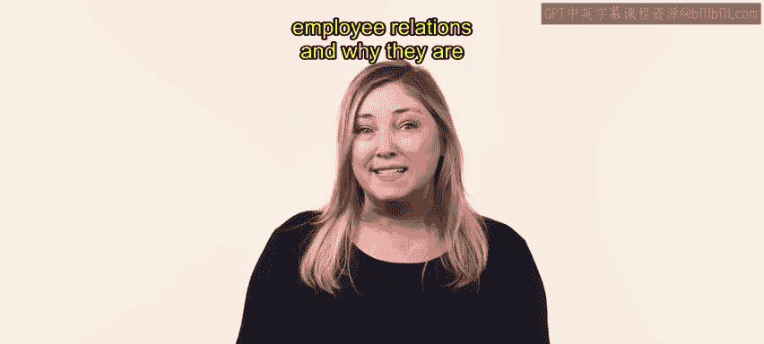
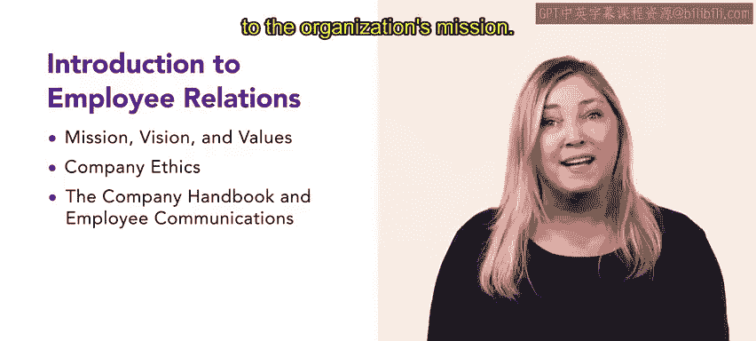
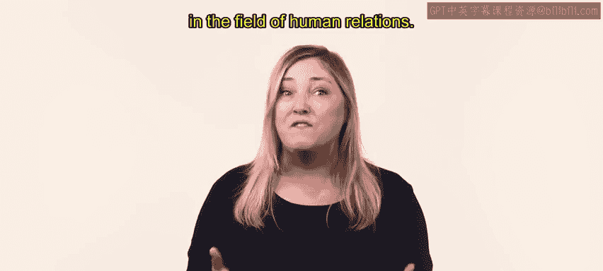

# HRCI《人力资源助理（员工关系、合规，4-5课／共5课）｜HRCI Human Resource Associate》 - P8：3_每周介绍：员工关系导论.zh_en - GPT中英字幕课程资源 - BV1qE4m19788

Welcome back This week， we will be focusing on employee relations and why they are important in your future role as an HR professional to begin。

 you will learn about an organization's mission and vision statements。

 You will also look at an organization's values and core competencies。

 These are extremely important in helping an organization to create their own unique identity that separates them from other organizations。

 Next， you will review ethics by exploring ethics codes and employee contracts and why they matter in your role as an HR professional。

 You will also review social media policies which are a constantly evolving an important component of HR。

😊。

After you review ethics， you will learn about the company handbook and employee communications。

 including communication strategies that will help you to communicate your vision， mission。

 core competencies， values， and ethics code。You will also learn about creating positive employee relationships and how this may affect employee commitment to the organization's mission。

Employee relations is a key component in the field of human relations， let's get started。

