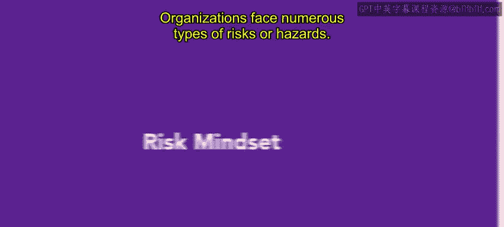
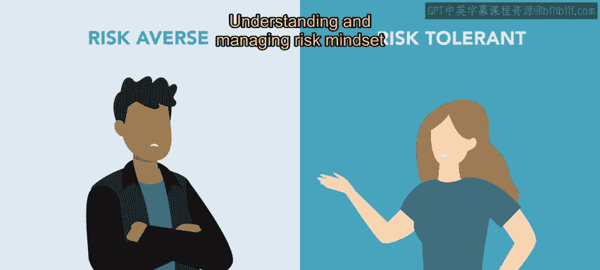
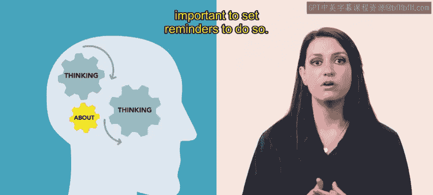
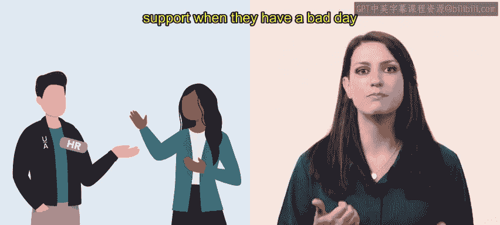

# HRCI《人力资源助理（员工关系、合规，4-5课／共5课）｜HRCI Human Resource Associate》 - P93：10_风险思维.zh_en - GPT中英字幕课程资源 - BV1qE4m19788

Organizations face numerous types of risks or hazards。HR professionals。

 along with an organization's leaders， face these risks and hazards with their own risk mindset In this video。

 we will discuss how individuals view risk。Daily， we all make choices。

 These choices can be as simple as what to eat or as complex as handling a security breach in an organization。

No matter the outcome， a decision is made with a certain mindset。As humans。

 we are prone to viewing situations as either positive or negative。

 and that view influences how we handle the situation。 However， when handling risk。

 mindset is more complex and simply good or bad。 risksk mindset refers to an individual's attitude or outlook towards risk and how it shapes their decisions and behaviors in certain situations。

It involves the way people perceive， assess， and respond to potential risks or uncertainties within an organization。

People can have different risk mindsets， meaning they approach and handle situations differently。

 Some people are risk averse， so they prefer to avoid unknown or negative outcomes。

 Others are risk tolerant， meaning they may be more willing to take chances and embrace uncertainty。

 a person's risk mindset is not permanent。 However， Over time。

 individuals can change their way of thinking based on elements such as past or present experiences。

 cultural background， personality， traits， the economy and education。

Understanding and managing risk mindset can be essential for personal and professional growth。

AR professionals need to develop a risk mindset so that they are able to identify and assess potential risks。

 make informed decisions， and knowingly take their own risk to achieve the organization's goals。

Risk management consultant David Hilson suggests individuals can develop this mindset by doing a variety of tasks。

 Let's use Nri， an HR professional at Urban attire to understand how to develop a risk mindset。

Nry is trying to change their mindset to be more positive and accepting of risk。

 They begin by incorporating a growth mindset To do so。

 Nari actively trains their team to think of challenges as opportunities for growth。

Nary also uses metacognition， which means thinking about one's own thought process。

 Neary is aware of their thoughts， embraces them， and makes adjustments when necessary。

When using metacognition， it's important to set reminders to do so。

Nachuss the words hazard， risk， and OSHA as verbal reminders to use metacognition。

A person can also use visual or sensory reminders to check in， such as an alarm。

Nary has also taught themselves that it is okay to seek assistance。

 to change the way they process information or behave。 For instance。

 Na knows who to ask for support when they have a bad day or face a difficult challenge。

Nary understands that changing the way they think is a process that will take time。

 but with the help of these steps， they are ready to go for the challenge。

Not only do organizations need to be aware of their specific risks。

 which is usually accomplished through risk assessment techniques。

But they also must be willing to change their own risk mindset or tolerate the risk mindset of others。

This technique helps leaders act on decisions with confidence in upcoming videos。

 you will learn more about approaching risk with a positive and negative mindset。😊。

