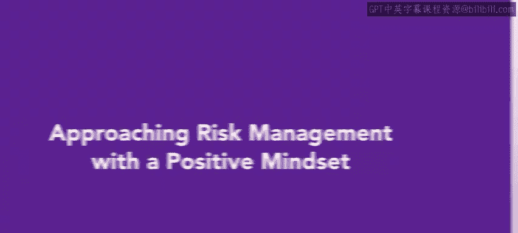
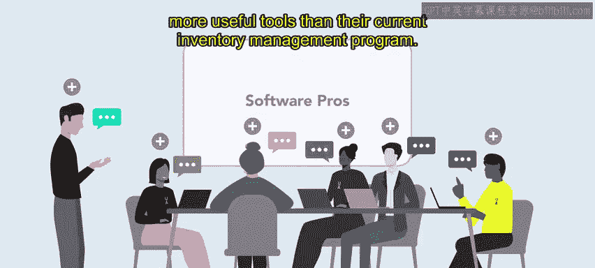
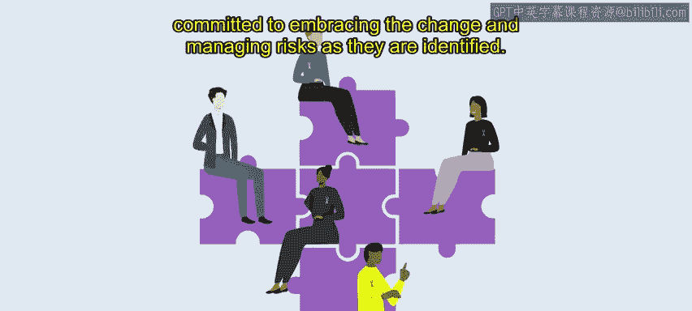

# HRCI《人力资源助理（员工关系、合规，4-5课／共5课）｜HRCI Human Resource Associate》 - P94：11_以积极思维方式处理风险管理.zh_en - GPT中英字幕课程资源 - BV1qE4m19788

As you have learned this week， risk management is an essential part of every organization's operations。

 You've also learned about cultivating a risk mindset。In this video。

 we will discuss how to have a positive mindset when approaching risk management。

 as well as some benefits to this approach。Approaching risk management with a positive mindset encourages an organization to assess risk。

 mitigate or eliminate it， and then move to the next risk more easily。

 A positive mindset allows for a sense of confidence and security in decision making and business planning。

There are many benefits to approaching risk management with a positive mindset Let's explore some ways you can try to handle risk positively。

First， one should embrace a growth mindset。 This does not mean avoid risks。

 It's more important to understand risks and how to manage them for improvement in an organization。

 With a growth mindset， one can learn from experience and enhance their risk management skills。 Next。

 it is important to focus on opportunities and not solely on negatives， such as financial losses。

 Focus on opportunities risks can present like potential innovation and creativity。

 It's possible to turn risks into competitive advantages。

 It also is useful to adopt a proactive approach as opposed to a reactive one。

 Rather than being reactive when risks arise， The organization can be proactive in identifying。

 assessing and mitigating potential risks。Implementing strategies for early detection and mitigation can help an organization determine when a potential risk is actually a potential opportunity。

Emphasizing open communication where everyone can discuss risks and uncertainties as the next critical step if there is an environment of positivity around risks。

 everyone in the organization will be more confident in raising awareness in advance and discussing the potential risks this allows the organization to address the risks proactively。

Finally， it is important to embrace changes that risks can bring in an organization if an organization approaches risk in a positive way。

 they are more likely to accept when strategies need to be adjusted based on new information。

Let's explore an example of a positive mindset and risk management executivecuts at Urban Attire are considering signing a contract with a relatively young organization that has developed new inventory management software。

Nary from HR team is tasked with assembling a risk assessment team to analyze the risk involved with the relationship。

Nary and a team go into the project with a positive mindset。

Everyone on the team has a unique personality， and they use this to their advantage to give various perspectives of the new software before it is implemented。

Nary makes sure to emphasize the importance of a frank discussion on the team。

 it's better to know about and handle risks early than wait until they become realized issues。

The team determines that the new software has many advantages。

 It can complete either individual item or batch item inventory。

 It can easily and quickly identify item type and cost。

 and it has significantly more useful tools than their current inventory management program。

After testing the program， many people on the team agree that it is also easier to use。

The majority of the team is willing to take a chance on the software。

 even though they know it may have some pitfalls such as time required to train employees and the overall cost of the program。

However， approaching the decision with a positive mindset allows the team to work together to analyze these hurdles。

 which they will use later to create a mitigation plan。

This is a big shift in process for urban attire， but everyone involved is committed to embracing the change and managing risks as they are identified。

Approaching risk with a positive mindset encourages forward thinking and improved decision making。

 It can be frightening to take risks， but also rewarding。

 Take care to think clearly about what may go wrong so you can make plan actions to mitigate the risk。

In the next video， you will explore how to approach risk with a negative mindset。

