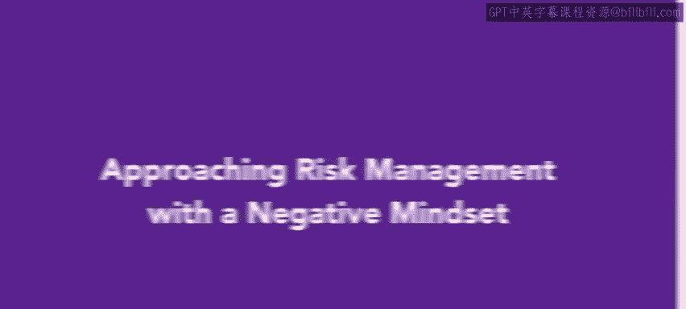
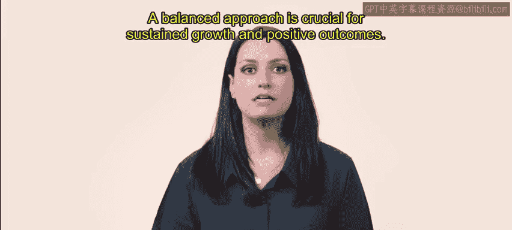
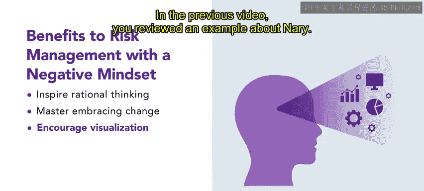
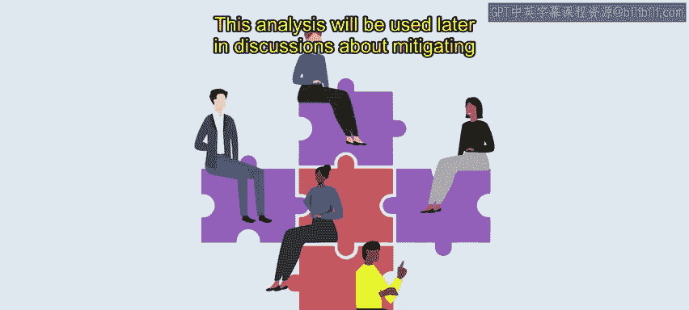
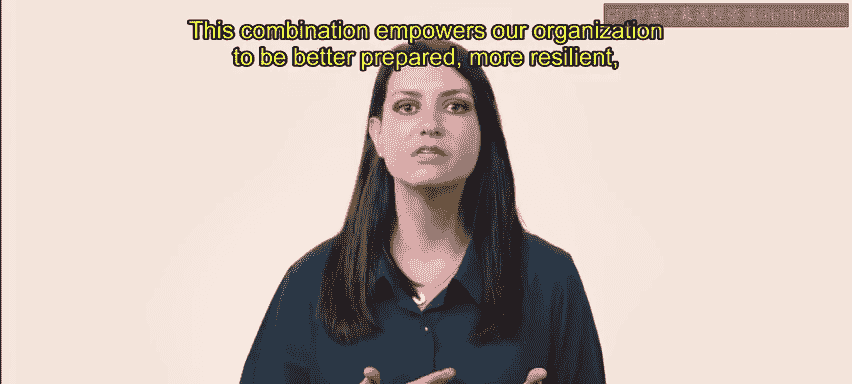

# HRCI《人力资源助理（员工关系、合规，4-5课／共5课）｜HRCI Human Resource Associate》 - P95：12_以消极思维方式处理风险管理.zh_en - GPT中英字幕课程资源 - BV1qE4m19788

As you learned in the previous video， there are many benefits to approaching risk with a positive mindset。

 However， being overly positive can lead to negative outcomes。

 such as being unprepared for the reality of certain risks。Ideally。

 risk management should be confronted with a mix of positive and negative mindset。

 Let's explore the concept of approaching risk with a negative mindset。

Although the phrase negative mindset implies that the mentality around risk is negative or even avoidant。

 it is more about preparing with an abundance of caution。

 A negative mindset regarding risk management involves predicting and managing and responding to a risk in a practical way。

 when encountering a risk， embracing the elements of both a negative and positive mindset can lead to successful risk mitigation。

A balanced approach is crucial for sustained growth and positive outcomes。

 The first benefit to approaching risk management with a negative mindset is that it inspires rational thinking。

 Thinking about risk with a singularly positive mindset can lead to being unprepared or even failure。

Only thinking with a negative mindset is not beneficial for an organization either。

Incorporating both mindsets encourages an organization to support and challenge ideas。

 Being honest and transparent about the potential effects of risk can have many positive effects on the workplace。

 including increased levels of respect and more profitable business outcomes。

 approaching risk with a negative mindset can also shift the focus to embrace change。

 To explain when organizations or teams have become complacent。

 Incorporating a negative risk mindset can act as a signal that something is not right and needs to change。

This approach can prompt organizations to seek alternatives。

 gather evidence through risk assessment and engage in a critical analysis of the situation at hand。

 However， it is essential to engage a negative mindset with care and sensitivity。

 Overly negative thoughts in environments can be counterproductive and demoralizing。

 which can decrease motivation to take advantage of the risk。

 Finding a balance in using constructive criticism to foster growth and improvement is key to embracing change。

The final benefit to approaching risk management with a negative mindset is that it encourages visualizations。

 such as imagining how a project might fail before it launches。

 Visualization can significantly improve the success rate of a project because it reveals potential weaknesses。

 blind spots and risk before the project even begins。

By anticipating failure scenarios and discussing them with a team。

 an organization can develop contingency plans and take preventative measures to address and mitigate risks proactively In the previous video。

 you reviewed an example about NAry As a reminder， NAry is tasked with creating a risk assessment team to analyze the risk involved with implementing a new inventory management system。

While a majority of the team enters a project with a positive mindset。

 a few do so with a negative mindset， while researching and analyzing the program。

 the individuals with a negative mindset approach Mary with some important concerns。

First， they encourage Ne to use a more balanced approach when analyzing the project。

 They notice that Mary is only focusing on the positive aspects without thinking rationally about the potential pitfalls。

 such as the cost of training or potential bugs and other issues that are often encountered with new software。

They encourage Ne to visualize what may go wrong with the project。

 Ne begins to use perspectives from individuals with positive and negative mindsets to fully understand the potential benefits and pitfalls of the software。

Due to the team's rational thinking， they are able to provide urban attirees executives with an informative and pragmatic analysis about the new program。

This analysis will be used later in discussions about mitigating the program's risks。

It is true that managing risk with a negative mindset leads to practical predictions。

 management and response to risk。 However， negative thinking should not overpower positive thinking。

Effective HR leaders incorporate both positive and negative thinking regarding risk management。

This combination empowers their organization to be better prepared。

 more resilient and adaptable when encountering risk。

