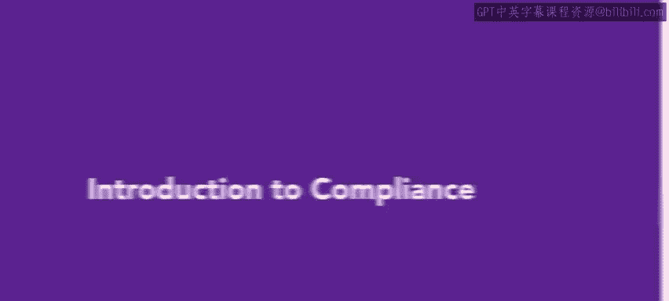
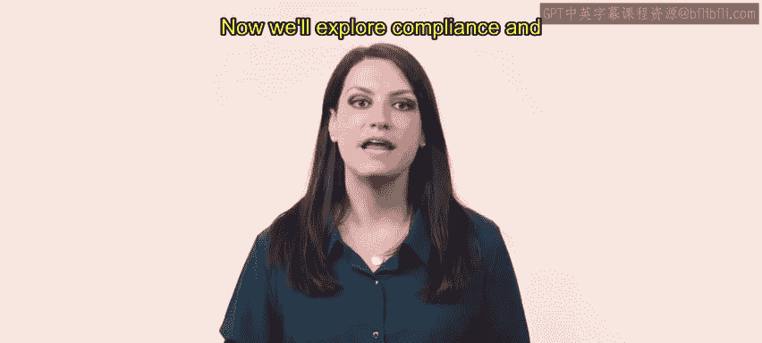
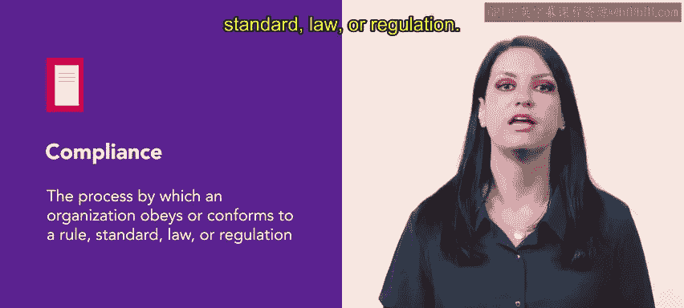
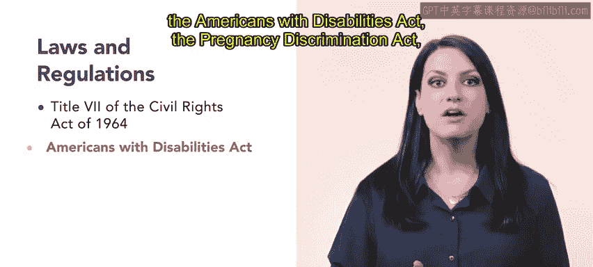
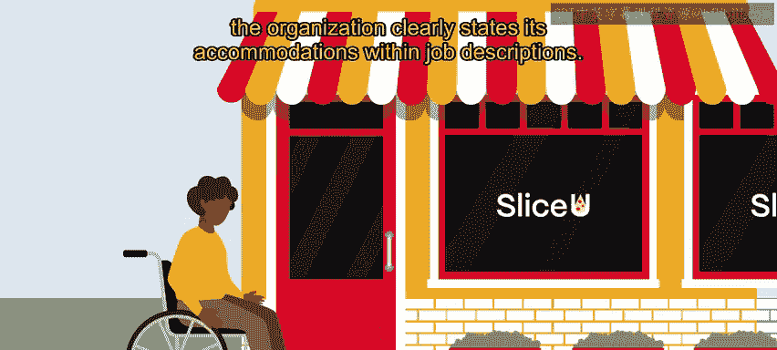
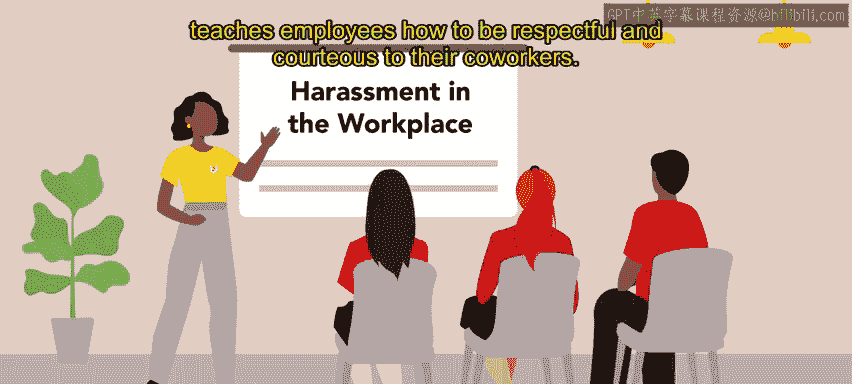

# HRCI《人力资源助理（员工关系、合规，4-5课／共5课）》 - P96：13_合规介绍

在本节课中，我们将要学习合规的概念，并了解这项职责如何融入人力资源助理的角色。上周我们探讨了风险管理，现在让我们来看看合规。

合规是一个组织遵守或符合某项规则、标准、法律或法规的过程。

工作场所中有多项需要遵守的法律法规。以下是其中一些重要的法律：

*   **1964年民权法案第七章**
*   **美国残疾人法案**
*   **怀孕歧视法案**
*   **公平劳动标准法案**

为了说明合规，我们以SliceU公司为例。该公司是工作场所平等的坚定倡导者，并严格遵守所有关于合规的法律法规。

根据《美国残疾人法案》，雇主不得歧视残疾人。该法案要求为残疾提供合理的便利，并禁止在工作描述中使用排他性语言。

SliceU在多个入口设置了坡道和自动门，并在大楼内安装了其他无障碍设施以满足员工需求。此外，该公司在其职位描述中明确说明了所提供的便利措施。

与风险管理类似，雇主可以通过员工培训来展示合规。

例如，SliceU公司提供零容忍骚扰培训。该培训不仅定义了工作场所的骚扰行为，还提供了实例，并教导员工如何尊重和礼貌地对待同事。

组织还可以营造一种合规文化。实现这一目标有多种方式，包括：

*   聘请合规经理
*   鼓励员工参与
*   进行持续培训

合规是人力资源职能的重要组成部分，实现合规的途径有很多。本周后续课程中，我们将进一步学习合规的更多内容。

本节课中，我们一起学习了合规的基本定义、相关的重要法律法规，以及组织如何通过具体措施和培训来确保合规。合规是人力资源工作的核心职责之一。