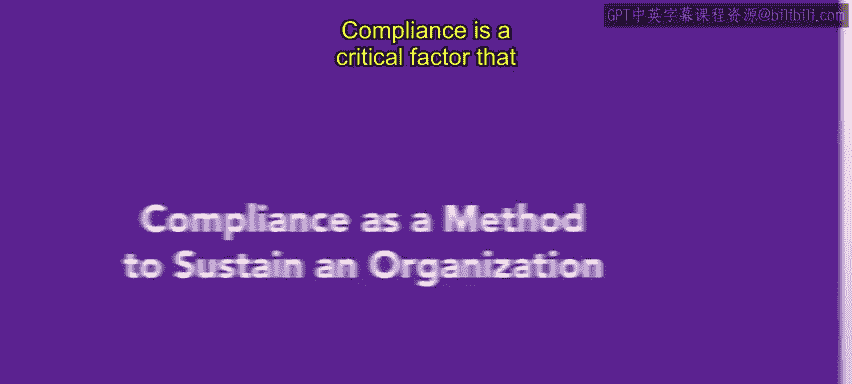
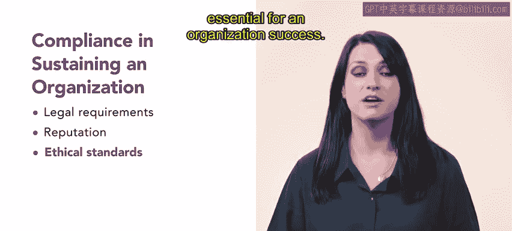

# HRCI《人力资源助理（员工关系、合规，4-5课／共5课）｜HRCI Human Resource Associate》 - P98：15_合规作为维持组织的方法.zh_en - GPT中英字幕课程资源 - BV1qE4m19788

Compliance is a critical factor that contributes to an organization's success organizations that are compliant adhere to laws。

 regulations and industry standards that govern its conduct in operations。

Organizations that focus on compliance have a better reputation， financial stability。

 employee morale and a safer work environment in this video you will learn of several ways in which compliance can sustain an organization。

😊。

As you've learned so far， compliance ensuress that an organization operates within the law。

Following laws such as OSHA helps prevent legal issues。

 fines and other consequences that can be detrimental to an organization's reputation and financial stability。

 demonstratingmonating compliance significantly enhances an organization's reputation。

 Custom want to conduct business with organizations that follow the law and are ethical。

 These actions build trust with customers， suppliers， investors， employeess and the public。

Compliance violations can tarnish an organization's reputation and it may struggle to recover。

Compliance also incorporates ethical guidelines which foster a culture of integrity and a positive and respectful work environment。

Ethical compliance helps an organization attract and retain talent。

 which is essential for an organization's success。

Compliant and successful organizations also emphasize the importance of following risk management procedures。

These procedures include mandatory reporting as well as risk assessment， mitigation or prevention。

Mitigating or preventing risk minimizes negative impacts on an organization and provides valuable insight into the safety and wellness of the employees。

These insights lead to better decision making and more efficient operations。

Compliance also contributes to cost savings for an organization。

Compliance can reduce or eliminate workers' compensation claims。

 lawsuits or legal fees regarding injury or accidents Likewise。

 the consequences for being noncompliant are numerous， including financial penalties。

 loss of business， loss of employees and other expenses。Organizations that enforce OSHA regulations。

 as well as implement health and wellness programs often reduce costs associated with absenteeism。

 sick time and time off of the job， minimizing these costs creates an important competitive advantage。

Compliance is both a legal obligation and a strategic imperative that leads an organization's long term sustainability in the next video you will learn about organizations that monitor compliance。

