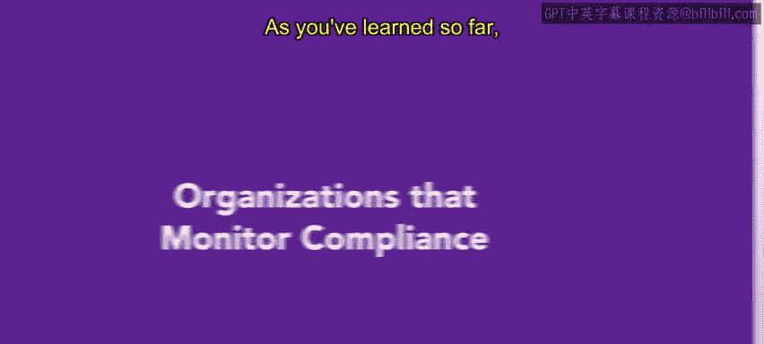
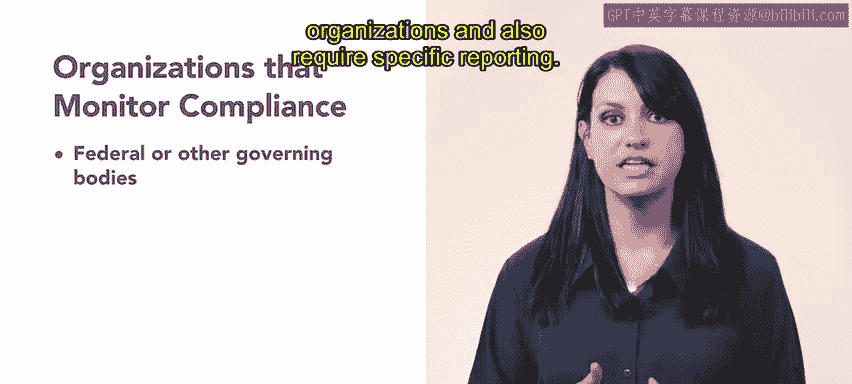
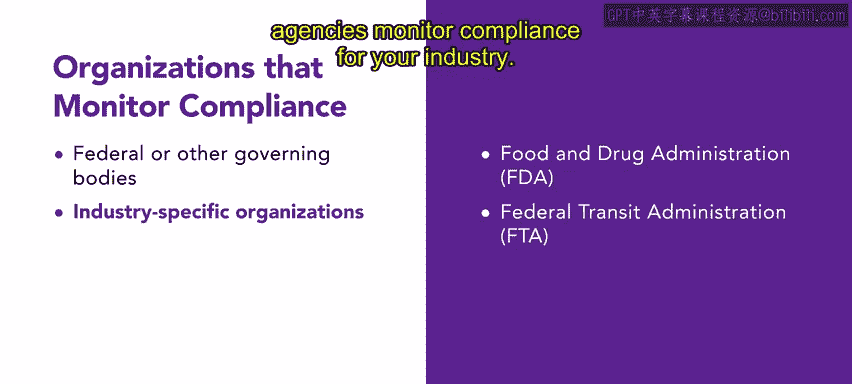
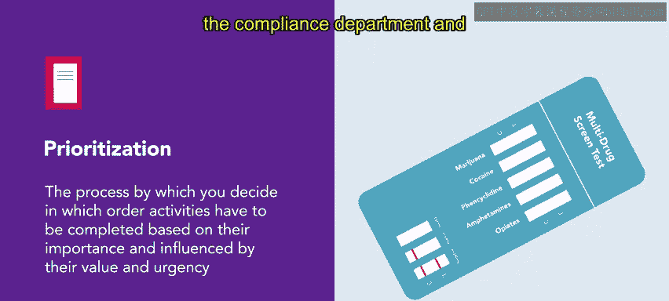

# HRCI《人力资源助理（员工关系、合规，4-5课／共5课）｜HRCI Human Resource Associate》 - P99：16_监督合规的组织.zh_en - GPT中英字幕课程资源 - BV1qE4m19788

As you have learned so far， organizations are required to comply with laws。

 There are several organizations that monitor compliance across different industries。

 As an HR professional， you will be required to know these organizations in what they require。

 The federal government plays a large role in compliance。

 It regularly inspects and audits organizations and also require specific reporting。

The US。 Department of Labor is one government agency that focuses on compliance。

 it provides information about compliance and also conducts checks to prevent violations and protect wages。

 workplace safety， health， retirement and other benefits。

Another federal compliance agency is OSHA OSHA oversees workplace safety and health across industries in the USS。

 its primary goal is to protect workers from hazards and maintain compliance。

The Environmental Protection Agency or EPA also monitors compliance related to environmental laws and regulations。

It serves to protect human health in the environment。The Department of Health and Human Services。

 or HHS and the Office for Civil Rights or OCR， are both important government agencies that are responsible for administering and enforcing standards related to health and safety。

There are also several industry specific organizations that monitor compliance。

 The Food and Drug Administration or FDA is responsible for regulating and monitoring compliance in food and pharmaceutical industries。

 It ensures that products meet safety and quality standards。

 The federal transit administration or FDA monitors safety performance and operations and maintenance procedures in the public transit industry。

 There are many other government agencies that monitor compliance。

 So it is important to know which agencies monitor compliance for your industry。

 Many organizations choose to dedicate a team or department that is responsible for monitoring compliance。

 This group is typically responsible for five areas。 I， prevention， monitoring and detection。

 resolution and advisory。 It focuses on identifying risks related to compliance and advises management on how to address or avoid the problem。

 For example， marijuana is the most detected drug found in the workplace and is often included in employers no drug policies。

 Many organizations。

Use random drug tests， which are typically planned and administered by the compliance Department and HR as a way to ensure compliance in the workplace。

Understanding which areas and agencies your organization is subject to will be helpful in aligning policies and procedures that become an essential part of the daily routine and culture。

