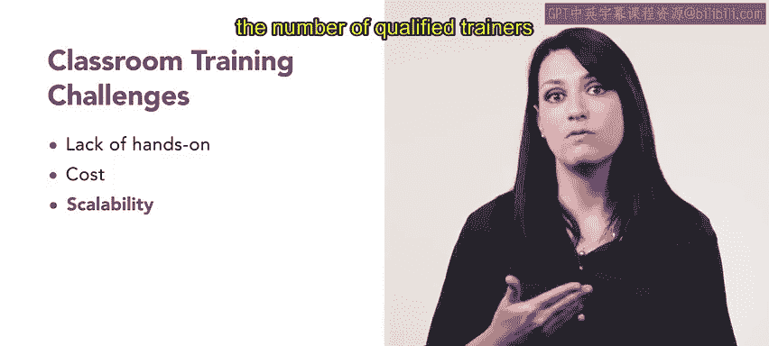

# HRCI《人力资源助理（招聘、学习发展、薪酬福利，1-3课／共5课）｜HRCI Human Resource Associate》 - P101：34_在职培训.zh_en - GPT中英字幕课程资源 - BV1qi421r7ba

In your human resources role， you may make decisions on the best way to deliver training such as onboarding and ongoing professional development In this video we will explore the three different delivery methods。

There are three different ways for organizations to deliver training on the job。

 virtual and classroom。

In this video we will explore these methods further the first method of delivering training is through on the job training this type of training。

 a manager or another experienced team member provides real time instructions on a specific topic。

Let's go back to our new cashier Ari at Urban attire for on the job training。

 there are many types that Ari could participate in apprenticeships， job rotation。

 coaching and mentoring and shadowing。Ari's manager at Urban Attire decided to set them up with a specific venture who will mentor them throughout the onboarding process and shadow what the experienced employee does throughout a shift on the job training is a cost effectiveff training method that allows new employees to experience real world situations receive immediate feedback and improve their engagement and retention because employees are experiencing the job while training。

On the job training does have some challenges on the job training can disrupt normal workflow and reduce productivity Employs may need time away from their regular duties to receive training。

 which can cause delays and affect deadlines。Selecting mentors is critical as bad habits will transfer if a mentor isnt using a standard procedure or process。

There is also a lack of assessment so it can be difficult to determine whether an employee has fully mastered a skill or has received sufficient training。

Since new employees are learning while on the job， there is a risk of mistakes。

Another training delivery method is virtual training Vi training is a process of delivering training content to learners remotely using technologies such as video conferencing。

 webinars and online learning platforms。This type of training can be delivered to learners anywhere in the world。

 regardless of their location or time zone， virtual training delivery has many pros。

 including accessibility for all of your employees regardless of their location。

 it is also flexible and can occur at different times of the day or even asynchronously。

It is cost effective since travel is not required and it is customizable to situations as it can be a custom webinar or even a course that is built。

Last， it is scalable as the number of participants isn't limited to a physical location or to costs of how many can be paid to attend by an organization。

There are some drawbacks to delivering training virtually。

 There is a lack of immediacy because it takes time in planning to execute。

 and there can be challenges with technical issues that cause frustration for employees attending。

You are also not able to control the environment to be distraction free。

 Some employers may even experience feelings of isolation due to the nature of virtual not having in person contact。

Virtual training also limits hands on learning that is stronger in a classroom or on the job training delivery。

Finally， there is classroom training delivery， a type of training delivered in a traditional classroom setting。

 this type of training typically involves a trainer who presents information to learners who then participates in activities and discussions to reinforce the learning。

Classroom Tra delivery provides a model for explaining complex ideas through lectures， presentations。

 and even supporting activities with an instructor's guidance。Ari。

 as well as other new employees at Urban attire， attend classroom training and are able to interact with other employees in the trainer directly asking any questions they might have。

The immediate feedback and support from trainees or other employees is very helpful as RAI is learning their new role as a cashier。

Classroom training delivery also has challenges with a lack of hands on activities。

 Many jobs require field work， which isn't possible in a classroom environment。 In addition。

 costs are higher for classroom training delivery due to the cost of bringing employees together in one location and providing funding for lodging and meals if needed。

Lastly， it isn't scalable as you have a limited number of students that it can be effective with and it is limited by the number of qualified trainers that can lead the sessions。

Overall， he must weigh the pros and cons of any training delivery method to determine the pros and cons of the best choice for the organization。

Now that you know the delivery methods， you can make a strong choice on the delivery method for onboarding。

 compliance， or any other training you need to be a part of in your human resources role。

