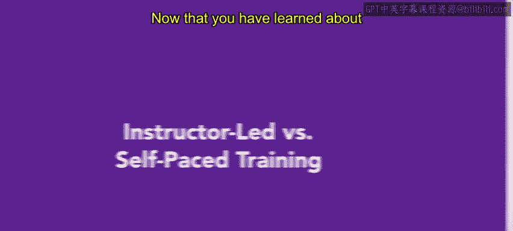
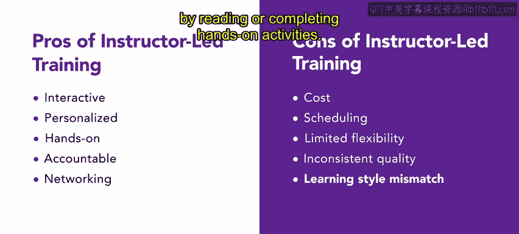
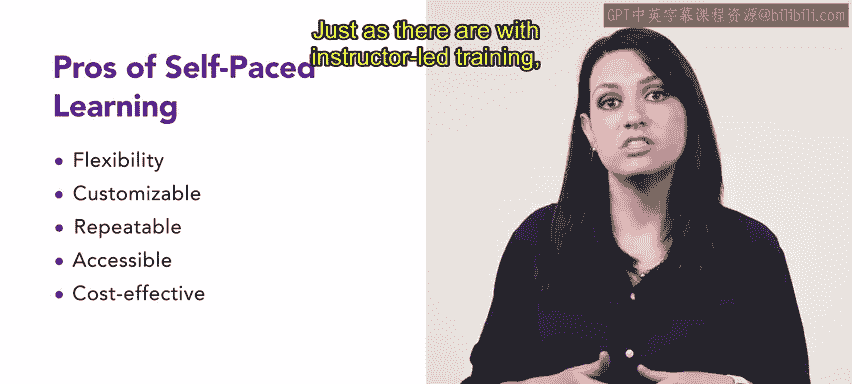
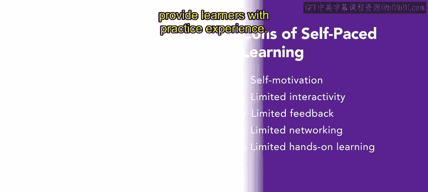

# HRCI《人力资源助理（招聘、学习发展、薪酬福利，1-3课／共5课）｜HRCI Human Resource Associate》 - P102：35_讲师主导vs自主学习.zh_en - GPT中英字幕课程资源 - BV1qi421r7ba

Now that you have learned about the three different types of training delivery on the job training。

 virtual training and classroom training， let's compare two training types。

 instructor led and self paced training designs。

Instructor led training is where employees learn with an instructor in class or in a live online class。

In this type of training， employees can experience their learning， ask questions。

 and receive responses in real time。Self paced training design describes programs that allow learners to choose when the training best fits their schedule to complete it。

Let's look at the pros of instructor led training instructor led training is interactive。

 allowing learners to ask questions， participate in group discussions。

 and receive immediate feedback from the instructor。In addition。

 instructor led training can be personalized to meet the needs of specific learners or groups of learners。

Instructors can adapt the pace， content and style to ensure comprehension and engagement。

 It also provides hands on learning opportunities through activities like role playing and simulations。

This allows learners to apply the knowledge and skills they are learning。

Instructor led training can help learners stay accountable for their participation and performance。

 This can motivate them to engage with the material and take ownership of their learning。Finally。

 this type of training provides an opportunity for networking。

 which allows learners to connect with peers and build a sense of community and support。

Instructor led training also has negative aspects， for example。

 it can be more expensive than other forms of training because it requires hiring an instructor and providing a venue for the training。

Also， instructor led training can cause scheduling problems for learners because it might require them to travel or take time off of work。

Similarly， this training might be less flexible than self paced learning because learners are required to participate at specific times and locations。

Inconsistent quality is another con because training can vary depending on the instructor's experience。

 expertise， and delivery style。Instructor led training might not be effective for all learning styles because we all learn differently。

 some people are visual learners and others learn best by reading or completing hands on activities。

Now let's compare the pros and cons of instructor led training to those of self pace training。

There are several positive aspects of self paced learning。

 the first is flexibility because learners can complete training whenever it works best for them。

Self paced learning can be customized to meet the needs and preferences of each learner。

 this means that learners can focus on the areas that they need the most help with and they can skip over the material that they already understand。

Similarly， self paced learning is repeatable， meaning it can be repeated as many times as necessary。

 allowing learners to review material and reinforce their understanding of the concepts。

Because self paced training can be delivered online。

 it can be more accessible to learners who might have scheduling constraints or require accommodations。

Finally， self paced learning can be more cost effective than instructor led training because it does not require hiring an instructor or providing a venue。

Just as there are with instructor led training， self pace learning has negative aspects that can make it difficult for some learners。

Self pace training requires learners to be self motivated and disciplined to complete the training。

Also， self paced training might not provide the same level of interactivity as instructor led training。

 which means that it might not be as engaging for some learners。

 This training style sometimes offers limited feedback because it's difficult to provide immediate feedback on student progress or understanding of the material。

 Similarlyly， self paced training does not provide an opportunity for learners to connect with peers and build a sense of community and support。

 because often learners are working alone or with a small group。Lastly。

 there is little opportunity for hands on learning such as role playing or simulations that provide learners with practice experience。

Overall， instructor led and self paced learning both have positive and negative components based on learning needs and expectations。

Instructor led learning provides immediate feedback enhanced on learning。

 and self paced learning offers flexibility and customization。Coming up。

 you'll learn about inhouse and external training services。

