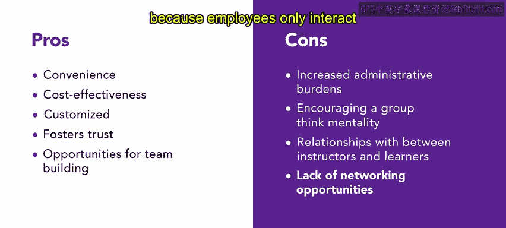

# HRCI《人力资源助理（招聘、学习发展、薪酬福利，1-3课／共5课）｜HRCI Human Resource Associate》 - P103：36_内部vs外部培训服务.zh_en - GPT中英字幕课程资源 - BV1qi421r7ba

In the previous lesson， you learned about instructor led and self pace instruction to add on to that knowledge。

 we are going to discuss in house and external training services。

In house programs are led by employees within the organization。

 while external training is conducted by outside experts。

Both training types offer benefits depending on the organization's needs。First。

 let's examine inhouse training inhouse training is a convenient and cost effectiveff option for companies because it uses internal resources It allows for customized training that reflects the organization's culture。

 One example is when urban attirees manager provides training on a new store layout leveraging their knowledge of the store。

 employees， customers and culture Inhouse training can also foster trust and team building among employees。

 However， it may increase administrative burdens encouraged group think and be undermined by friendships between instructors and learners。

 Additionally， there are limited networking opportunities because employees only interact with those within their organization。

 companiesan often prefer in-house training for reasons such as customizing the content to fit specific organizational needs。

 For example， Ur attire's general manager conducts training on the latest style of pants to ensure that the training is tailored to the employee' needs。

Enhouse training may also be necessary for technical， confidential， or specific format training。

Let's examine the pros and cons of external training Ex training involves hiring specialized experts from outside the organization who can bring a fresh perspective and keep up with the latest technology。

 techniques and strategies。External training can often increase organizational efficiency with fewer distractions for the trainer to focus on。

However， there are some cons。 Let's consider an urban attire example。

 The organization hires an external expert to teach a new computer system。

 even though it is more costly and reduces control over the content， focus， format。

 schedule and location of the training。 This offsite training also leads to a short term decrease in productivity。

 However， the organization believes that the benefits of gaining new insights into their workforce and organization。

 as well as enhancing organizational efficiency by allowing employees to focus on core competencies。

 outweigh the drawbacks。 Ex training may be preferred by an organization and situations where they lack expertise in a specific area。

 require standardized training， Want to save time and resources or need exposure to new ideas and best practices。

External training is also necessary for certification or credentials that cannot be achieved in house。

 like cultural competency or harassment training。

Overall， inhouse training is cost efficient， customizable。

 and tailored training that is good for companies that need organization specific training。

External training is a fantastic option for companies that need an expert with a fresh perspective on material now let's review preferred training delivery methods。

