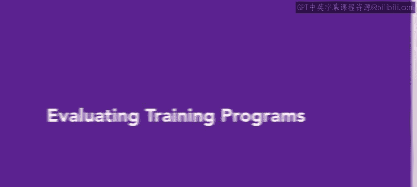
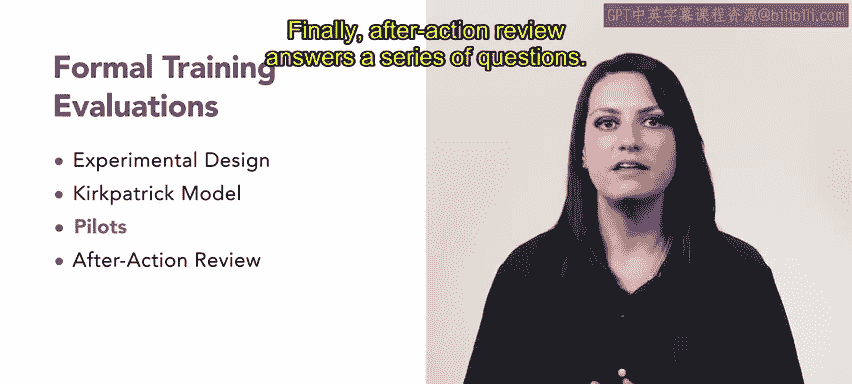

# HRCI人力资源助理课程：第37课：评估培训项目 📊

在本节课中，我们将讨论培训项目开发完成后，用于评估其效果的不同方法。

## 概述

培训项目开发完成后，有必要衡量其有效性，以确定它是否成功达到了预设的目标或课程目的。评估培训效果有多种方法，包括非正式和正式的方法。

## 非正式评估方法

非正式评估方法主要用于收集员工对培训项目的印象反馈。以下是几种常见的方式：

*   **调查问卷与访谈**：可以使用调查、问卷和访谈来收集员工的印象。例如，经理可以发送在线问卷来收集员工对培训的反馈。问卷可以设置1到5分的评分，并征求额外意见。
*   **绩效测试**：另一种方法是进行绩效测试，比较员工在完成培训前后的表现。
*   **观察法**：也可以观察已完成培训项目的员工。然而，当员工知道自己的工作被跟踪时，他们可能会工作得更快、表现得更好。

## 正式评估方法

除了非正式方法，还有几种正式的培训项目评估方法。上一节我们介绍了非正式方法，本节中我们来看看几种结构化的正式评估方法。

以下是几种主要的正式评估方法：

*   **实验设计**：其目标是检验两个或多个变量之间的假设。
*   **柯克帕特里克模型**：该模型包括评估员工对培训材料的初始反应、学生学习新知识的情况、评估工作表现以及审视培训反馈。
*   **试点项目**：这是指让一小部分员工和管理层亲自参与培训项目，以观察其运行方式以及有效传授所需技能的程度。他们评估培训项目，并在项目全面实施前推荐需要进行的修改。
*   **事后回顾**：这种方法通过回答一系列问题来进行评估。

## 事后回顾示例问题

以下是事后回顾中可能包含的一些问题示例：

*   培训的预期学习成果是什么？这些成果是否达成？
*   培训过程中哪些方面进展顺利？哪些方面不顺利？
*   培训材料和活动是否有效地支持了学习成果？

## 总结

本节课中，我们一起学习了公司可用于评估培训的几种方法，包括非正式和正式的培训评估方法。随着课程的继续，我们将更深入地探讨这些不同的方法。