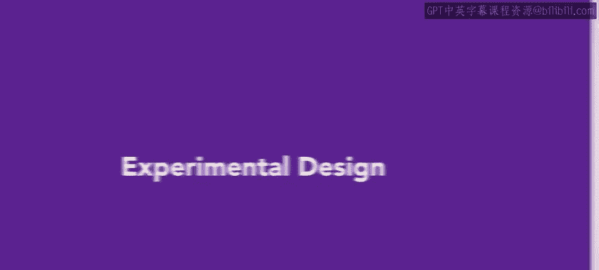
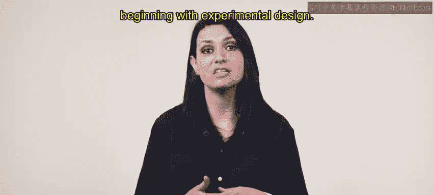
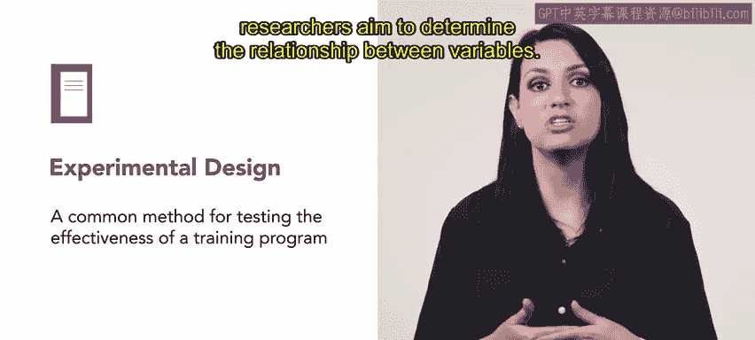
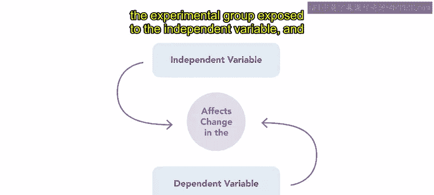
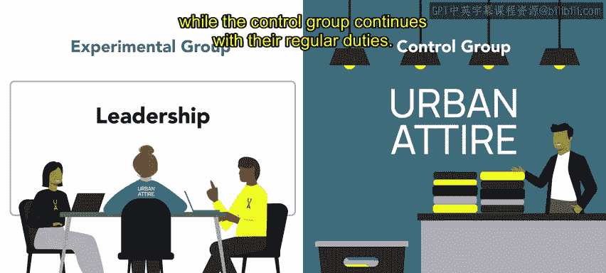
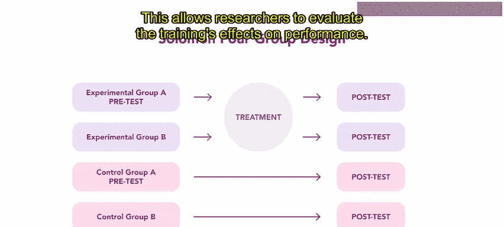
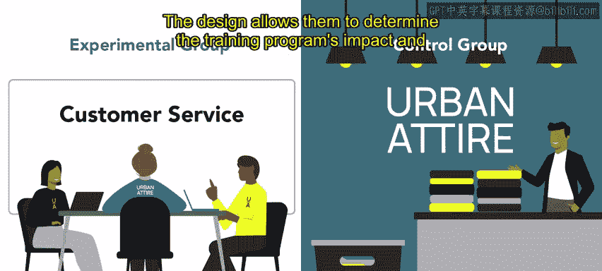
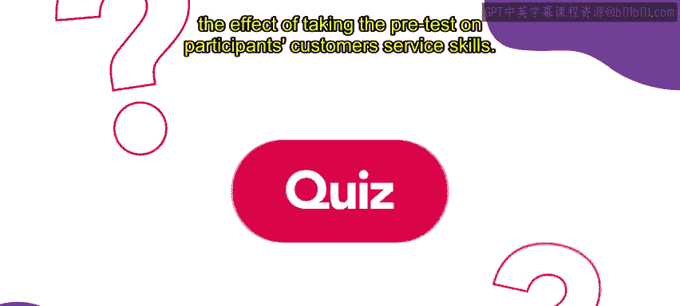
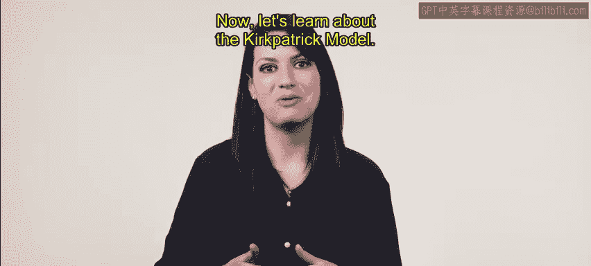

# HRCI《人力资源助理（招聘、学习发展、薪酬福利，1-3课／共5课）》：P105：38_实验设计

欢迎回来。在上一节中，我们简要介绍了评估培训项目的方法。本节中，我们将开始具体学习每一种方法，首先从实验设计开始。实验设计是一种用于测试培训项目有效性的常用方法。它是探索和识别因果关系的主要方法。

通过实验，研究者旨在确定变量之间的关系。

实验涉及两种类型的变量：自变量和因变量。自变量是可能导致因变量变化的因素，而因变量则受自变量处理的影响。实验通常至少涉及两个组：接受自变量处理的实验组，以及不接受自变量处理的对照组。

以下是实验设计的一个具体例子。

*   **实验组**：接受自变量处理（例如培训）的组。
*   **对照组**：不接受自变量处理的组。

例如，Urban Attire公司的人力资源团队希望评估一个新的领导力发展培训项目的有效性。他们随机将一组员工分配到实验组（接受培训）或对照组（不接受培训）。两组员工都完成一项培训前评估，以建立领导技能的基线水平。实验组接受领导力发展培训，而对照组则继续他们的日常工作。

培训项目完成后，两组员工都进行培训后评估，以测量他们的领导技能水平。组织比较实验组和对照组在领导技能上的变化，以确定培训项目是否有效。将参与者随机分配到实验组和对照组有助于确保两组之间的结果差异是由培训干预引起的，而不是其他因素。这种类型的实验设计可以为培训项目的有效性提供有力证据。

所罗门四组设计是另一种衡量培训项目成功的有力方法。以下是其分组方式。

*   参与者被随机分为四组。
*   其中两组接受前测（一组为前测组，一组为非前测组）。
*   一组前测组和一组非前测组接受培训。
*   所有四组都接受后测。

这种设计允许研究者评估培训对绩效的影响，以及进行前测本身对参与者表现的可能影响。

Urban Attire公司使用这种设计来评估一个新的客户服务培训项目。该设计使他们能够确定培训项目的影响，以及进行前测对参与者客户服务技能的影响。

总而言之，使用实验设计是测试培训项目有效性的一种方法，这对于确保培训项目的成功至关重要。接下来，让我们学习柯氏评估模型。

在本节课中，我们一起学习了实验设计的基本概念。我们了解到实验设计通过控制变量和设置对照组来探索因果关系，是评估培训效果的重要工具。我们介绍了基本的双组实验设计和更严谨的所罗门四组设计，并通过实例说明了它们的应用。掌握这些方法有助于人力资源从业者科学地衡量培训项目的实际成效。