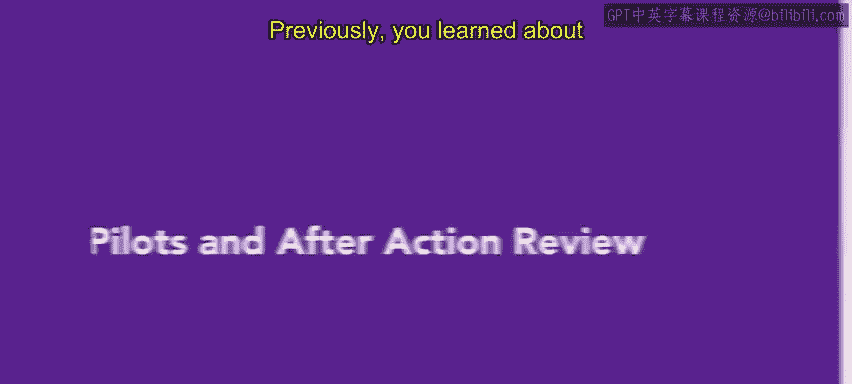
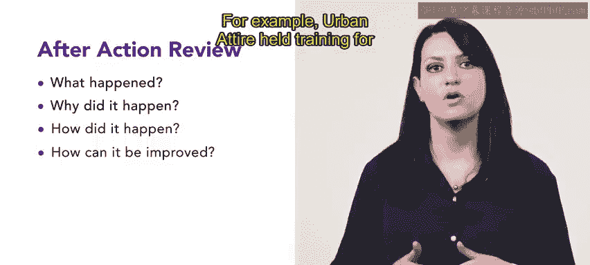

# HRCI《人力资源助理（招聘、学习发展、薪酬福利，1-3课／共5课）｜HRCI Human Resource Associate》 - P107：40_试点和行动后评估.zh_en - GPT中英字幕课程资源 - BV1qi421r7ba

Previously， you learned about the Kirkpatrick model and the four levels of evaluation in this video let's explore pilot tests and after action reviews to see how they are used for training。

A very important type of formal evaluation is the pilot test。

 also known as a pilot program in a pilot test， a focus group consisting of a small number of workers in management。

 evaluate a training program before it is implemented and provide feedback on any changes that need to be made。

 It allows companies to reduce the risk of investing resources in a training program that may or may not be effective or feasible on a larger scale。

 Let's explore an example。 Human resources at Connect has decided to conduct a pilot test with 10 employees to develop a new training program that focuses on effective communication techniques over a period of two weeks。

During the pilot， Connective collects data through surveys and questionnaires on the effectiveness of the programming。

 including changes in customer satisfaction ratings， call resolution rates。

 and representative self assessments on their communication skills。

After reviewing the surveys collected during the pilot。

 Connective HR decides to add additional training modules about call resolutions。

 The other lessons in the program were proven to be successful and needed no revisions。

 Because the pilot was successful， Connective decided to roll out the training to all customer service representatives。

 Now， let's explore an after action review， which is a versatile procedure that summarize its the findings of a training program and provides recommendations for future improvements。

 These reviews can be used at the same time with Kirkpatrick's methods and should be the final report after conducting other types of analyses After action reviews answer three questions。

 What happened， Why did it happen and how did it happen or how can it be improved。For example。

 Urban Attire held training for their sales team about effective communications with customers。

 the purpose of it was to improve the communication skills of the sales team and increase sales。

Participants in the review were given pre training and post training surveys to gauge their understanding of effective communication and their confidence level in applying the concepts。

During the training session， observations were made to assess engagement levels in participation。

 Following the training， Sal data was collected for a week and analyzed to measure the effectiveness of training and any changes in performance。

 The pre and post test survey results showed a significant improvement in their sales teams's understanding of effective communication and their confidence level in applying the concepts。

The observation results indicated that the sales team was engaged and actively participating in the training。

Finally， the sales data showed a 10% increase in sales compared to the previous week。

Using pilot tests and after reviews can help an HR associate discover policies and procedures that will enhance a particular business situation。

In an upcoming video， we will look at internships and how they can also help you as an HR associate。

