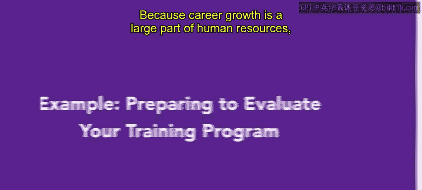
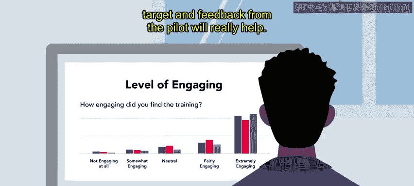

# HRCI《人力资源助理》课程：第41课：示例：准备与评估培训项目 📊

在本节课中，我们将学习如何在一个真实场景中准备和评估一个培训项目。我们将跟随人力资源专员Alex的视角，了解他如何为一个名为“Connective”的远程办公公司设计并测试一项关于工作与生活平衡的新培训计划。

---

## 背景介绍：Connective公司与其需求

上一节我们介绍了培训评估的重要性，本节中我们来看看一个具体的案例。

Connective是一家现代化的通信组织，其名称寓意着“连接”。该公司专门帮助分布式团队通过一套软件工具（如视频会议和基于云的电话系统）进行协作。Connective拥有大量完全远程办公的员工。

Connective的人力资源部认识到工作与生活平衡的重要性，同时也意识到远程员工实现这一点可能很困难。基于此，他们推出了一项工作与生活平衡倡议。Alex作为人力资源部的一员，协助创建了一个与此倡议相符的新培训项目，并希望评估其吸引力和在员工中的反响。

## 确定评估方法与试点计划

为了衡量培训的成功与否，Alex需要一套有效的评估策略。

Alex决定让参与培训的员工完成三次调查。这三次调查将在**培训前**、**培训刚结束时**以及**培训结束三周后**进行，以测量培训的短期和长期效果。

由于这是一个全新的培训，人力资源团队决定先运行一个**试点计划**。他们将挑选来自不同部门的一小群员工参与，以测试项目的接受度。

以下是试点计划中调查问卷的核心评估维度：
*   **内容清晰度**：培训内容是否易于理解。
*   **工作相关性**：培训内容是否与员工的实际工作相关。
*   **有效性**：培训是否达到了预期目标。
*   **满意度**：员工对培训的整体感受。

调查结果将为Alex提供关键见解，帮助他在全公司推广前改进培训项目。例如，如果员工认为某些内容不相关，Alex可以调整培训，增加更多关于新系统如何惠及不同岗位的实例。

对Alex而言，确保新培训与组织所有成员都息息相关至关重要。运行试点培训计划有助于在全员参与前对内容进行双重核查。

Alex知道保持参与者的投入度可能具有挑战性，因此调查中也包含了相关问题。制定有效且引人入胜的培训方案很难，试点反馈将提供极大帮助。

## 激励措施与实施

为了鼓励员工提供反馈，Alex引入了一个小的激励措施。

在完成调查后，参与者将获得一张价值5美元的本地咖啡店礼品卡。这虽然是小奖励，但Alex希望它能鼓励人们完成调查。😊

## 总结与启示

通过运行试点计划并收集员工反馈，Alex可以在向整个组织推广之前，对培训项目进行修正和调整。这种方法确保了培训项目将受到欢迎、具有相关性且高效。

在你的未来人力资源角色中，很可能也需要创建类似的培训项目。评估这些项目是流程中的重要组成部分，也是确保培训取得成功的关键。

本节课中，我们一起学习了如何通过**试点计划**和**多阶段调查**来系统性地准备和评估一个培训项目，并了解了**小激励措施**在提升反馈率方面的作用。