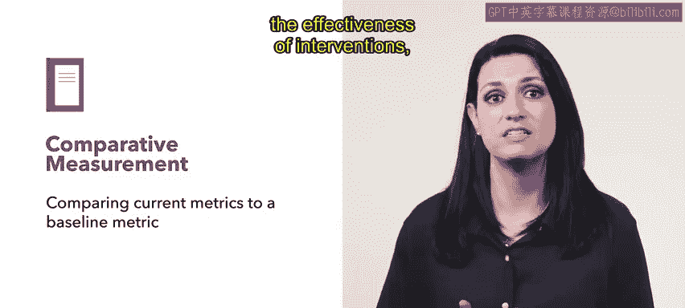

# HRCI《人力资源助理（招聘、学习发展、薪酬福利，1-3课／共5课）｜HRCI Human Resource Associate》 - P110：43_培训中常见指标.zh_en - GPT中英字幕课程资源 - BV1qi421r7ba

Previously， you learned how setting smart goals can be a great tool for learning metrics the next step is identifying what metrics human resources can use to measure success for training。

In this video， you'll learn about common metrics and training。

The first metric is the training return on investment。

 This is the amount of profitability or efficiency derived from the money invested in training。

 Another common metric HR teams can use for training is the cost per employee lists the total cost of training divided by the number of employees。

Next， we have learner engagement。 This can be important metric because it shows the amount of time and effort learners put into the learning process This can affect other metrics such as the return on investment。

Another common training metric is a training experience satisfaction。

 this is the degree of satisfaction the employee felt at the end of the training。

This metric is typically gauged through surveys Finally。

 there is another common metric that can take a few different forms based on data and scores from training courses。

They can be used to evaluate the effectiveness of training programs Ex include course enrollment data。

 course completion data and assessment scores， particularly pass rates。

Metrics help evaluate policies， processes or programs。

 Comparative measurements compare current metrics to a baseline to determine the effectiveness of interventions or if changes are needed。

 For example， Connective takes a baseline measure of the number of sick days taken。

 They find that employees are using all of their sick days and not rolling any over。

Human resources decides an intervention is needed for the wellness of the employees Connective creates a wellness campaign that measures the number of steps employees take and rewards employees for getting moving Human resources can compare the number of sick days taken before and after the program's implementation to measure success。

If there is a decrease in the number of sick days taken after the program's implementation。

 this indicates that the program is effective if there is no change or an increase in sick days taken。

 changes to the program may be needed。

There are many different metrics to measure success of a training。

 knowing a few of these will set you up for success with the goals you are trying to achieve。

Coming up， you'll learn even more about the common training metrics。

