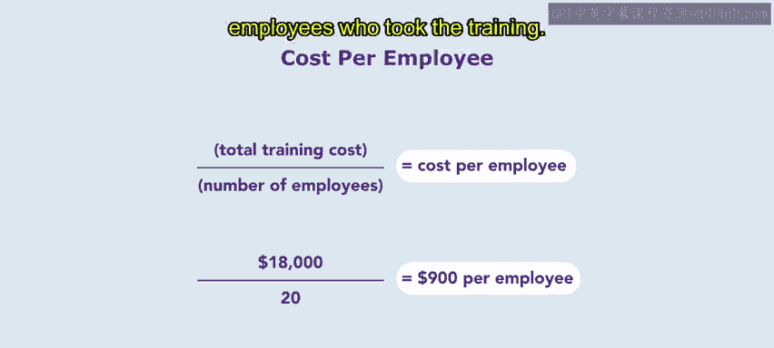

# HRCI《人力资源助理（招聘、学习发展、薪酬福利，1-3课／共5课）｜HRCI Human Resource Associate》 - P111：44_每位员工的培训成本.zh_en - GPT中英字幕课程资源 - BV1qi421r7ba

Previously， you learned about common metrics or training and how they're used。

In this video， you'll take a deeper dive into training costs per employee。

 Remember the training cost per employee is the total cost of training divided by the number of employees。

 The cost of training should include the cost of training materials such as books。

 videos or online modules and the cost of the facilities used for the training。 Additionally。

 there might be costs associated with travel and accommodation for participants and trainers。

 as well as administrative costs like scheduling registration and tracking of training progress。

Let's explore further using an example of the organization Connective。

Connective， the telecom organization has implemented a virtual training program for its employees to improve their sales and customer service skills The program consists of online modules。

 webinars and virtual coaching sessions to determine the training cost per employee the following cost elements were considered。

First， we have the cost of online modules connectedive purchase an online training platform subscription for $5000 per year。

 The training platform has unlimited access to all training modules。

 which includes training on sales and customer service skills。

Connective hosted a total of six webinars each lasting two hours。

 the webinars were conducted by external trainers who charged a fee of $500 per webinar。

 including all materials。Connive also contracted a virtual coaching organization to provide coaching sessions to the employees。

The coaching organization charged a total of $10，000 for 50 hours of coaching。

 which was divided among 20 employees。

Based on the above cost elements， the total cost of the virtual training program can be calculated as follows。

$5，000 for the online modules plus $3，000 for the webinars， plus $10。

000 for the virtual coaching equals $18，000 in total training costs。

To determine the training cost per employee， the total training cost is divided by the number of employees who participated in the training program。

 In this case， we had a total training cost of $18000 divided by the 20 employees who took the training。

 This gives us $900 as the cost per employee based on the analysis the cost per employee for the virtual training program was determined to be $900。

 This training cost is likely to be significantly lower than the cost of traditional in-per training programs because it eliminates the need for travel and accommodation expenses for both trainers and participants。

Additionally， the virtual training program can be accessed by employees at any time providing flexibility and convenience for learning。

Coming up， you'll explore cost benefit analysis， keep it up。

