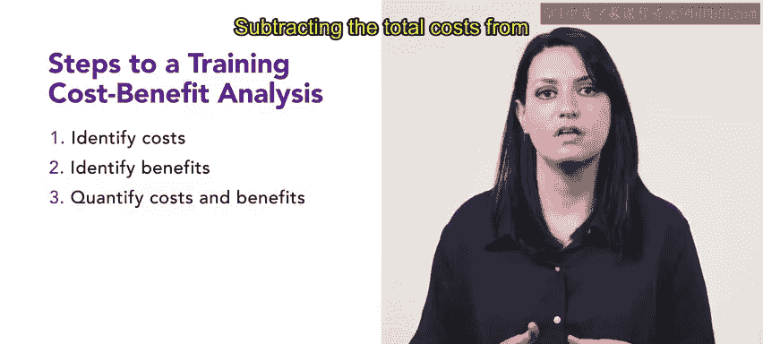

# HRCI人力资源助理课程：P112：成本效益分析与投资回报率 💰

在本节课中，我们将学习如何评估培训项目的经济可行性，具体包括成本效益分析和投资回报率（ROI）的计算方法。这两种工具能帮助组织衡量培训投入的价值，并做出更明智的资源分配决策。

---

上一节我们介绍了常见的培训衡量指标及其用途，例如计算人均培训成本。本节中，我们将深入探讨人均培训成本这一指标，并学习如何计算培训项目的整体投资回报率。

## 成本效益分析 📊

成本效益分析是一种财务分析工具，用于评估特定项目或投资的成本与收益。在培训领域，通过比较培训项目的总成本与项目带来的收益，可以评估该培训项目的经济可行性。

以下是进行培训成本效益分析的步骤。

### 识别成本

首先，需要识别与培训项目相关的所有成本。这些成本可能包括：
*   培训开发成本
*   讲师费用
*   材料费用
*   技术费用
*   行政成本
*   员工参与培训所花费的时间成本

### 识别收益

接下来，识别培训项目带来的收益。这些收益可能包括：
*   生产力提升
*   工作绩效改善
*   员工满意度提高
*   离职率降低
*   其他积极成果

### 量化与计算

识别成本和收益后，需要将它们以货币形式量化。这可能需要一些估算，但确保考虑所有成本和收益至关重要。

从总收益中减去总成本，即可得出培训项目的**净收益**。公式如下：

**净收益 = 总收益 - 总成本**

净收益为正表示该项目在经济上是可行的；净收益为负则表示该项目在经济上不可行。

### 综合考量

需要记住，成本效益分析仅是评估培训项目有效性的一个因素。其他因素，如员工参与度、学习成果和员工反馈，也应一并考虑。在完成成本效益分析并综合考虑其他因素后，可以决定是否继续推进该培训项目。

通过进行成本效益分析，组织可以对培训项目投资做出明智决策，并有效分配资源。

---

## 投资回报率分析 📈

现在，让我们看看人均培训成本指标中的另一个要素——投资回报率。

投资回报率是指组织从一项投资中获得的收益减去进行该项投资所花费的成本。换句话说，它是针对特定投资的利润与损失的比较。

以下是进行培训投资回报率分析的步骤。

### 识别成本与收益

与进行成本效益分析类似，进行投资回报率分析的第一步同样是识别与培训项目相关的所有成本。这些成本包括培训开发、讲师费用、材料、技术、行政成本以及员工培训时间成本。

接下来，识别培训项目带来的收益，例如生产力提升、绩效改善、员工满意度提高和离职率降低等积极成果。

### 量化与计算

识别成本和收益后，需要为每一项分配货币价值。这可能需要估算，但确保考虑所有项目非常重要。

投资回报率的计算公式如下：

**ROI = (收益的货币价值 / 成本的货币价值) × 100%**

ROI为正表示培训项目产生了回报；ROI为负则表示项目未能产生回报。

### 结果解读

计算出ROI后，需要解读结果。高ROI表明培训项目相对于投资产生了显著的回报。低ROI或负ROI则表明项目可能效果不佳或效率不高，可能需要进一步分析。

通过为培训项目进行成本效益分析和投资回报率分析，组织可以做出明智的投资决策，并有效分配资源。

---

在本节课中，我们一起学习了如何运用成本效益分析和投资回报率来评估培训项目的经济价值。这两种工具的核心在于将培训的投入与产出进行量化比较，从而为决策提供数据支持。接下来，我们将探讨另一个培训衡量指标：学习者参与度。