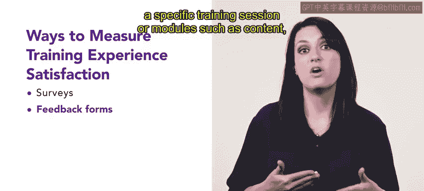

# HRCI人力资源助理课程：第3课：培训体验满意度

在本节课中，我们将要学习如何衡量和解读培训体验满意度。培训体验满意度是衡量培训项目成功与否的关键指标之一，它反映了学员对所接受学习体验的满意程度。

上一节我们介绍了培训指标的基本概念，本节中我们来看看如何具体衡量培训体验满意度。

## 什么是培训体验满意度？

培训体验满意度是指学员对所接受学习体验感到满意的程度。这个指标可以通过多种方式进行衡量。

## 衡量培训体验满意度的方法

以下是几种常用的衡量培训体验满意度的方法：

**1. 问卷调查**
问卷调查可用于收集学员对其培训体验的反馈。问卷可以在培训前、培训中和培训后发放，以收集关于培训体验各个方面的反馈，例如培训材料的质量、授课效果以及整体体验。

**2. 反馈表**
反馈表也可用于收集关于特定培训课程或模块的反馈，例如内容、授课方式以及培训材料的相关性。

**3. 净推荐值**
净推荐值是一个广泛用于衡量客户满意度的指标。它也可用于衡量培训体验满意度。NPS基于一个单一问题：学员有多大可能向他人推荐该培训项目。其分数通过推荐者的百分比减去贬损者的百分比来计算，公式为：
`NPS = % 推荐者 - % 贬损者`

**4. 焦点小组**
焦点小组是另一个收集学员培训体验反馈的有用工具。一个焦点小组通常由一小群学员组成，他们讨论自己的培训体验，并就培训项目的各个方面提供反馈。

**5. 一对一访谈**
一对一访谈可用于深入了解学员的培训体验。这些访谈可以由培训师、经理或其他利益相关者进行，以收集关于培训项目特定方面的详细反馈。

## 案例研究：SliceU公司的DEI培训项目

让我们通过一个例子来探索如何衡量和解读培训体验满意度指标。

SliceU公司最近实施了一个多元化和包容性培训项目，旨在增强员工对职场中多元化、公平和包容性的理解。SliceU希望衡量该项目的有效性，并收集员工对培训体验满意度的反馈，以确定需要改进的领域。

SliceU在培训前后对学员进行了调查，以衡量他们对体验各个方面的满意度，包括材料的相关性和实用性、授课质量以及整体体验。调查还询问了员工对组织DEI承诺的看法。

调查结果显示：
*   94%的学员认为培训材料相关且有用。
*   90%的学员将授课质量评为优秀或良好。
*   85%的学员认为组织致力于DEI，而在培训项目开始前，这一比例为75%。

除了调查，SliceU还进行了焦点小组讨论，以收集关于培训项目特定方面的详细反馈。学员小组讨论了他们的体验，并就内容、授课方式和相关性提供了反馈。

焦点小组的结果显示，学员特别投入于互动练习，这让他们能够在模拟环境中练习技能。学员也赞赏培训中提供的真实案例，并认为这些案例有助于理解DEI原则在工作场所的实际应用。

基于调查和焦点小组的结果，SliceU得出结论：DEI培训项目增强了员工对工作中DEI原则的理解。通过衡量培训体验满意度，组织还发现了在某些模块中提高参与度的机会，并能够收集关于培训项目有效性的反馈，确定需要改进的领域。这正是培训体验满意度成为一个优秀工具的原因。

## 总结

本节课中我们一起学习了培训体验满意度的概念及其衡量方法。我们了解到，培训体验满意度是评估培训效果的重要工具，可以通过问卷调查、反馈表、净推荐值、焦点小组和一对一访谈等多种方式进行衡量。通过案例研究，我们看到了如何实际应用这些方法来收集反馈、评估效果并指导培训项目的持续改进。