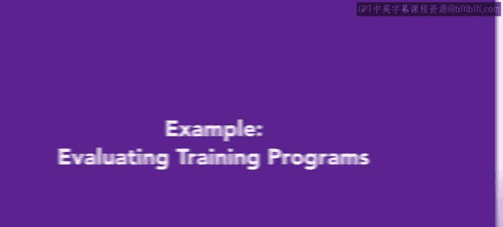
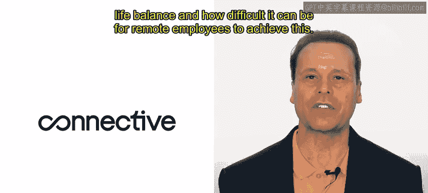
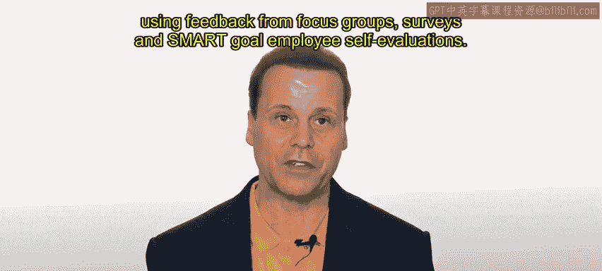
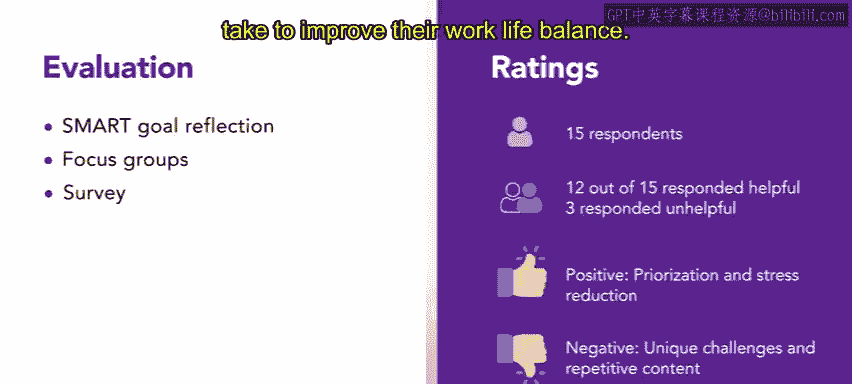
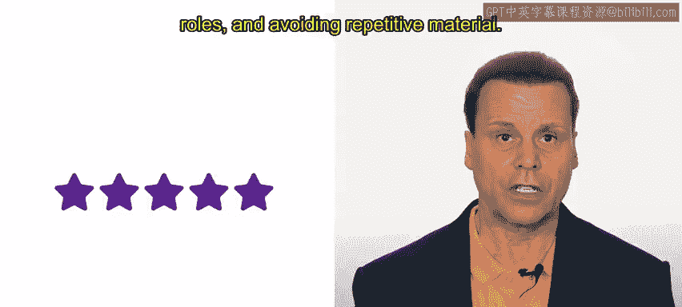
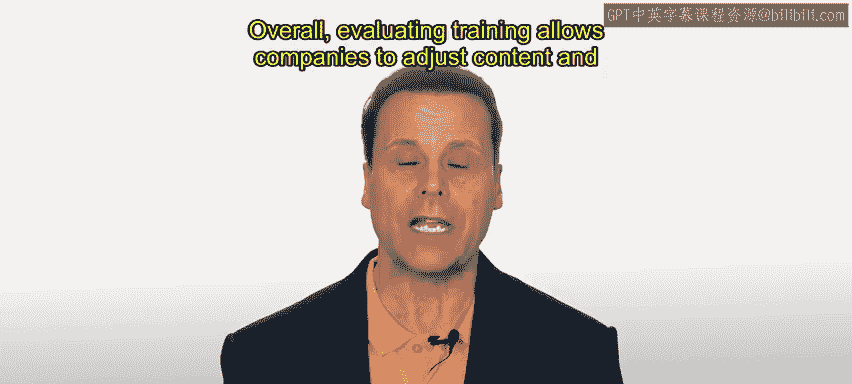

# HRCI人力资源助理课程：第3课：示例：评估培训项目 📊

在本节课中，我们将学习如何完成一个培训项目的评估，以及如何在必要时利用评估结果来调整培训效果。

上一节我们介绍了培训项目的基本概念，本节中我们来看看一个具体的评估案例。

让我们回到Connective公司的人力资源员工Alex，看看该公司的“工作与生活平衡”计划进展如何。需要说明的是，Connective是一家现代化的通信组织，专门帮助企业保持联系。顾名思义，该公司专注于帮助分布式员工队伍通过一套软件工具（如视频会议和基于云的电话系统）进行协作。Connective拥有大量完全远程办公的员工。公司人力资源部门认识到工作与生活平衡的重要性，也意识到远程员工实现这一点可能很困难。

为了启动这项计划，Alex创建了一个培训项目，并让一个由少数员工组成的试点小组完成了培训。培训的目标是帮助员工实现更好的工作与生活平衡，改善他们的整体福祉，并提高工作满意度。人力资源部门将通过焦点小组访谈、问卷调查和SMART目标员工自我评估等方式收集的反馈来评估培训的有效性。

以下是培训评估中收集到的具体反馈：

**1. SMART目标自我评估**
作为工作与生活平衡培训的一部分，员工被要求创建SMART目标，即具体的、可衡量的、可实现的、相关的、有时限的、与工作生活平衡相关的目标。培训后，员工通过自我评估报告了他们在实现目标方面的进展。在完成自我评估的20名员工中，有15名报告称正在朝着实现目标取得进展。具体的反馈包括：培训帮助他们设定了现实且可实现的目标，他们觉得SMART目标框架特别有帮助。一些员工发现，由于工作过度或个人事务，很难实现工作与生活平衡的目标。

**2. 焦点小组访谈**
Alex与20名已完成工作与生活平衡培训的员工进行了两次焦点小组访谈。焦点小组的反馈好坏参半。一些员工认为培训很有帮助，确实改善了他们的工作与生活平衡。另一些员工则认为培训内容过于基础，没有提供实际的、可操作的方法来改善工作与生活平衡。具体的反馈包括：积极的方面是，培训帮助他们优先处理任务，学会了拒绝额外工作，并将任务委派给同事；消极的方面是，培训没有解决不同部门和岗位员工面临的独特挑战，并且材料有些重复。

**3. 问卷调查**
此外，Alex还向所有完成工作与生活平衡培训的员工分发了一份调查问卷。在参加培训的20人中，有15人完成了调查。在这15人中，12人认为培训有帮助，3人认为没有帮助。调查还显示，有10名员工因培训而在工作或个人生活中实施了至少一项改变。具体的反馈包括：积极的方面是，培训帮助他们更好地管理时间、优先处理任务并减轻压力；消极的方面是，培训没有提供足够多的、学员可以采取的具体行动来改善工作与生活平衡。

总体而言，试点小组创建的工作与生活平衡培训对许多员工产生了积极影响。来自焦点小组、问卷调查和SMART目标员工自我评估的反馈表明，培训帮助员工更好地管理时间、减轻压力，并实现了更好的工作与生活平衡。然而，培训也存在一些可以改进的领域，例如解决不同部门和岗位员工面临的独特挑战，以及避免材料重复。基于此次评估，Alex将修订培训内容，以更好地满足不同员工的需求，同时仍能提供有帮助的信息和内容，然后再在全公司范围内实施培训。

总而言之，评估培训使公司能够调整内容并最大化其影响力。

本节课中我们一起学习了如何通过多种方法（自我评估、焦点小组、问卷调查）系统性地评估一个培训项目的效果，并基于反馈数据进行改进，以确保培训能够真正满足员工需求并达成预期目标。