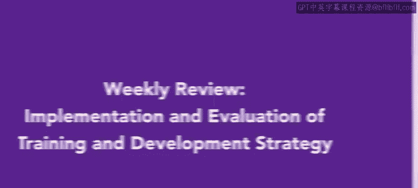
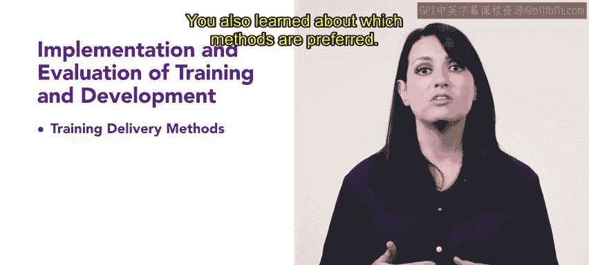

# HRCI《人力资源助理（招聘、学习发展、薪酬福利，1-3课／共5课）｜HRCI Human Resource Associate》 - P116：49_每周回顾：培训与发展策略的实施和评估.zh_en - GPT中英字幕课程资源 - BV1qi421r7ba

Congratulations on your progress in this course， you learned a lot about implementation and evaluation of training and development。

 an important skill for an HR professional to develop Everything you're learning now will be used in your future HR career。

 Less recap what we have covered in this module。 and lesson one。

 you learned about training and delivery methods， such as on the job training and the learning management system。

 You also learned about which methods are preferred。😊。

In lesson two， you learned about evaluating training programs。

 you learned about the different types of evaluation such as experimental design in the Kirkpat model。

 you also learned about pilots and after action reviews and the benefit and purpose of evaluating training programs。

 Finally， you learned about common metrics and training and how to identify the cost of training per employee。

 You also learned about employee engagement and training experience satisfaction。

That's it for this review of implementation and evaluation of training and development。

 you're doing great。

